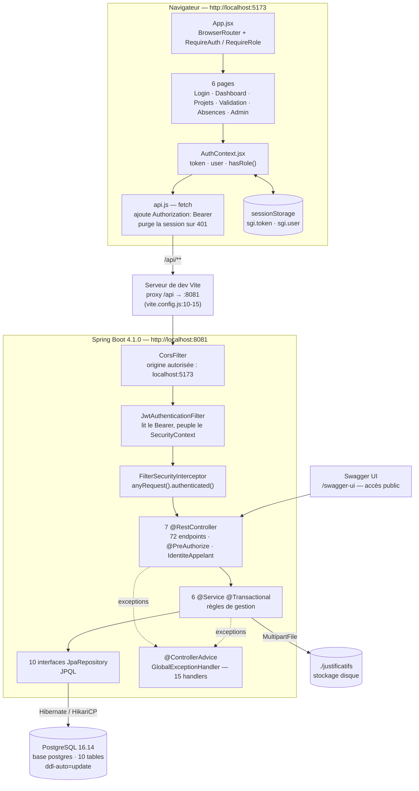
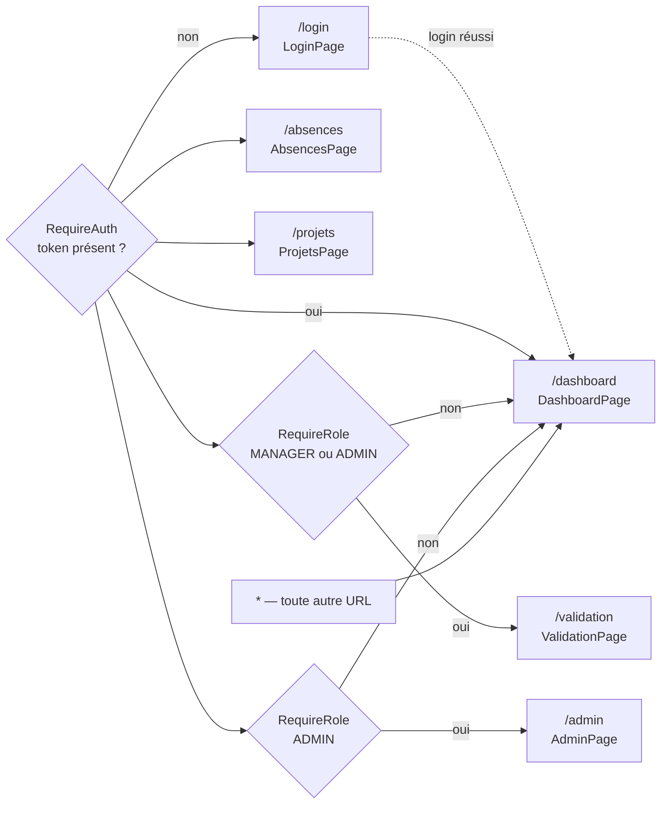
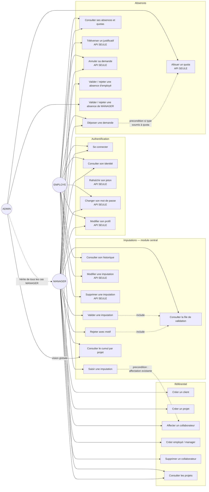
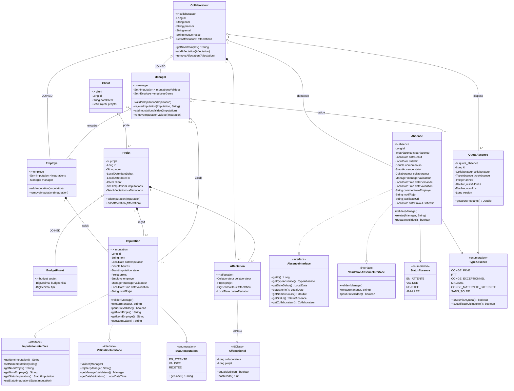
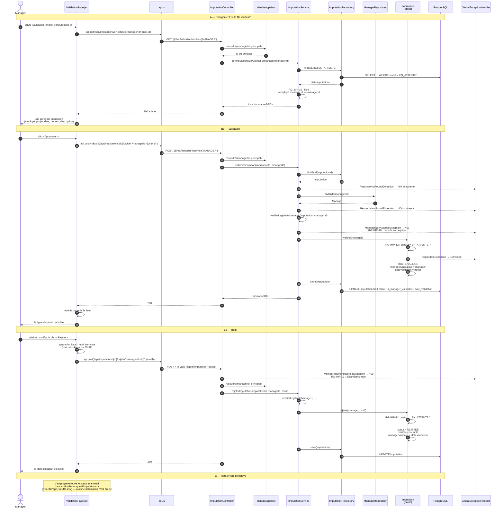
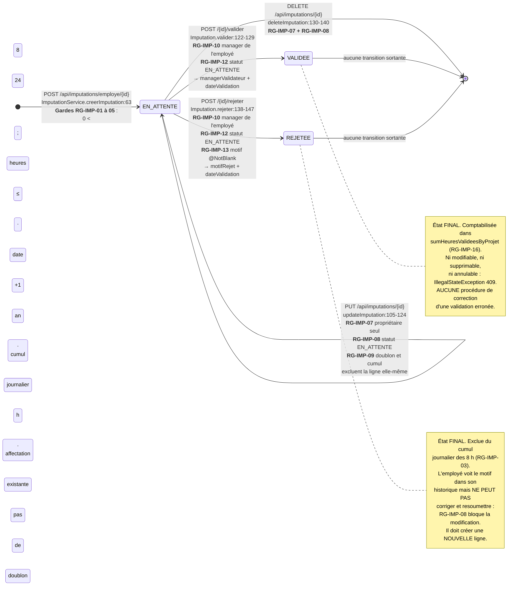
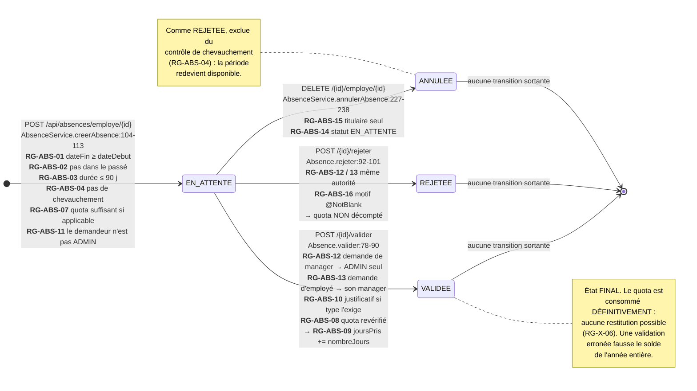
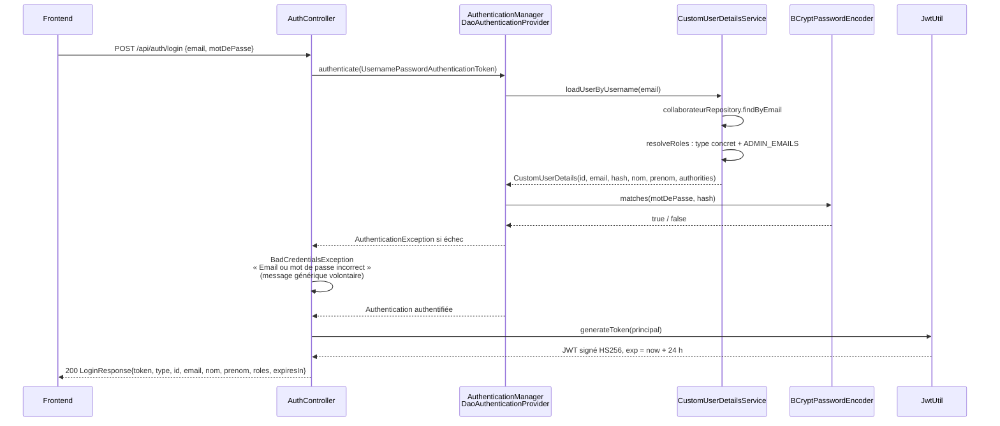
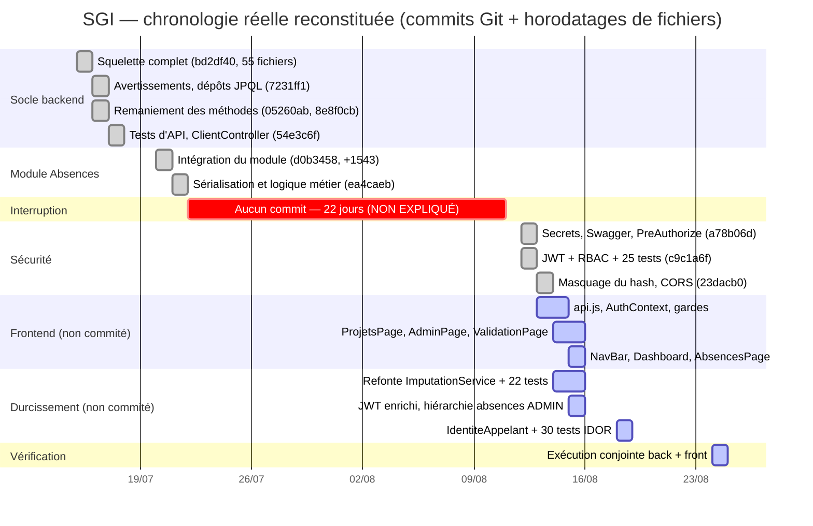

# EXTRACTION SGI — Dossier factuel pour rapport de stage

**Projet** : SGI — Système de Gestion des Imputations
**Entité** : Smart Square Services (groupe Sopra Banking Software)
**Dépôt analysé** : `C:\Users\Lenovo\3S-SGI` — branche `master`, HEAD `23dacb0`
**Date d'extraction** : 2026-09-02
**Méthode** : lecture intégrale des 8 157 lignes de code source (back + front), interrogation
de la base PostgreSQL 16.14 réelle (`localhost:5432/postgres`), réexécution complète de la
suite de tests le 2026-09-02, analyse des 10 commits de l'historique Git.

> **Comment lire ce document.** Chaque affirmation est sourcée entre parenthèses
> (`fichier:ligne`, `commit xxxxxxx`, `table.colonne`, résultat de commande). Lorsqu'une
> information demandée n'existe pas dans le dépôt, la mention **NON TROUVÉ — à me demander**
> apparaît explicitement plutôt qu'une reconstitution plausible. Les rubriques
> **IMPLÉMENTÉ** / **NON IMPLÉMENTÉ** séparent systématiquement le code réel de l'intention.

> ### Trois écarts majeurs entre l'énoncé du sujet et le code réel
> À lire **avant** de rédiger le rapport : ce sont les trois pièges les plus probables du jury.
>
> 1. **Il n'existe aucune entité « feuille de temps ».** Aucune classe `FeuilleTemps`,
>    `FeuilleDeTemps` ni `Timesheet` dans le dépôt (recherche exhaustive sur `src/`). L'unité
>    de saisie est **la ligne d'imputation individuelle** (`entity/Imputation.java`), créée
>    directement au statut `EN_ATTENTE`. Il n'y a donc **pas d'étape de soumission** : le cycle
>    réel est `création → validation/rejet`, et non `saisie → soumission → validation`.
> 2. **Il n'existe aucune entité `Tache`.** Aucun dictionnaire global des tâches, aucun
>    découplage TACHE/PROJET n'est modélisé. Le champ `imputation.nom` est un **texte libre**
>    de 100 caractères saisi par l'employé (`entity/Imputation.java:32-33`, colonne
>    `imputation.nom character varying(100) not null` en base). Détail complet en §5.4.
> 3. **Aucun document de spécification n'est présent dans le dépôt** : pas de DCG (v1, v2 ou
>    v3), pas de cahier des charges, pas de compte rendu de revue de robustesse, pas de liste
>    d'anomalies. Les seuls documents sont `ARCHITECTURE.md`, `SECURITY.md` et
>    `temp-absences/absences-module/INTEGRATION.md`. Détail en §1.2, §1.4 et §11.

---

## Table des matières

1. [Inventaire du dépôt](#1--inventaire-du-dépôt)
2. [Contexte et besoin](#2--contexte-et-besoin)
3. [Spécifications](#3--spécifications)
4. [Architecture](#4--architecture)
5. [Modèle de données](#5--modèle-de-données)
6. [Diagrammes UML générés depuis le code](#6--diagrammes-uml-générés-depuis-le-code)
7. [API REST](#7--api-rest)
8. [Sécurité](#8--sécurité)
9. [Tests](#9--tests)
10. [Gestion de projet (depuis Git)](#10--gestion-de-projet-depuis-git)
11. [Difficultés et évolutions](#11--difficultés-et-évolutions)
12. [Environnement et limites](#12--environnement-et-limites)
13. [Captures à réaliser](#13--captures-à-réaliser)

---

# 1 — INVENTAIRE DU DÉPÔT

## 1.1 Arborescence commentée

```
3S-SGI/
├── pom.xml                       Build Maven — Spring Boot 4.1.0, cible Java 17
├── mvnw / mvnw.cmd               Wrapper Maven
├── .mvn/wrapper/                 Configuration du wrapper
├── .env                          NON VERSIONNÉ (.gitignore:34) — DB_PASSWORD, JWT_SECRET, ADMIN_EMAILS
│                                 Vérifié : « git ls-files .env » ne retourne rien.
├── run.ps1                       Charge .env dans l'environnement puis « .\mvnw spring-boot:run »
├── .gitattributes                Fins de ligne : mvnw en LF, *.cmd en CRLF
├── ARCHITECTURE.md               Doc backend — 8 196 o, figée au commit bd2df40 (2026-07-15)
│                                 PARTIELLEMENT OBSOLÈTE, voir §1.2
├── SECURITY.md                   État sécurité — 6 092 o, contenu daté 2026-08-12 (commit c9c1a6f)
│                                 PARTIELLEMENT OBSOLÈTE, voir §1.2 et §11.3
│
├── src/main/java/com/SSS/SGI/
│   ├── SgiApplication.java       Point d'entrée @SpringBootApplication (13 lignes)
│   ├── config/                   3 classes : SecurityConfig, PasswordConfig, OpenApiConfig
│   ├── controller/               7 contrôleurs REST + 4 DTO de requête mal placés (voir §12.4)
│   ├── service/                  6 services métier (1 240 lignes au total)
│   ├── repository/               10 interfaces Spring Data JPA
│   ├── entity/                   12 classes (dont 3 enums dans entity/enums/ et 1 dans entity/)
│   ├── dto/                      17 DTO — records Java et classes Lombok mélangés (voir §12.4)
│   ├── interfaces/               4 contrats métier
│   ├── exception/                11 classes : 9 exceptions métier + ErrorResponse + handler global
│   └── security/                 4 classes : JwtUtil, JwtAuthenticationFilter,
│                                 CustomUserDetails, IdentiteAppelant
├── src/main/resources/
│   └── application.properties    Profil par défaut → PostgreSQL, port 8081
│                                 AUCUN data.sql / import.sql (find . -name "*.sql" → vide)
├── src/test/java/com/SSS/SGI/    9 classes de test, 141 tests (voir §9)
├── src/test/resources/
│   └── application-test.properties  Profil « test » → H2 en mémoire, port 8080
│
├── frontend/                     NON VERSIONNÉ (untracked dans git status)
│   ├── package.json              React 18.3.1, react-router-dom 6.26.2, Vite 5.4.8
│   ├── vite.config.js            Port 5173 + proxy /api → http://localhost:8081
│   ├── index.html                Coquille HTML, lang="fr", titre « SGI »
│   ├── README.md                 Notes de lancement et limites connues du front
│   └── src/
│       ├── main.jsx              Point de montage React
│       ├── App.jsx               Routage : /login, /dashboard, /absences, /validation,
│       │                         /projets, /admin
│       ├── api.js                Client HTTP maison (fetch), gestion du jeton et des 401
│       ├── auth/                 AuthContext.jsx (état de session), Guards.jsx (RequireAuth,
│       │                         RequireRole)
│       ├── components/           NavBar.jsx, StatusBadge.jsx, ErrorBanner.jsx
│       ├── pages/                6 pages (1 557 lignes)
│       └── styles/index.css      435 lignes de CSS écrit à la main, aucun framework
│
├── temp-absences/absences-module/  Livraison originelle du module Absences (voir §1.3)
│   ├── INTEGRATION.md            Notice d'intégration — seule mention du « DCG » du dépôt
│   └── src/main/java/...         18 fichiers, dont 8 ont divergé de la version intégrée
│
├── justificatifs/                Stockage disque des justificatifs d'absence
│   └── 4_1784539273322_certificat.pdf   1 fichier de test, 28 octets
│
├── endpoints.json                21 132 o — inventaire d'endpoints généré par un script tiers,
│                                 chemins absolus « C:\Users\pc\Bureau\SGI\ » → machine d'un
│                                 co-équipier. OBSOLÈTE (décrit POST /api/imputations, remplacé
│                                 depuis par POST /api/imputations/employe/{employeId})
├── error.log                     56 372 o — trace d'erreurs du 2026-08-12
├── backend-out.log               Journal de démarrage Spring du 2026-08-24 15:57
├── backend-err.log               2 octets (vide)
├── backend-pid.txt               PID du dernier backend lancé
├── frontend-out.log              Journal de démarrage Vite du 2026-08-24 15:56
├── login.json / body.json        Corps de requête de test pour curl
├── certificat.pdf                28 o — fichier factice pour tester le téléversement
├── target/                       Sortie de build (non versionnée)
└── .idea/                        Config IntelliJ, incluant la source de données PostgreSQL
```

**Volumétrie mesurée** (hors `node_modules`, `target`, `.git`) : 174 fichiers.
Code source : **8 157 lignes** — 4 397 pour le backend `main`, 2 949 pour les tests,
1 557 pour le frontend (`wc -l` sur l'ensemble des `.java`, `.jsx`, `.js`).

## 1.2 Documents trouvés et leurs dates

| Document | Taille | Dernière modification | État |
|---|---|---|---|
| `ARCHITECTURE.md` | 8 196 o | 2026-07-20 (introduit au commit `bd2df40`, 2026-07-15) | **Partiellement obsolète** |
| `SECURITY.md` | 6 092 o | 2026-08-13 (contenu daté « 2026-08-12 » en ligne 3) | **Partiellement obsolète** |
| `temp-absences/absences-module/INTEGRATION.md` | 3,1 ko | 2026-07-20 | Historique, module intégré depuis |
| `frontend/README.md` | 1,1 ko | 2026-08 | À jour |
| `endpoints.json` | 21 132 o | 2026-07-20 | **Obsolète** (voir §1.1) |

### Ce qui est obsolète dans `ARCHITECTURE.md`

| Affirmation du document | Réalité du code |
|---|---|
| « Authentification : HTTP Basic Authentication » | JWT stateless depuis `c9c1a6f` (`config/SecurityConfig.java:69`, `security/JwtUtil.java`) |
| « CORS configuré pour tous les origines » | `SecurityConfig.corsConfigurationSource:122` restreint à `http://localhost:5173` — mais 6 contrôleurs portent encore `@CrossOrigin(origins = "*")`, voir §8.7 |
| « `POST /` — Créer une imputation » | `POST /api/imputations/employe/{employeId}` (`ImputationController.java:49`) |
| « `POST /clients` » et « `GET /clients` » sous `/api/projets` | Contrôleur séparé `ClientController` sur `/api/clients` |
| « `POST /employe` — Créer un employé (ADMIN) » | `@PreAuthorize("hasRole('MANAGER')")` (`CollaborateurController.java:72`) — **tout manager peut créer un compte** |
| Bloc `application.properties` : base `sgi_db`, utilisateur `sgi_user`, secret JWT en dur | Réel : base `postgres`, utilisateur `postgres`, mot de passe et secret externalisés en variables d'environnement (`application.properties:4-6,21`) depuis `a78b06d` |
| « L'application sera disponible à : `http://localhost:8080/api` » | Port réel **8081** (`application.properties:17`) |
| Section « Prochaines Étapes » : ajouter JWT, les tests, Swagger | Les trois sont faits (`c9c1a6f` pour JWT + tests, `OpenApiConfig.java` pour Swagger) |

**À dire au jury** : `ARCHITECTURE.md` documente l'état du projet à la mi-juillet et n'a jamais
été mis à jour ensuite. C'est un fait à assumer, pas à cacher.

### Ce qui est obsolète dans `SECURITY.md`

Le document liste une section « Hors périmètre de cette passe (gaps connus, non corrigés) ».
**Trois des quatre points listés ont depuis été corrigés** dans le répertoire de travail :

| Faille annoncée comme « non corrigée » dans `SECURITY.md` | Correctif appliqué depuis |
|---|---|
| « Ownership par principal non généralisé » | Classe `security/IdentiteAppelant.java` (créée le 2026-08-18, non versionnée) appelée sur 18 endpoints |
| « `POST /{id}/change-password` n'a pas reçu la même vérification » | `CollaborateurController.java:153-155` — contrôle `principal.getId().equals(id)` présent |
| « Le hash du mot de passe est toujours renvoyé dans les réponses JSON » | `entity/Collaborateur.java:51` — `@JsonProperty(access = WRITE_ONLY)`, commit `23dacb0` |
| « `ADMIN` par liste d'emails plutôt que par entité » | **Toujours vrai** (`service/CustomUserDetailsService.java:52-61`) |

`SECURITY.md` annonce également « `./mvnw test` — 70/70 tests passent ». Le chiffre réel
mesuré le 2026-09-02 est **141 tests** (voir §9.1) : 71 tests ont été ajoutés depuis, sans
mise à jour du document.

## 1.3 Le dossier `temp-absences` — divergence mesurée

`temp-absences/absences-module/` contient la livraison originelle du module Absences (18
fichiers Java + `INTEGRATION.md`). Le module a été intégré dans `src/main/java/` au commit
`d0b3458` (2026-07-20, 42 fichiers, +1 543 lignes), puis a divergé.

Comparaison fichier par fichier (`diff -q`) :

| Fichier | État |
|---|---|
| `dto/AllouerQuotaRequest.java`, `dto/CreateAbsenceRequest.java`, `dto/QuotaAbsenceDTO.java`, `dto/RejeterAbsenceRequest.java` | **Identiques** |
| `entity/enums/StatutAbsence.java`, `entity/enums/TypeAbsence.java` | **Identiques** |
| `exception/AbsenceChevauchementException.java`, `exception/JustificatifManquantException.java`, `exception/QuotaInsuffisantException.java` | **Identiques** |
| `interfaces/ValidationAbsenceInterface.java` | **Identique** |
| `controller/AbsenceController.java` | **Divergé** (RBAC + `IdentiteAppelant` ajoutés) |
| `dto/AbsenceDTO.java` | **Divergé** (+ `collaborateurType`, `justificatifRequis`) |
| `entity/Absence.java` | **Divergé** (titulaire typé `Collaborateur` au lieu d'`Employe`) |
| `entity/QuotaAbsence.java` | **Divergé** (+ `@Version`, titulaire `Collaborateur`) |
| `interfaces/AbsenceInterface.java` | **Divergé** |
| `repository/AbsenceRepository.java`, `repository/QuotaAbsenceRepository.java` | **Divergés** |
| `service/AbsenceService.java` | **Divergé** (+149 lignes : hiérarchie de validation, rôle ADMIN) |

**10 fichiers identiques, 8 divergés.** Le dossier `temp-absences/` est aujourd'hui du **code
mort** : il n'est ni compilé (hors du `sourceDirectory` Maven) ni référencé. À supprimer avant
toute remise (voir §12.4).

## 1.4 Ce qui n'existe PAS dans le dépôt

Recherche exhaustive effectuée. Aucun de ces éléments n'a été trouvé :

- **NON TROUVÉ — à me demander** : DCG (Dossier de Conception Générale), quelle qu'en soit la
  version. Le sigle « DCG » n'apparaît qu'une fois dans tout le dépôt, dans
  `temp-absences/absences-module/INTEGRATION.md:67-70` : « *Ce module introduit deux tables et
  deux enums non présents dans le DCG actuel (section 8). Si vous voulez, je peux mettre à jour
  le document Word* ». Le document Word en question **n'est pas dans le dépôt**.
- **NON TROUVÉ — à me demander** : cahier des charges, expression de besoin, spécifications
  fonctionnelles.
- **NON TROUVÉ — à me demander** : compte rendu de revue de robustesse, et en particulier la
  liste des « 14 anomalies » évoquée dans votre demande. Recherche des chaînes `anomalie`,
  `robustesse`, `revue` sur l'ensemble du dépôt et de l'historique Git : aucune occurrence.
- **NON TROUVÉ** : diagrammes UML sources (`.puml`, `.drawio`, `.vsdx`, images de conception).
- **NON TROUVÉ** : script de création de schéma (`schema.sql`), jeu de données de référence
  (`data.sql`, `import.sql`), fixtures. Le schéma est généré par Hibernate
  (`ddl-auto=update`, `application.properties:10`).
- **NON TROUVÉ** : `README.md` racine, `CHANGELOG.md`, `Dockerfile`, `docker-compose.yml`,
  configuration CI/CD (`.github/workflows/`, `Jenkinsfile`, `.gitlab-ci.yml`).
- **NON TROUVÉ** : aucun test frontend (ni Jest, ni Vitest, ni Testing Library dans
  `frontend/package.json`), aucun linter configuré (pas d'ESLint, malgré les commentaires
  `// eslint-disable-next-line` présents dans 6 fichiers).
- **NON TROUVÉ** : convention de commit, modèle de PR, branches de fonctionnalité (voir §10).

---

# 2 — CONTEXTE ET BESOIN

> **Avertissement méthodologique.** Aucun document du dépôt ne décrit l'existant avant SGI, les
> irritants, ni des objectifs chiffrés. Cette section ne peut donc pas être « extraite » : elle
> est **reconstituée à partir de ce que le code atteste**, et les rubriques manquantes sont
> signalées comme telles. Les éléments narratifs (contexte de l'entreprise, processus antérieur,
> gains attendus) devront venir de vous.

## 2.1 L'existant avant SGI, les irritants, les objectifs

**NON TROUVÉ — à me demander.** Rien dans le dépôt, la documentation ou l'historique Git ne
documente :

- comment les temps étaient saisis avant SGI (tableur ? outil groupe ? papier ?) ;
- le volume concerné (nombre de collaborateurs, de projets, de clients) ;
- les irritants identifiés (retards de saisie, erreurs de refacturation, absence de visibilité
  sur la consommation budgétaire…) ;
- des objectifs chiffrés (délai de clôture mensuelle, taux de saisie à date, réduction du temps
  de traitement) ;
- le commanditaire, le périmètre organisationnel, le calendrier contractuel.

**Ce sont les questions n°1 à préparer avant la soutenance** : un jury demandera
systématiquement « quel problème résolviez-vous, et comment le mesuriez-vous ? ».

## 2.2 Ce que le code atteste de la finalité du système

Ces éléments sont, eux, sourcés :

1. **La finalité déclarée est le cumul d'heures validées par projet.** La méthode
   `ImputationService.getCumulHeuresValideesByProjet` porte le commentaire « *Cumul des heures
   validées par projet — la finalité du système d'imputations* »
   (`service/ImputationService.java:186-193`). Elle s'appuie sur
   `ImputationRepository.sumHeuresValideesByProjet`, qui ne somme que les lignes au statut
   `VALIDEE` (`repository/ImputationRepository.java:20-22`).
2. **Le contexte est celui d'une ESN facturant au client.** Le modèle porte `Client`,
   `Projet`, un sous-type `BudgetProjet` avec `budget_initial` et `tjm` (*Tarif Journalier
   Moyen*, `entity/BudgetProjet.java:20-24`), et une table `affectation` avec un
   `taux_affectation` en pourcentage. C'est le vocabulaire de la refacturation en régie.
3. **Le processus métier est un circuit de validation hiérarchique à deux niveaux** :
   employé → son manager (imputations et absences) ; manager → administrateur (absences
   uniquement). Attesté par `AbsenceService.verifierAutoriteValidation:201-215` et
   `ImputationService.verifierLegitimiteManager:195-201`.
4. **La saisie est unitaire, pas hebdomadaire.** Une imputation = un employé × un projet × une
   date × un nombre d'heures, avec contrainte anti-doublon sur ce triplet
   (`ImputationRepository.findDoublon:16-18`).
5. **Le plafond de saisie est de 8 heures par jour et par employé, tous projets confondus**
   (`ImputationService.validerReglesMetier:222-227`). C'est la règle qui matérialise une
   journée de travail standard.
6. **Le module Absences est un ajout postérieur** : il n'existe pas au premier commit
   (`bd2df40`, 2026-07-15) et arrive cinq jours plus tard (`d0b3458`, 2026-07-20). Son auteur
   note lui-même qu'il « *introduit deux tables et deux enums non présents dans le DCG actuel* »
   (`INTEGRATION.md:67-69`) — le périmètre s'est donc élargi en cours de route.

## 2.3 Acteurs — attestés par le code

| Acteur | Existence en base | Comment le rôle est attribué | Source |
|---|---|---|---|
| **EMPLOYE** | Table `employe` (sous-type JOINED de `collaborateur`, discriminant `type_collaborateur = 'EMPLOYE'`) | Dérivé du type concret de l'entité | `CustomUserDetailsService.resolveRoles:57-59` |
| **MANAGER** | Table `manager` (sous-type JOINED, discriminant `'MANAGER'`) | Dérivé du type concret | `CustomUserDetailsService.resolveRoles:53-56` |
| **ADMIN** | **Aucune table, aucune entité** | Un manager dont l'email figure dans `sgi.security.admin-emails` reçoit `ROLE_ADMIN` **en plus** de `ROLE_MANAGER` | `CustomUserDetailsService:34-38, 54-55` ; `application.properties:24` |
| **Client** | Table `client` — **donnée de référence, pas un utilisateur** | Aucun compte, aucune connexion possible | `entity/Client.java` |

**Conséquences structurelles à assumer devant le jury :**

- Un `Collaborateur` est **soit** un `Employe`, **soit** un `Manager` — jamais les deux (héritage
  `JOINED` avec discriminant, `entity/Collaborateur.java:24-25`). Un manager ne peut donc **pas
  saisir d'imputation** : `POST /api/imputations/employe/{id}` est réservé à `hasRole('EMPLOYE')`
  (`ImputationController.java:50`), et `Imputation.employe` est typé `Employe`
  (`entity/Imputation.java:56`). Le front en tient compte : la carte « Mes imputations » du
  tableau de bord n'apparaît que pour `hasRole('EMPLOYE')` (`pages/DashboardPage.jsx:119`).
- **Tout ADMIN est aussi MANAGER.** Le front doit exclure explicitement l'ADMIN partout où il
  cible « les managers non-admins » — le code le fait et le commente
  (`components/NavBar.jsx:28-31`, `pages/DashboardPage.jsx:31-33`,
  `pages/AbsencesPage.jsx:46-49`).
- **Le statut ADMIN n'est pas traçable en base.** Retirer un email de `ADMIN_EMAILS` retire le
  rôle sans laisser de trace. Ce choix est documenté et assumé dans `SECURITY.md` (section
  « Rôle ADMIN : pas d'entité dédiée ») : la contrainte affichée était de ne pas modifier le
  schéma de base de données.

## 2.4 Périmètre effectivement livré

**Backend (IMPLÉMENTÉ — versionné jusqu'au commit `23dacb0`, plus des travaux non commités) :**

| Module | Contenu |
|---|---|
| Authentification | JWT HS256, `login` / `refresh` / `me`, hachage BCrypt |
| RBAC | 3 rôles, `@PreAuthorize` sur 69 des 72 endpoints |
| Contrôle de propriété (anti-IDOR) | `IdentiteAppelant` appelé sur 18 endpoints |
| Collaborateurs | CRUD employés et managers, profil, mot de passe |
| Clients / Projets | CRUD complet, sous-type projet budgété (budget + TJM) |
| Affectations | Création, mise à jour du taux, suppression, contrôle du cumul ≤ 100 % |
| Imputations | Création, modification, suppression, validation, rejet, 5 règles métier, cumul par projet |
| Absences | Demande, annulation, validation, rejet, quotas annuels, justificatifs, 6 types |
| Documentation API | Swagger UI via springdoc-openapi 2.8.6 |
| Tests | 141 tests automatisés, tous verts |

**Frontend (IMPLÉMENTÉ mais NON VERSIONNÉ — dossier `frontend/` untracked) :**

6 pages React : `/login`, `/dashboard`, `/projets` (saisie + historique + cumuls),
`/validation` (imputations et absences), `/absences`, `/admin` (clients, projets, affectations,
comptes).

## 2.5 Périmètre écarté — ce qui n'est PAS fait

| Fonctionnalité | Statut | Preuve |
|---|---|---|
| **Feuille de temps hebdomadaire** | **NON IMPLÉMENTÉE** | Aucune entité de regroupement ; saisie ligne à ligne |
| **Étape de soumission** | **NON IMPLÉMENTÉE** | Statut initial `EN_ATTENTE` posé dès la création (`ImputationService.java:63`) ; pas de valeur `BROUILLON` dans l'enum `StatutImputation` |
| **Dictionnaire de tâches / entité `Tache`** | **NON IMPLÉMENTÉE** | `imputation.nom` est un `varchar(100)` libre — voir §5.4 |
| **Jours fériés** | **NON IMPLÉMENTÉE** | Commentaire explicite : « *Ne tient pas encore compte des jours fériés : à raffiner avec une table JourFerie* » (`AbsenceService.java:295-299`) ; `calculerJoursOuvres` exclut seulement samedi et dimanche (`:300-311`) |
| **Suivi de consommation budgétaire** | **NON IMPLÉMENTÉE** | `BudgetProjet` stocke `budgetInitial` et `tjm` mais **aucun code ne les confronte aux heures imputées** : `getBudgetInitial()` n'est lu que par le CRUD |
| **Notifications / e-mails** | **NON IMPLÉMENTÉE** | Aucune dépendance `spring-boot-starter-mail` dans `pom.xml` |
| **Export (CSV, Excel, PDF)** | **NON IMPLÉMENTÉE** | Aucun endpoint, aucune bibliothèque |
| **Audit / historique des modifications** | **NON IMPLÉMENTÉE** | Aucune colonne `created_at` / `updated_at` / `updated_by`, pas d'Hibernate Envers |
| **Pagination des listes** | **NON IMPLÉMENTÉE** | Tous les `findAll()` retournent des `List` complètes |
| **Restitution du quota à l'annulation** | **NON IMPLÉMENTÉE** | Une absence `VALIDEE` ne peut pas être annulée (`AbsenceService.annulerAbsence:233-235`), donc le cas ne se pose pas — mais aucune procédure de correction n'existe |
| **Migrations de schéma versionnées** | **NON IMPLÉMENTÉE** | `ddl-auto=update`, ni Flyway ni Liquibase |
| **Déploiement / conteneurisation** | **NON IMPLÉMENTÉE** | Ni Dockerfile ni pipeline CI |

---

# 3 — SPÉCIFICATIONS

> **Statut de cette section.** Il n'existe **aucun document de spécification** dans le dépôt
> (§1.4). Les besoins ci-dessous sont donc **reconstitués par rétro-ingénierie du code** : chaque
> ligne renvoie à l'implémentation qui l'atteste. Ils décrivent ce que le système **fait**, pas
> ce qu'on lui avait demandé de faire. La distinction est essentielle en soutenance.

## 3.1 Besoins fonctionnels (reconstitués depuis le code)

### Domaine A — Authentification et comptes

| Réf. | Besoin | Implémenté ? | Où |
|---|---|---|---|
| BF-01 | Un collaborateur s'authentifie par email + mot de passe et reçoit un jeton | **OUI** | `AuthController.login:41-54` |
| BF-02 | Le jeton porte l'identité et les rôles, évitant un accès base à chaque requête | **OUI** | `JwtUtil.generateToken:37-55` ; `JwtAuthenticationFilter:43-53` |
| BF-03 | Un collaborateur peut prolonger sa session sans ressaisir ses identifiants | **OUI** | `AuthController.refresh:59-77` — **jamais appelé par le front** |
| BF-04 | L'application connaît à tout instant l'identité de l'appelant | **OUI** | `AuthController.me:81-86` |
| BF-05 | Un manager crée des comptes employés et managers | **OUI** | `CollaborateurController:71-85` |
| BF-06 | Un collaborateur modifie son profil (nom, prénom, email) | **OUI** | `CollaborateurController.updateProfile:122-139` |
| BF-07 | Un collaborateur change son mot de passe | **OUI** | `CollaborateurController.changePassword:147-158` |
| BF-08 | Un manager consulte et supprime les comptes | **OUI** | `CollaborateurController:108-113, 220-225` |

### Domaine B — Référentiel projets

| Réf. | Besoin | Implémenté ? | Où |
|---|---|---|---|
| BF-09 | Gérer les clients (donneurs d'ordre) | **OUI** — CRUD complet | `ClientController` (6 endpoints) |
| BF-10 | Gérer les projets rattachés à un client | **OUI** — CRUD complet | `ProjetController:39-103` |
| BF-11 | Distinguer les projets au forfait, porteurs d'un budget et d'un TJM | **OUI** — sous-type `BudgetProjet` | `ProjetController:110-165` ; `entity/BudgetProjet.java` |
| BF-12 | Suivre la consommation du budget | **NON IMPLÉMENTÉ** | Aucun calcul ne rapproche `budgetInitial`/`tjm` des heures imputées |

### Domaine C — Affectations

| Réf. | Besoin | Implémenté ? | Où |
|---|---|---|---|
| BF-13 | Affecter un collaborateur à un projet avec un taux d'occupation | **OUI** | `AffectationService.createAffectation:42-75` |
| BF-14 | Empêcher qu'un collaborateur soit affecté à plus de 100 % au total | **OUI** | `AffectationService:61-66, 161-165` |
| BF-15 | Modifier ou retirer une affectation | **OUI** | `AffectationService:108-144` |
| BF-16 | Connaître la charge totale d'un collaborateur | **OUI** | `AffectationService.getTauxAffectationTotal:150-155` |

### Domaine D — Imputations (cœur du système)

| Réf. | Besoin | Implémenté ? | Où |
|---|---|---|---|
| BF-17 | Un employé saisit du temps sur un projet auquel il est affecté | **OUI** | `ImputationService.creerImputation:48-66` |
| BF-18 | La saisie est contrôlée par des règles métier (voir §3.3) | **OUI** — 5 règles | `ImputationService.validerReglesMetier:208-239` |
| BF-19 | L'employé corrige ou supprime une saisie tant qu'elle n'est pas traitée | **OUI** | `ImputationService:104-140` |
| BF-20 | Le manager voit la file des saisies de son équipe en attente | **OUI** | `ImputationService.getImputationsEnAttenteForManager:178-184` |
| BF-21 | Le manager valide ou rejette, avec motif obligatoire au rejet | **OUI** | `ImputationService:146-172` ; `RejeterImputationRequest` (`@NotBlank`) |
| BF-22 | Le système restitue le cumul d'heures validées par projet | **OUI** | `ImputationService.getCumulHeuresValideesByProjet:189-193` |
| BF-23 | Une feuille de temps hebdomadaire regroupe les saisies | **NON IMPLÉMENTÉ** | Aucune entité de regroupement |
| BF-24 | Les tâches sont choisies dans un référentiel commun | **NON IMPLÉMENTÉ** | `imputation.nom` = texte libre (§5.4) |

### Domaine E — Absences

| Réf. | Besoin | Implémenté ? | Où |
|---|---|---|---|
| BF-25 | Un collaborateur (employé **ou** manager) dépose une demande d'absence | **OUI** | `AbsenceService.creerAbsence:58-114` |
| BF-26 | Six types d'absence, aux règles distinctes | **OUI** | `entity/enums/TypeAbsence.java:11-16` |
| BF-27 | Un quota annuel par collaborateur et par type est alloué par un administrateur | **OUI** | `AbsenceService.allouerQuota:271-288` |
| BF-28 | Le quota est contrôlé à la demande **et** à la validation | **OUI** | `:92-102` et `:165-170` |
| BF-29 | Certains types exigent un justificatif avant validation | **OUI** | `entity/Absence.valider:82-86` |
| BF-30 | Le demandeur annule sa demande tant qu'elle est en attente | **OUI** | `AbsenceService.annulerAbsence:227-238` |
| BF-31 | La demande d'un manager remonte à l'administrateur | **OUI** | `AbsenceService.verifierAutoriteValidation:202-208` |
| BF-32 | Le décompte des jours ignore samedi et dimanche | **OUI** | `calculerJoursOuvres:300-311` |
| BF-33 | Le décompte des jours ignore les jours fériés | **NON IMPLÉMENTÉ** | Commentaire `:295-299` |

## 3.2 Besoins non fonctionnels

| Réf. | Besoin | État | Preuve |
|---|---|---|---|
| BNF-01 | Authentification obligatoire sur toute l'API métier | **TENU** | `SecurityConfig:70-73` — `anyRequest().authenticated()` ; seuls `/api/auth/login`, `/api/auth/refresh`, `/swagger-ui/**`, `/v3/api-docs/**` sont ouverts (`:44-49`) |
| BNF-02 | API sans session serveur (scalabilité horizontale) | **TENU** | `SessionCreationPolicy.STATELESS` (`SecurityConfig:69`) |
| BNF-03 | Mots de passe jamais stockés en clair | **TENU** | BCrypt (`config/PasswordConfig.java:16`), appliqué à la création (`CollaborateurService:84, 106`) |
| BNF-04 | Mots de passe jamais exposés dans les réponses | **TENU depuis `23dacb0`** | `@JsonProperty(access = WRITE_ONLY)` (`entity/Collaborateur.java:51`) |
| BNF-05 | Erreurs métier lisibles par l'utilisateur final | **TENU** | 15 handlers dans `GlobalExceptionHandler` ; messages en français, affichés tels quels par le front (`pages/ProjetsPage.jsx:113-115`) |
| BNF-06 | API documentée | **TENU** | springdoc-openapi 2.8.6 ; `@Operation` + `@ApiResponse` sur **tous** les endpoints |
| BNF-07 | Secrets hors du code source | **TENU depuis `a78b06d`** | `${DB_PASSWORD}`, `${JWT_SECRET}` (`application.properties:6,21`) ; `.env` dans `.gitignore:34`, absent de l'index Git |
| BNF-08 | Non-régression automatisée | **TENU** | 141 tests, tous verts (§9.1) |
| BNF-09 | Concurrence maîtrisée sur les données sensibles | **PARTIEL** | `@Version` sur `QuotaAbsence` uniquement (`entity/QuotaAbsence.java:42-44`) ; **rien sur `Imputation`** (§8.9) |
| BNF-10 | Traçabilité des actions | **NON TENU** | Aucun audit ; seules `date_validation` et `id_manager_validateur` sont conservées |
| BNF-11 | Performance sur volumes réels | **NON ÉVALUÉ** | Aucune pagination, aucun index métier (§5.7), aucun test de charge |
| BNF-12 | Chiffrement du transport | **NON TENU** | HTTP en clair, aucune configuration TLS |
| BNF-13 | Disponibilité / supervision | **NON TENU** | Pas d'Actuator, pas de *health check* |

## 3.3 Règles de gestion — inventaire exhaustif

Chaque règle a été relevée dans le code. La colonne « Lieu » donne le fichier, la méthode et la
ligne. Les règles **NON IMPLÉMENTÉES** sont listées en §3.3.5.

### 3.3.1 Imputations

| Réf. | Règle | Lieu d'implémentation | Erreur levée |
|---|---|---|---|
| **RG-IMP-01** | Le nombre d'heures doit être strictement supérieur à 0 et inférieur ou égal à 24 | `ImputationService.validerReglesMetier:209-213` | `ValidationException` → **400** |
| **RG-IMP-02** | La date d'imputation ne peut pas dépasser aujourd'hui + 1 an | `ImputationService.validerReglesMetier:215-218` | `ValidationException` → **400** |
| **RG-IMP-03** | Le cumul journalier d'un employé, tous projets confondus, ne peut pas dépasser 8 h. Les imputations `REJETEE` sont exclues du cumul | `ImputationService.validerReglesMetier:220-227` + `ImputationRepository.sumHeuresDuJour:24-26` | `ValidationException` → **400** |
| **RG-IMP-04** | Un employé ne peut imputer que sur un projet auquel il est **affecté** | `ImputationService.validerReglesMetier:229-231` + `AffectationRepository.findByCollaborateurIdAndProjetId:22-23` | `ValidationException` → **400** |
| **RG-IMP-05** | Une seule imputation par triplet (employé, projet, date) | `ImputationService.validerReglesMetier:233-238` + `ImputationRepository.findDoublon:16-18` | `ValidationException` → **400** |
| **RG-IMP-06** | Toute imputation naît au statut `EN_ATTENTE` | `ImputationService.creerImputation:63` | — |
| **RG-IMP-07** | Seul l'employé propriétaire peut modifier ou supprimer son imputation | `ImputationService.updateImputation:107-109` et `deleteImputation:133-135` | `ImputationNonAutoriseeException` → **403** |
| **RG-IMP-08** | Une imputation ne peut être modifiée ou supprimée que si elle est `EN_ATTENTE` | `ImputationService:110-112` et `:136-138` | `IllegalStateException` → **409** |
| **RG-IMP-09** | En modification, le contrôle anti-doublon et le plafond journalier **excluent l'imputation elle-même** | `ImputationService.updateImputation:116` (paramètre `excludeImputationId`) | — |
| **RG-IMP-10** | Seul **le manager de l'employé** peut valider ou rejeter son imputation | `ImputationService.verifierLegitimiteManager:195-201` | `ManagerNonAutoriseException` → **403** |
| **RG-IMP-11** | Un employé sans manager rattaché voit ses imputations invalidables par personne | `ImputationService:196` (test `getManager() == null`) | `ManagerNonAutoriseException` → **403** |
| **RG-IMP-12** | Seule une imputation `EN_ATTENTE` peut être validée ou rejetée | `entity/Imputation.valider:123-125` et `rejeter:140-142` | `IllegalStateException` → **409** |
| **RG-IMP-13** | Le rejet exige un motif non vide | `dto/RejeterImputationRequest` (`@NotBlank`) + `@Valid` sur `ImputationController:193` | `MethodArgumentNotValidException` → **400** |
| **RG-IMP-14** | À la validation ou au rejet, le manager validateur et la date de validation sont horodatés | `entity/Imputation.valider:126-128`, `rejeter:143-146` | — |
| **RG-IMP-15** | La file d'attente d'un manager ne contient que les imputations de **ses** employés | `ImputationService.getImputationsEnAttenteForManager:178-184` | — |
| **RG-IMP-16** | Le cumul d'un projet ne compte que les heures au statut `VALIDEE` | `ImputationRepository.sumHeuresValideesByProjet:20-22` | — |
| **RG-IMP-17** | L'identité de l'appelant est celle du jeton, jamais celle annoncée dans l'URL | `security/IdentiteAppelant.resoudre:35-42` | `AccessDeniedException` → **403** |

### 3.3.2 Affectations

| Réf. | Règle | Lieu d'implémentation | Erreur levée |
|---|---|---|---|
| **RG-AFF-01** | Le taux d'affectation est compris entre 0 et 100 | `AffectationService.createAffectation:54-58` et `updateTauxAffectation:116-120` | `IllegalArgumentException` → **400** |
| **RG-AFF-02** | La somme des taux d'un collaborateur ne peut pas dépasser 100 % | `AffectationService:61-66` + `canAffectCollaborateur:161-165` | `TauxAffectationDepasseException` → **400** |
| **RG-AFF-03** | En modification, le contrôle du cumul exclut le taux actuel de l'affectation modifiée | `AffectationService.updateTauxAffectation:125-132` | `TauxAffectationDepasseException` → **400** |
| **RG-AFF-04** | Un couple (collaborateur, projet) ne peut avoir qu'une seule affectation | Clé primaire composite `affectation_pkey (id_collaborateur, id_projet)` + `@IdClass(AffectationId)` (`entity/Affectation.java:21`) | Contrainte SQL |
| **RG-AFF-05** | Collaborateur et projet doivent exister | `AffectationService:46-51` | `IllegalArgumentException` → **400** |

### 3.3.3 Absences

| Réf. | Règle | Lieu d'implémentation | Erreur levée |
|---|---|---|---|
| **RG-ABS-01** | La date de fin ne peut pas précéder la date de début | `AbsenceService.creerAbsence:69-71` | `IllegalArgumentException` → **400** |
| **RG-ABS-02** | Une absence ne peut pas être créée dans le passé | `AbsenceService.creerAbsence:73-75` | `IllegalArgumentException` → **400** |
| **RG-ABS-03** | La durée d'une absence ne peut pas dépasser 90 jours | `AbsenceService.creerAbsence:77-80` | `IllegalArgumentException` → **400** |
| **RG-ABS-04** | Aucune absence ne peut chevaucher une autre absence du même collaborateur, hors `REJETEE` et `ANNULEE` | `AbsenceService:82-87` + `AbsenceRepository.findChevauchements:22-31` | `AbsenceChevauchementException` → **400** |
| **RG-ABS-05** | Le nombre de jours décompté est le nombre de jours **ouvrés** (lundi–vendredi) de la période, bornes incluses | `AbsenceService.calculerJoursOuvres:300-311` | — |
| **RG-ABS-06** | Les types `CONGE_PAYE`, `RTT` et `CONGE_EXCEPTIONNEL` sont soumis à quota ; `MALADIE`, `CONGE_MATERNITE_PATERNITE` et `SANS_SOLDE` ne le sont pas | `entity/enums/TypeAbsence.java:11-16` | — |
| **RG-ABS-07** | Pour un type soumis à quota, un quota doit exister pour l'année de début, et le solde doit couvrir la demande | `AbsenceService.creerAbsence:92-102` | `QuotaInsuffisantException` → **400** |
| **RG-ABS-08** | Le solde est **revérifié au moment de la validation** (il a pu changer entre-temps) | `AbsenceService.validerAbsence:164-170` | `QuotaInsuffisantException` → **400** |
| **RG-ABS-09** | Le décompte (`joursPris`) n'est appliqué **qu'à la validation**, jamais à la demande | `AbsenceService.validerAbsence:172-173` | — |
| **RG-ABS-10** | Les types `MALADIE` et `CONGE_MATERNITE_PATERNITE` exigent un justificatif **avant validation** | `entity/Absence.valider:82-86` + `TypeAbsence.isJustificatifObligatoire` | `JustificatifManquantException` → **400** |
| **RG-ABS-11** | Un administrateur ne peut pas déposer de demande d'absence : il est au sommet de la hiérarchie et n'a pas d'approbateur | `AbsenceService.creerAbsence:60-64` | `AdminNonAutoriseException` → **403** |
| **RG-ABS-12** | La demande déposée par un **manager** ne peut être traitée que par un **administrateur**, jamais par un manager pair | `AbsenceService.verifierAutoriteValidation:202-208` | `ManagerNonAutoriseException` → **403** |
| **RG-ABS-13** | La demande d'un **employé** ne peut être traitée que par **son** manager | `AbsenceService.verifierAutoriteValidation:210-214` + `appartientAUnEmployeDe:263-269` | `ManagerNonAutoriseException` → **403** |
| **RG-ABS-14** | Seule une absence `EN_ATTENTE` peut être validée, rejetée ou annulée | `entity/Absence.valider:79-81`, `rejeter:94-96`, `AbsenceService.annulerAbsence:233-235` | `IllegalStateException` → **409** |
| **RG-ABS-15** | Seul le titulaire peut annuler sa propre demande | `AbsenceService.annulerAbsence:230-232` | `IllegalArgumentException` → **400** |
| **RG-ABS-16** | Le rejet exige un motif non vide | `dto/RejeterAbsenceRequest` (`@NotBlank`) + `@Valid` (`AbsenceController:134`) | **400** |
| **RG-ABS-17** | La file de validation est filtrée : un administrateur ne voit **que** les demandes de managers ; un manager non-admin ne voit **que** celles de ses employés (jamais les siennes) | `AbsenceService.listerEnAttente:254-261` | — |
| **RG-ABS-18** | Un quota est unique par (collaborateur, type, année) ; une nouvelle allocation écrase la valeur existante | Contrainte `uk_quota_employe_type_annee` (`entity/QuotaAbsence.java:10-13`) + `allouerQuota:276-287` | Contrainte SQL |
| **RG-ABS-19** | Le solde restant est calculé, jamais stocké : `joursAlloues − joursPris` | `entity/QuotaAbsence.getJoursRestants:47-50` (`@Transient`) | — |
| **RG-ABS-20** | Le quota est protégé par verrouillage optimiste | `entity/QuotaAbsence.java:42-44` (`@Version`) | `OptimisticLockException` |

### 3.3.4 Comptes, projets et clients

| Réf. | Règle | Lieu d'implémentation | Erreur levée |
|---|---|---|---|
| **RG-COL-01** | L'email d'un collaborateur est unique | `entity/Collaborateur.java:46` (`unique = true`) → contrainte `collaborateur_email_key` | Contrainte SQL → **500** (voir §8.10) |
| **RG-COL-02** | Nom, prénom, email et mot de passe sont obligatoires | `entity/Collaborateur.java:36-52` (`@NotBlank`, `@Email`) + double contrôle `CollaborateurService:71-83, 93-104` | **400** |
| **RG-COL-03** | Le mot de passe est haché en BCrypt avant persistance | `CollaborateurService.createEmploye:84`, `createManager:106`, `changePassword:142` | — |
| **RG-COL-04** | Changer de mot de passe exige l'ancien mot de passe | `CollaborateurService.changePassword:139-141` | `IllegalArgumentException` → **400** |
| **RG-COL-05** | Modifier son profil exige le mot de passe actuel **et** que le jeton corresponde au compte ciblé | `CollaborateurController.updateProfile:128-130` + `CollaborateurService:120-122` | **403** puis **400** |
| **RG-COL-06** | Un `Manager` figurant dans `ADMIN_EMAILS` obtient `ROLE_ADMIN` en plus de `ROLE_MANAGER` ; un `Employe` obtient `ROLE_EMPLOYE` | `CustomUserDetailsService.resolveRoles:52-61` | `UsernameNotFoundException` si type inconnu |
| **RG-PRJ-01** | Un projet doit être rattaché à un client | `ProjetService.createProjet:91-93` + `projet.id_client NOT NULL` | `IllegalArgumentException` → **400** |
| **RG-PRJ-02** | Un projet budgété exige un budget initial **et** un TJM | `ProjetService.createBudgetProjet:151-156` | `IllegalArgumentException` → **400** |
| **RG-PRJ-03** | La mise à jour d'un projet ne touche ni au client ni au type | `ProjetService.updateProjet:128-138` (seuls `nom`, `dateDebut`, `dateFin` sont réaffectés) | — |
| **RG-CLI-01** | Le nom d'un client est obligatoire | `ProjetService.createClient:40-42` + `@NotBlank` (`entity/Client.java:32`) | `IllegalArgumentException` → **400** |
| **RG-CLI-02** | Supprimer un client supprime ses projets en cascade | `entity/Client.java:37` (`cascade = ALL, orphanRemoval = true`) | — |

### 3.3.5 Règles attendues mais NON IMPLÉMENTÉES

| Réf. | Règle absente | Conséquence | Preuve de l'absence |
|---|---|---|---|
| **RG-X-01** | Interdire la saisie sur une date antérieure au début ou postérieure à la fin du projet | Un employé peut imputer sur un projet clos | `validerReglesMetier` ne lit ni `projet.dateDebut` ni `projet.dateFin` |
| **RG-X-02** | Interdire la saisie un jour où le collaborateur est en absence validée | Double comptage possible : 8 h imputées **et** 1 jour de congé validé le même jour | Aucun appel d'`AbsenceRepository` depuis `ImputationService` |
| **RG-X-03** | Interdire la saisie un samedi, un dimanche ou un jour férié | Rien n'empêche 8 h le dimanche | `validerReglesMetier` ne teste pas `getDayOfWeek()` |
| **RG-X-04** | Interdire la saisie sur une période déjà clôturée (verrou de période) | Un employé peut modifier une saisie de janvier en décembre | Aucune notion de période ni de clôture |
| **RG-X-05** | Contrôler que le total imputé sur un projet reste dans le budget | Dépassement budgétaire non détecté | `budgetInitial` et `tjm` jamais lus hors CRUD |
| **RG-X-06** | Restituer les jours au quota si une absence validée est annulée | Solde durablement faux en cas d'erreur | Transition `VALIDEE → ANNULEE` inexistante |
| **RG-X-07** | Exclure les jours fériés du décompte d'absence | Décompte de jours faux les semaines fériées | Commentaire `AbsenceService:295-299` |
| **RG-X-08** | Empêcher un manager de se supprimer lui-même ou de supprimer un pair | Suppression de compte sans garde-fou | `CollaborateurController.deleteCollaborateur:220-225` — aucun contrôle |
| **RG-X-09** | Politique de mot de passe (longueur, complexité, expiration) | Mot de passe d'un caractère accepté | Aucune contrainte hors `@NotBlank` |
| **RG-X-10** | Limitation du nombre de tentatives de connexion | Force brute possible | Aucun compteur ni verrouillage |

## 3.4 Cas d'utilisation par acteur

### EMPLOYE

| UC | Cas d'utilisation | Endpoint | Écran |
|---|---|---|---|
| UC-E1 | Se connecter | `POST /api/auth/login` | `/login` |
| UC-E2 | Consulter son tableau de bord (5 dernières imputations, quotas, 5 dernières absences) | `GET /api/imputations/employe/{id}`, `GET /api/absences/quotas/...`, `GET /api/absences/employe/{id}` | `/dashboard` |
| UC-E3 | Consulter la liste des projets auxquels il est affecté | `GET /api/affectations/collaborateur/{id}` | `/projets` |
| UC-E4 | **Saisir une imputation** | `POST /api/imputations/employe/{employeId}` | `/projets` |
| UC-E5 | Consulter son historique d'imputations avec statut et motif de rejet | `GET /api/imputations/employe/{id}` | `/projets` |
| UC-E6 | Modifier une imputation en attente | `PUT /api/imputations/{id}` | **Aucun écran** — API seule |
| UC-E7 | Supprimer une imputation en attente | `DELETE /api/imputations/{id}` | **Aucun écran** — API seule |
| UC-E8 | Déposer une demande d'absence | `POST /api/absences/employe/{employeId}` | `/absences` |
| UC-E9 | Consulter l'historique de ses absences | `GET /api/absences/employe/{id}` | `/absences` |
| UC-E10 | Annuler une demande en attente | `DELETE /api/absences/{id}/employe/{employeId}` | **Aucun écran** — API seule |
| UC-E11 | Téléverser un justificatif | `POST /api/absences/{id}/justificatif` | **Aucun écran** — API seule |
| UC-E12 | Changer son mot de passe / modifier son profil | `POST /{id}/change-password`, `PUT /{id}/profile` | **Aucun écran** — API seule |

### MANAGER (non administrateur)

| UC | Cas d'utilisation | Endpoint | Écran |
|---|---|---|---|
| UC-M1 | Se connecter | `POST /api/auth/login` | `/login` |
| UC-M2 | Voir le nombre d'imputations et d'absences en attente dans son équipe | `GET /api/imputations/en-attente`, `GET /api/absences/en-attente` | `/dashboard` |
| UC-M3 | **Valider une imputation** | `POST /api/imputations/{id}/valider` | `/validation` |
| UC-M4 | **Rejeter une imputation avec motif** | `POST /api/imputations/{id}/rejeter` | `/validation` |
| UC-M5 | Valider / rejeter une demande d'absence de son équipe | `POST /api/absences/{id}/valider` et `/rejeter` | `/validation` |
| UC-M6 | Consulter les projets et leur cumul d'heures validées | `GET /api/projets`, `GET /api/imputations/projet/{id}/cumul-heures` | `/projets` |
| UC-M7 | Déposer sa propre demande d'absence | `POST /api/absences/employe/{employeId}` | `/absences` |
| UC-M8 | Créer / supprimer des comptes, gérer clients, projets, affectations | 30+ endpoints `MANAGER` | **Écran `/admin` réservé à ADMIN côté front** — le back l'autorise pourtant (§8.11) |

### ADMIN (manager promu par `ADMIN_EMAILS`)

| UC | Cas d'utilisation | Endpoint | Écran |
|---|---|---|---|
| UC-A1 | Tout ce que fait un MANAGER (il porte les deux rôles) | — | — |
| UC-A2 | Voir le cumul d'heures de **tous** les projets et les effectifs globaux | `GET /api/projets` + `GET /api/imputations/projet/{id}/cumul-heures`, `GET /api/collaborateurs/employes` et `/managers` | `/dashboard` |
| UC-A3 | **Valider / rejeter les demandes d'absence des managers** | `GET /api/absences/en-attente` puis `/valider` ou `/rejeter` | `/validation` |
| UC-A4 | Créer un client | `POST /api/clients` | `/admin` |
| UC-A5 | Créer un projet | `POST /api/projets` | `/admin` |
| UC-A6 | Affecter un collaborateur à un projet avec un taux | `POST /api/affectations` | `/admin` |
| UC-A7 | Créer un employé (avec son manager) ou un manager | `POST /api/collaborateurs/employe` et `/manager` | `/admin` |
| UC-A8 | **Allouer un quota d'absence** | `POST /api/absences/quotas` | **Aucun écran** — API seule (voir §12.5) |
| UC-A9 | Lister toutes les affectations | `GET /api/affectations` | **Aucun écran** |

**Point d'attention pour le jury.** L'administrateur est le **seul** à pouvoir allouer un quota
(`@PreAuthorize("hasRole('ADMIN')")`, `AbsenceController:159`), or **aucun écran ne le permet**.
Sans quota, toute demande de `CONGE_PAYE`, `RTT` ou `CONGE_EXCEPTIONNEL` échoue avec
« *Aucun quota … défini pour <année>* » (`AbsenceService:95-96`). La chaîne d'absence n'est donc
**pas utilisable de bout en bout depuis l'interface** : il faut passer par Swagger ou curl.

---

# 4 — ARCHITECTURE

## 4.1 Stack et versions exactes

### Backend — source : `pom.xml`

| Élément | Version | Ligne |
|---|---|---|
| `spring-boot-starter-parent` | **4.1.0** | `pom.xml:9` |
| Cible de compilation Java | **17** (`java.version`, `maven.compiler.release`) | `pom.xml:31-32` |
| JDK réellement installé sur le poste | **Temurin OpenJDK 21.0.11 LTS** | `java -version` |
| `spring-boot-starter-data-jpa` | héritée du parent | `pom.xml:36-39` |
| `spring-boot-starter-security` | héritée du parent | `pom.xml:40-43` |
| `spring-boot-starter-web` | héritée du parent | `pom.xml:44-47` |
| `spring-boot-starter-validation` | héritée du parent | `pom.xml:53-56` |
| `springdoc-openapi-starter-webmvc-ui` | **2.8.6** | `pom.xml:48-52` |
| `postgresql` (driver JDBC) | héritée du parent, scope `runtime` | `pom.xml:59-63` |
| `h2` | héritée du parent, scope `runtime` | `pom.xml:65-70` |
| `lombok` | **1.18.30**, `optional` | `pom.xml:73-78` |
| `jjwt-api` / `jjwt-impl` / `jjwt-jackson` | **0.12.3** | `pom.xml:81-97` |
| `spring-boot-starter-test`, `spring-boot-webmvc-test`, `spring-security-test` | héritées, scope `test` | `pom.xml:100-114` |
| PostgreSQL serveur | **16.14** | `backend-out.log` (« Database version: 16.14 ») |

**Points notables du build.** Le `maven-compiler-plugin` est configuré en `fork` avec 512 Mo à
1 Go de mémoire (`pom.xml:130-135`) et déclare explicitement l'`annotationProcessorPath` Lombok
pour `default-compile` **et** `default-testCompile` (`pom.xml:136-166`) — trace d'un problème de
traitement des annotations Lombok résolu manuellement. Lombok est exclu du fat-jar
(`pom.xml:119-126`).

### Frontend — source : `frontend/package.json`

| Élément | Version |
|---|---|
| `react` / `react-dom` | **^18.3.1** |
| `react-router-dom` | **^6.26.2** |
| `vite` (dev) | **^5.4.8** — build réel observé : **5.4.21** (`frontend-out.log`) |
| `@vitejs/plugin-react` (dev) | **^4.3.2** |

Aucune dépendance de production hors ces trois-là : **aucune bibliothèque UI, aucun client HTTP
(axios), aucun gestionnaire d'état (Redux, Zustand), aucun framework CSS**. Tout est écrit à la
main : `fetch` encapsulé dans `src/api.js`, état via `useState`/`useContext`, 435 lignes de CSS
dans `src/styles/index.css`.

## 4.2 Schéma d'architecture



## 4.3 Organisation du backend, couche par couche

### `config/` — 3 classes

| Classe | Rôle | Points saillants |
|---|---|---|
| `SecurityConfig` | Chaîne de filtres Spring Security | `@EnableWebSecurity`, `@EnableMethodSecurity(prePostEnabled = true)` (`:40-41`) ; CSRF désactivé, sessions `STATELESS` (`:68-69`) ; 4 chemins publics (`:44-49`) ; gestionnaires 401/403 personnalisés écrivant du JSON à la main plutôt que via un `ObjectMapper` injecté, avec justification en commentaire (`:96-97`) |
| `PasswordConfig` | Expose le bean `PasswordEncoder` | `new BCryptPasswordEncoder()` — force par défaut (10) (`:16`) |
| `OpenApiConfig` | Métadonnées Swagger | Titre, description, version `v1`, contact « Smart Square Services » (`:14-23`) |

### `security/` — 4 classes

| Classe | Rôle |
|---|---|
| `JwtUtil` | Génération et lecture des jetons. Clé HMAC dérivée de `${jwt.secret}` (`:33`) ; claims `sub` (email), `id`, `roles`, `nom`, `prenom` (`:45-54`) ; `isTokenValid` avale les exceptions et renvoie un booléen (`:68-75`) |
| `JwtAuthenticationFilter` | `OncePerRequestFilter` inséré avant `UsernamePasswordAuthenticationFilter`. **Ne rejette jamais la requête** : un jeton absent ou invalide laisse le contexte vide et c'est la règle d'autorisation qui produit le 401/403 (`:17-21`, `:54-56`) |
| `CustomUserDetails` | Principal enrichi : porte l'`id` métier (indispensable au contrôle de propriété) plus `nom` et `prenom` pour éviter un aller-retour base côté front (`:10-13`) |
| `IdentiteAppelant` | **Classe pivot anti-IDOR**, ajoutée le 2026-08-18. Trois méthodes statiques : `resoudre` (l'id du jeton l'emporte toujours sur celui de l'URL, `:35-42`), `exigerProprietaire` (`:48-53`), `exigerProprietaireSiSimpleEmploye` (`:60-64`). Le Javadoc explicite l'attaque contrée : « *un employé authentifié agit au nom de n'importe quel autre en changeant un id dans l'URL* » (`:8-11`) |

### `controller/` — 7 contrôleurs, 72 endpoints

| Contrôleur | Base | Endpoints | Sécurisation |
|---|---|---|---|
| `AuthController` | `/api/auth` | 3 | **Aucun `@PreAuthorize`** — `login` et `refresh` publics par `SecurityConfig`, `me` protégé par `anyRequest().authenticated()` |
| `ImputationController` | `/api/imputations` | 14 | `@PreAuthorize` sur les 14 ; `IdentiteAppelant` sur 8 |
| `AbsenceController` | `/api/absences` | 10 | `@PreAuthorize` sur les 10 ; `IdentiteAppelant` sur 7 |
| `CollaborateurController` | `/api/collaborateurs` **et** `/api/collaborateur` | 17 | `@PreAuthorize` sur les 17 ; contrôle de propriété manuel sur 2 |
| `ProjetController` | `/api/projets` | 13 | `@PreAuthorize` sur les 13 |
| `ClientController` | `/api/clients` | 6 | `@PreAuthorize` sur les 6 |
| `AffectationController` | `/api/affectations` | 9 | `@PreAuthorize` sur les 9 ; `IdentiteAppelant` sur 3 |

`CollaborateurController` déclare **deux chemins de base** :
`@RequestMapping({"/api/collaborateurs", "/api/collaborateur"})` (`:27`). Ses 17 méthodes sont
donc joignables par 34 URL distinctes. Ce doublon n'est documenté nulle part et n'est utilisé
par aucun appel du front.

### `service/` — 6 services

| Service | Lignes | Rôle | Injection |
|---|---|---|---|
| `ImputationService` | 262 | 5 règles métier de saisie, validation, rejet, cumul | Constructeur explicite (`:35-46`) |
| `AbsenceService` | 350 | Demande, quotas, hiérarchie de validation, justificatifs | `@RequiredArgsConstructor` Lombok (`:39`) |
| `CollaborateurService` | 199 | CRUD comptes, BCrypt, mot de passe | Constructeur explicite |
| `ProjetService` | 202 | CRUD clients, projets, projets budgétés | Constructeur explicite |
| `AffectationService` | 167 | Affectations et contrôle du taux cumulé | Constructeur explicite |
| `CustomUserDetailsService` | 62 | Pont Spring Security ↔ base ; résolution des rôles | Constructeur explicite |

**Deux styles transactionnels coexistent** : `ImputationService`, `AffectationService`,
`CollaborateurService` et `ProjetService` portent `@Transactional` au niveau **classe** ;
`AbsenceService` ne l'a **que sur les méthodes d'écriture** (`:58, 116, 146, 179, 227, 271`) —
ses méthodes de lecture s'exécutent donc hors transaction, ce qui fonctionne uniquement parce
que `spring.jpa.open-in-view` est actif par défaut (avertissement visible dans
`backend-out.log`). C'est un couplage fragile à signaler.

**Deux styles d'injection coexistent** également : constructeur écrit à la main (5 services) et
`@RequiredArgsConstructor` (1 service).

### `repository/` — 10 interfaces

Toutes étendent `JpaRepository`. **Particularité notable** : la quasi-totalité des méthodes
dérivables par convention de nommage sont malgré tout annotées `@Query` avec le JPQL écrit à la
main — par exemple `@Query("SELECT c FROM Collaborateur c WHERE c.email = :email")` pour un
simple `findByEmail` (`CollaborateurRepository:12-13`). Seuls `EmployeRepository` et
`QuotaAbsenceRepository` utilisent la dérivation automatique.

Requêtes JPQL réellement porteuses de logique :

- `ImputationRepository.findDoublon` — anti-doublon avec exclusion conditionnelle
  `(:excludeId IS NULL OR i.id <> :excludeId)` (`:16-18`) ;
- `ImputationRepository.sumHeuresValideesByProjet` — `COALESCE(SUM(...), 0)` filtré sur
  `VALIDEE` (`:20-22`) ;
- `ImputationRepository.sumHeuresDuJour` — cumul journalier excluant `REJETEE` (`:24-26`) ;
- `AbsenceRepository.findChevauchements` — détection d'intersection de périodes
  `a.dateDebut <= :dateFin AND a.dateFin >= :dateDebut`, en ignorant `REJETEE` et `ANNULEE`
  (`:22-31`).

### `entity/` — 12 classes

Deux hiérarchies d'héritage, toutes deux en stratégie **JOINED** avec colonne discriminante :

- `Collaborateur` (`type_collaborateur`) → `Employe` (`EMPLOYE`), `Manager` (`MANAGER`) ;
- `Projet` (`type_projet`) → `BudgetProjet` (`BUDGET`).

Quatre entités portent du **comportement métier**, pas seulement des données :
`Imputation.valider`/`rejeter` (`:122-147`), `Absence.valider`/`rejeter` (`:78-101`),
`Manager.validerImputation`/`rejeterImputation` (`:37-56`), `QuotaAbsence.getJoursRestants`
(`:48-50`). C'est un modèle de domaine partiellement riche — argument solide en soutenance.

### `dto/` et `exception/`

17 DTO, dont **10 records Java** (`AbsenceDTO`, `ImputationDTO`, `LoginRequest`, `LoginResponse`,
`MeResponse`, `QuotaAbsenceDTO`, `CreateAbsenceRequest`, `CreateImputationRequest`,
`AllouerQuotaRequest`, `RejeterAbsenceRequest`, `RejeterImputationRequest`) et **6 classes
Lombok `@Data`** (`AffectationDTO`, `BudgetProjetDTO`, `ClientDTO`, `CollaborateurDTO`,
`ProjetDTO`). Les 5 DTO Lombok sont **du code mort** : aucun contrôleur ni service ne les
instancie — les endpoints concernés retournent directement les entités JPA (voir §12.4).

9 exceptions métier héritant de `RuntimeException`, plus `ErrorResponse` (record
`status/message/timestamp`) et `GlobalExceptionHandler` (15 handlers, détail en §7.9).

## 4.4 Organisation du frontend

### Routage — `src/App.jsx`



`RequireAuth` monte la `NavBar` et un `<main class="page-content">` autour de l'`<Outlet>`
(`auth/Guards.jsx:15-22`) ; il affiche « Chargement… » tant que `ready` est faux, ce qui évite
une redirection prématurée vers `/login` pendant la revalidation de session (`:9-11`).

### Gestion de l'état

Il n'y a **pas de bibliothèque d'état global**. Deux niveaux :

1. **`AuthContext`** (`auth/AuthContext.jsx`) — unique contexte React de l'application. Il
   expose `{ token, user, ready, login, logout, hasRole }`. Au montage, si un jeton est présent
   en `sessionStorage` mais pas l'utilisateur, il appelle `GET /api/auth/me` pour revalider la
   session côté serveur (`:11-30`).
2. **État local par page** — chaque page gère ses propres `useState` (`loading`, `error`,
   `data`, formulaires). `ValidationPage` définit même un petit hook maison `useRowState` pour
   l'état par ligne (motif de rejet, occupation, erreur) (`:6-12`).

### Persistance de session

Le jeton vit à deux endroits (`src/api.js:1-35`) : une variable module `memoryToken` (évite un
accès `sessionStorage` à chaque requête) et `sessionStorage` sous les clés `sgi.token` et
`sgi.user`, pour survivre à un rechargement de page. `sessionStorage` (et non `localStorage`)
signifie que la session **meurt à la fermeture de l'onglet** — choix délibéré, documenté dans
`frontend/README.md`.

### Comment le front parle au back

Toute la communication passe par une unique fonction `request` (`src/api.js:46-92`) :

1. lit le jeton en mémoire ;
2. pose `Content-Type: application/json` s'il y a un corps, et `Authorization: Bearer <token>`
   si un jeton existe (`:49-54`) ;
3. appelle `fetch` sur un chemin **relatif** (`/api/...`) — c'est le proxy Vite
   (`vite.config.js:10-15`) qui redirige vers `http://localhost:8081`, si bien qu'**en
   développement le navigateur ne fait jamais de requête cross-origin** ;
4. **cas 401 avec jeton** : purge la session et redirige vers `/login` (`:65-71`). Un 401 *sans*
   jeton (échec de connexion) est laissé au demandeur, avec un commentaire expliquant la
   distinction (`:62-64`) ;
5. lit le corps en texte puis tente `JSON.parse`, avec repli sur la chaîne brute (`:73-81`) —
   nécessaire car plusieurs endpoints renvoient du texte nu (`"Imputation supprimée avec
   succès"`, `ImputationController:171`) ;
6. sur réponse non-OK, lève une `ApiError` portant `status` et `body`, en privilégiant le champ
   `message` du `ErrorResponse` backend (`:83-89`). C'est ce qui permet aux pages d'afficher
   directement les messages métier français du serveur.

Cinq verbes sont exposés : `get`, `post`, `postNoBody`, `put`, `del` (`:94-100`). `postNoBody`
existe parce que `POST /valider` n'attend aucun corps.

### Pages et leurs appels

| Page | Lignes | Appels API |
|---|---|---|
| `LoginPage.jsx` | 68 | via `AuthContext.login` → `POST /api/auth/login` |
| `DashboardPage.jsx` | 238 | 8 appels selon le rôle (imputations, quotas, absences, files d'attente, cumuls, effectifs) |
| `ProjetsPage.jsx` | 283 | `GET /api/projets` **ou** `GET /api/affectations/collaborateur/{id}` selon le rôle ; `POST /api/imputations/employe/{id}` ; `GET /api/imputations/employe/{id}` ; `GET .../cumul-heures` |
| `ValidationPage.jsx` | 238 | 2 chargements + 4 actions (valider/rejeter × imputation/absence) |
| `AbsencesPage.jsx` | 186 | `GET` et `POST /api/absences/employe/{id}` |
| `AdminPage.jsx` | 544 | 4 chargements + 5 créations (client, projet, affectation, employé, manager) |

**Adaptation notable au RBAC backend** (`ProjetsPage.jsx:47-57`) : `GET /api/projets` est
réservé aux managers. Pour un employé, la page reconstruit donc la liste des projets à partir de
ses affectations, en dédoublonnant par `Map` sur l'id du projet. Le commentaire l'explique
explicitement. C'est un bon exemple à citer d'adaptation du front à une contrainte de sécurité
du back.

---

# 5 — MODÈLE DE DONNÉES

> **Source de cette section.** Le schéma décrit ci-dessous n'est pas déduit du code : il a été
> **relevé directement dans la base PostgreSQL 16.14 en fonctionnement** (`\d <table>` sur
> `localhost:5432/postgres`, le 2026-09-02). Les noms de contraintes générés par Hibernate sont
> reproduits tels quels. Le schéma est créé et maintenu par Hibernate
> (`spring.jpa.hibernate.ddl-auto=update`, `application.properties:10`) — **il n'existe aucun
> script SQL versionné**.

## 5.1 Les 10 tables

### `collaborateur` — racine de la hiérarchie des personnes

| Colonne | Type | Contraintes | Entité |
|---|---|---|---|
| `id_collaborateur` | `bigint` | **PK**, `generated by default as identity` | `Collaborateur.id` |
| `type_collaborateur` | `varchar(31)` | `NOT NULL`, `CHECK IN ('Collaborateur','EMPLOYE','MANAGER')` | Discriminant JPA |
| `nom` | `varchar(50)` | `NOT NULL` | `Collaborateur.nom` (`@NotBlank`) |
| `prenom` | `varchar(50)` | `NOT NULL` | `Collaborateur.prenom` (`@NotBlank`) |
| `email` | `varchar(100)` | `NOT NULL`, **UNIQUE** (`collaborateur_email_key`) | `Collaborateur.email` (`@NotBlank @Email`) |
| `mot_de_passe` | `varchar(255)` | `NOT NULL` | `Collaborateur.motDePasse` — hash BCrypt, `@JsonProperty(WRITE_ONLY)` |

Index : `collaborateur_pkey` (btree sur la PK), `collaborateur_email_key` (btree unique).
Référencée par : `employe`, `manager`, `affectation`, `quota_absence.id_employe`,
`absence.id_employe`.

**Remarque.** La contrainte `CHECK` autorise la valeur `'Collaborateur'`, ce qui permettrait
d'insérer une ligne de la classe racine — instanciable car `Collaborateur` n'est **pas
abstraite** (`entity/Collaborateur.java:28`). Une telle ligne serait rejetée à l'authentification
par `CustomUserDetailsService.resolveRoles:60` (`UsernameNotFoundException`, « *Type de
collaborateur non reconnu* »). C'est une porte laissée ouverte par le modèle.

### `employe` — sous-type JOINED

| Colonne | Type | Contraintes |
|---|---|---|
| `id_collaborateur` | `bigint` | **PK** et **FK** → `collaborateur.id_collaborateur` (`fk20leac5lv2j205741kdn7hqga`) |
| `id_manager` | `bigint` | **NULLABLE**, FK → `manager.id_collaborateur` (`fkg963xhr555de213891a8guvwa`) |

`id_manager` **nullable** est structurant : un employé sans manager voit ses imputations et ses
absences **invalidables par personne** (`ImputationService:196`, `AbsenceService:268`). Un test
couvre explicitement ce cas (`AbsenceServiceTest:487`).

### `manager` — sous-type JOINED

| Colonne | Type | Contraintes |
|---|---|---|
| `id_collaborateur` | `bigint` | **PK** et **FK** → `collaborateur.id_collaborateur` |

Table sans attribut propre : le sous-type n'existe que pour porter le rôle et les associations
inverses. Référencée par `employe.id_manager`, `imputation.id_manager_validateur`,
`absence.id_manager_validateur`.

### `client`

| Colonne | Type | Contraintes |
|---|---|---|
| `id_client` | `bigint` | **PK**, identity |
| `nom_client` | `varchar(100)` | `NOT NULL` |

`nom_client` **n'est pas unique** en base — rien n'empêche deux clients homonymes, alors que
`ProjetService.findByNomClient` renvoie un `Optional<Client>` : en cas de doublon la requête
lèverait une `NonUniqueResultException`. Défaut de modélisation à signaler.
L'entité accepte trois alias JSON en entrée : `nom`, `nom_client`, `nomClient`
(`@JsonAlias`, `entity/Client.java:33`).

### `projet` — racine de la seconde hiérarchie

| Colonne | Type | Contraintes |
|---|---|---|
| `id_projet` | `bigint` | **PK**, identity |
| `type_projet` | `varchar(31)` | `NOT NULL`, `CHECK IN ('PROJET','BUDGET')` |
| `nom` | `varchar(100)` | `NOT NULL` |
| `date_debut` | `date` | nullable |
| `date_fin` | `date` | nullable |
| `id_client` | `bigint` | `NOT NULL`, FK → `client.id_client` (`fkhquklcvgo5vxr5mr8bj1g6ln8`) |

`date_debut` et `date_fin` sont nullables et, surtout, **ne sont jamais confrontées à la date
d'une imputation** (règle RG-X-01, §3.3.5).

### `budget_projet` — sous-type JOINED

| Colonne | Type | Contraintes |
|---|---|---|
| `id_projet` | `bigint` | **PK** et **FK** → `projet.id_projet` |
| `budget_initial` | `numeric(12,2)` | `NOT NULL` |
| `tjm` | `numeric(8,2)` | `NOT NULL` — Tarif Journalier Moyen |

**Ces deux colonnes ne sont lues par aucune règle métier.** Elles sont stockées, exposées par
l'API, et jamais exploitées (§2.5).

### `affectation` — association porteuse

| Colonne | Type | Contraintes |
|---|---|---|
| `id_collaborateur` | `bigint` | **PK composite**, FK → `collaborateur` (`fk65970vomad0q62yana3l7pa31`) |
| `id_projet` | `bigint` | **PK composite**, FK → `projet` (`fkryjr8cppkto7uwxffw9ngvyn`) |
| `taux_affectation` | `numeric(5,2)` | `NOT NULL` — pourcentage |
| `date_affectation` | `date` | nullable |

Clé primaire composite `affectation_pkey (id_collaborateur, id_projet)`, matérialisée côté Java
par `@IdClass(AffectationId.class)` (`entity/Affectation.java:21`). `AffectationId` implémente
`equals`/`hashCode` à la main (`entity/AffectationId.java:22-34`), obligatoire pour une clé
composite JPA.

**Modélisation à défendre** : le taux d'affectation est une **donnée métier décidée par le
manager**, pas une donnée dérivée. C'est exactement ce que justifie `ARCHITECTURE.md` (section
« Hypothèses de Conception », point 1). L'association Many-to-Many est donc réifiée en entité
propre plutôt que d'être une simple table de jointure `@ManyToMany`.

### `imputation` — table centrale

| Colonne | Type | Contraintes |
|---|---|---|
| `id_imputation` | `bigint` | **PK**, identity |
| `nom` | `varchar(100)` | `NOT NULL` — **description libre**, voir §5.4 |
| `date_imputation` | `date` | **NULLABLE** |
| `heures` | `double precision` | **NULLABLE** |
| `statut` | `varchar(255)` | `NOT NULL`, `CHECK IN ('EN_ATTENTE','VALIDEE','REJETEE')` |
| `id_projet` | `bigint` | `NOT NULL`, FK → `projet` |
| `id_employe` | `bigint` | `NOT NULL`, FK → **`employe`** (`fkk3w87tm0jri1luo7khgvqtjuu`) |
| `id_manager_validateur` | `bigint` | nullable, FK → `manager` |
| `date_validation` | `timestamp(6)` | nullable |
| `motif_rejet` | `varchar(500)` | nullable |

**Trois anomalies de schéma à assumer :**

1. **`date_imputation` et `heures` sont nullables** alors que ce sont les données les plus
   importantes de la table. Le code le documente : « *Nullable en base : les imputations créées
   avant l'ajout de ce champ n'ont pas de date. La création via l'API l'exige toujours* »
   (`entity/Imputation.java:35-43`). C'est une **dette de migration** : les colonnes ont été
   ajoutées après coup sur des lignes existantes, et `ddl-auto=update` ne peut pas poser un
   `NOT NULL` rétroactif. Le front doit d'ailleurs prévoir le cas
   (`pages/ProjetsPage.jsx:210-211` : `{i.dateImputation || '—'}`).
2. **`statut` est en `varchar(255)`** alors que l'équivalent sur `absence` est en `varchar(20)`.
   L'entité `Imputation` ne précise pas `length` sur `@Column` (`:47`), contrairement à `Absence`
   (`:42`). Incohérence sans gravité, mais visible.
3. **La FK `id_employe` pointe sur `employe`, pas sur `collaborateur`.** Un manager ne peut donc
   **structurellement pas** porter d'imputation (voir §2.3) — c'est une contrainte de base de
   données, pas seulement une règle applicative.

### `absence`

| Colonne | Type | Contraintes |
|---|---|---|
| `id_absence` | `bigint` | **PK**, identity |
| `type_absence` | `varchar(40)` | `NOT NULL`, `CHECK IN ('CONGE_PAYE','RTT','CONGE_EXCEPTIONNEL','MALADIE','CONGE_MATERNITE_PATERNITE','SANS_SOLDE')` |
| `date_debut` | `date` | `NOT NULL` |
| `date_fin` | `date` | `NOT NULL` |
| `nombre_jours` | `double precision` | `NOT NULL` — jours ouvrés calculés |
| `statut` | `varchar(20)` | `NOT NULL`, `CHECK IN ('EN_ATTENTE','VALIDEE','REJETEE','ANNULEE')` |
| `id_employe` | `bigint` | `NOT NULL`, FK → **`collaborateur`** (`fkpsolykjdea7j9qoms3g16b3ty`) |
| `id_manager_validateur` | `bigint` | nullable, FK → `manager` |
| `date_demande` | `timestamp(6)` | `NOT NULL`, valeur par défaut `LocalDateTime.now()` côté Java |
| `date_validation` | `timestamp(6)` | nullable |
| `commentaire_employe` | `varchar(500)` | nullable |
| `motif_rejet` | `varchar(500)` | nullable |
| `justificatif_url` | `varchar(255)` | nullable — chemin disque |
| `date_envoi_justificatif` | `date` | nullable |

**Point de conception majeur.** La colonne s'appelle `id_employe` mais la clé étrangère pointe
sur **`collaborateur`**, pas sur `employe` — contrairement à `imputation`. C'est ce qui permet à
un **manager de déposer une demande d'absence**. Le choix est explicité en commentaire :
« *Titulaire de la demande : un Employe ou un Manager (colonne id_employe conservée telle
quelle, sa cible n'est plus limitée aux seules lignes de type EMPLOYE)* »
(`entity/Absence.java:45-51`). Le nom de colonne a été conservé pour ne pas casser les données
existantes ; c'est un compromis de nommage assumé, à savoir expliquer en soutenance.

### `quota_absence`

| Colonne | Type | Contraintes |
|---|---|---|
| `id_quota` | `bigint` | **PK**, identity |
| `id_employe` | `bigint` | `NOT NULL`, FK → **`collaborateur`** (`fkbf53o0tjxke1hq2sqxdsiwtql`) |
| `type_absence` | `varchar(40)` | `NOT NULL`, même `CHECK` que `absence` |
| `annee` | `integer` | `NOT NULL` |
| `jours_alloues` | `double precision` | `NOT NULL` |
| `jours_pris` | `double precision` | `NOT NULL`, initialisé à `0.0` côté Java |
| `version` | `bigint` | `NOT NULL DEFAULT 0` — **verrou optimiste** `@Version` |

Contrainte **UNIQUE nommée explicitement** : `uk_quota_employe_type_annee (id_employe,
type_absence, annee)` — la seule contrainte du schéma dont le nom ait été choisi par le
développeur plutôt que généré par Hibernate (`entity/QuotaAbsence.java:10-13`).

`jours_restants` **n'est pas une colonne** : c'est une méthode `@Transient` calculée à la volée
(`entity/QuotaAbsence.java:47-50`). Bonne pratique — pas de donnée dérivée dénormalisée.

## 5.2 Les trois énumérations

| Enum | Valeurs | Persistance | Fichier |
|---|---|---|---|
| `StatutImputation` | `EN_ATTENTE("En attente")`, `VALIDEE("Validée")`, `REJETEE("Rejetée")` | `@Enumerated(STRING)` | `entity/StatutImputation.java` — **hors du paquet `entity/enums`**, incohérence de rangement |
| `StatutAbsence` | `EN_ATTENTE`, `VALIDEE`, `REJETEE`, **`ANNULEE`** | `@Enumerated(STRING)` | `entity/enums/StatutAbsence.java` |
| `TypeAbsence` | 6 valeurs portant chacune 2 booléens de règle | `@Enumerated(STRING)` | `entity/enums/TypeAbsence.java` |

`TypeAbsence` est le meilleur exemple d'**enum métier riche** du projet : chaque constante porte
ses propres règles de gestion, ce qui évite un `switch` disséminé dans les services.

| Type | `soumisAQuota` | `justificatifObligatoire` |
|---|---|---|
| `CONGE_PAYE` | **oui** | non |
| `RTT` | **oui** | non |
| `CONGE_EXCEPTIONNEL` | **oui** | non |
| `MALADIE` | non | **oui** |
| `CONGE_MATERNITE_PATERNITE` | non | **oui** |
| `SANS_SOLDE` | non | non |

Le choix « maladie et maternité/paternité ne décomptent aucun quota » est **documenté et
justifié** : « *règle FR usuelle : les arrêts maladie ne s'imputent pas sur les congés payés* »
(`INTEGRATION.md:60-63`). Excellent point à citer en soutenance.

Il existe enfin un enum `entity/enums/Role.java` (`ADMIN`, `MANAGER`, `EMPLOYE`) qui est **du
code mort** : les rôles circulent sous forme de `String` dans `CustomUserDetails.fromRoles` et
dans le claim JWT `roles` — l'enum n'est référencé nulle part.

## 5.3 Relations et cardinalités

| Relation | Cardinalité | Côté propriétaire | Chargement | Cascade |
|---|---|---|---|---|
| `Collaborateur` ← `Employe` | 1..1 (héritage JOINED) | — | — | — |
| `Collaborateur` ← `Manager` | 1..1 (héritage JOINED) | — | — | — |
| `Projet` ← `BudgetProjet` | 1..1 (héritage JOINED) | — | — | — |
| `Manager` 1 — 0..* `Employe` | Un manager encadre N employés ; un employé a 0 ou 1 manager | `Employe.manager` | `LAZY` | aucune |
| `Client` 1 — 0..* `Projet` | Un client porte N projets ; un projet a exactement 1 client (`NOT NULL`) | `Projet.client` | `LAZY` | `ALL` + `orphanRemoval` côté `Client` |
| `Collaborateur` 0..* — 0..* `Projet` **via `Affectation`** | Association N-N réifiée, porteuse de `tauxAffectation` et `dateAffectation` | `Affectation` (les deux côtés `@Id`) | `LAZY` | `ALL` + `orphanRemoval` depuis `Collaborateur` et `Projet` |
| `Employe` 1 — 0..* `Imputation` | Un employé saisit N imputations | `Imputation.employe` | `LAZY` | `ALL` + `orphanRemoval` côté `Employe` |
| `Projet` 1 — 0..* `Imputation` | Un projet reçoit N imputations | `Imputation.projet` | `LAZY` | `ALL` + `orphanRemoval` côté `Projet` |
| `Manager` 0..1 — 0..* `Imputation` (validation) | Un manager valide N imputations | `Imputation.managerValidateur` | `LAZY` | `ALL`, **`orphanRemoval = false`** (`entity/Manager.java:25`) |
| `Collaborateur` 1 — 0..* `Absence` | Employé **ou** manager | `Absence.collaborateur` | `LAZY`, `optional = false` | aucune |
| `Manager` 0..1 — 0..* `Absence` (validation) | — | `Absence.managerValidateur` | `LAZY` | aucune |
| `Collaborateur` 1 — 0..* `QuotaAbsence` | Un quota par (collaborateur, type, année) | `QuotaAbsence.collaborateur` | `LAZY`, `optional = false` | aucune |

**Détail défendable en soutenance** : `Manager.imputationsValidees` est en `orphanRemoval =
false` là où toutes les autres collections sont en `true`. C'est volontaire : retirer une
imputation de la liste des validations d'un manager ne doit **pas** supprimer l'imputation
elle-même.

**Piège de chargement paresseux réellement rencontré et corrigé.** `Absence.collaborateur` est
typé sur la classe racine `Collaborateur` et chargé en `LAZY`. Un `instanceof Manager` sur le
proxy Hibernate non résolu **renvoie `false` même pour un manager**. Le code contourne le
problème par `Hibernate.unproxy(collaborateur) instanceof Manager`, avec un commentaire
détaillé (`service/AbsenceService.java:217-225`). C'est un très bon exemple concret de
difficulté technique à raconter.

## 5.4 Le découplage TACHE / PROJET

### Ce qui existe réellement

**Il n'y a aucune entité `Tache` dans le projet.** Aucun dictionnaire global des tâches, aucune
table de référence, aucune association Tâche ↔ Projet. Vérifications effectuées :

- aucun fichier `Tache.java`, `Task.java`, `TacheRepository.java` dans `src/` ;
- aucune table `tache` dans la base (`\dt` retourne exactement 10 tables, listées en §5.1) ;
- aucune occurrence des chaînes `Tache`, `tache` ou `task` dans le code source.

**Ce qui joue le rôle de « tâche » est le champ `imputation.nom`** :

| Aspect | Réalité |
|---|---|
| Type SQL | `character varying(100) NOT NULL` |
| Déclaration Java | `@Column(name = "nom", nullable = false, length = 100) private String nom;` (`entity/Imputation.java:32-33`) |
| Validation en entrée | `@NotBlank String nom` dans `CreateImputationRequest` — **aucune autre contrainte** |
| Saisie côté front | Champ texte libre, libellé « Description », placeholder « *Ex : Développement module facturation* » (`pages/ProjetsPage.jsx:167-175`) |
| Restitution | Colonne « Description » de l'historique (`pages/ProjetsPage.jsx:203, 212`) et guillemets sous l'en-tête dans l'écran de validation (`pages/ValidationPage.jsx:135`) |
| Exposition dans le modèle | Accessible via `ImputationInterface.getNomImputation()` / `setNomImputation()` (`interfaces/ImputationInterface.java`) |

### Conséquences à assumer devant le jury

1. **Aucune analyse par nature d'activité n'est possible.** Deux employés qui saisissent
   « dev module facturation » et « Développement module facturation » produisent deux libellés
   distincts : aucun regroupement, aucune statistique par type de tâche.
2. **La seule agrégation implémentée est par projet**
   (`ImputationRepository.sumHeuresValideesByProjet`). Il n'existe **aucune** agrégation par
   tâche, par employé ou par période.
3. **La contrainte d'unicité anti-doublon porte sur (employé, projet, date)** et **non** sur la
   tâche (`ImputationRepository.findDoublon:16-18`). Un employé ne peut donc saisir **qu'une
   seule ligne par projet et par jour** : impossible de distinguer « 3 h de développement » et
   « 2 h de réunion » sur le même projet le même jour — il faut tout agréger dans une seule
   ligne de 5 h avec une description unique.

### Ce qu'il faudrait pour introduire le découplage

Si votre DCG spécifie un dictionnaire global de tâches découplé des projets, **l'écart entre la
spécification et la réalisation est total**, et le chiffrer honnêtement est plus solide que de
le contourner :

- créer une entité `Tache(id, libelle, code, actif)` — le dictionnaire global ;
- remplacer `imputation.nom` par `imputation.id_tache` (FK) — **migration de données requise** ;
- étendre la contrainte anti-doublon au quadruplet (employé, projet, **tâche**, date) ;
- décider du rattachement : dictionnaire purement global, ou table d'association
  `projet_tache` restreignant les tâches proposées par projet ;
- ajouter un CRUD `TacheController` et un sélecteur dans le formulaire de saisie.

## 5.5 Modèle logique de données complet (MLD)

```mermaid
erDiagram
    CLIENT ||--o{ PROJET : "porte"
    PROJET ||--o| BUDGET_PROJET : "héritage JOINED (type_projet=BUDGET)"
    COLLABORATEUR ||--o| EMPLOYE : "héritage JOINED (type=EMPLOYE)"
    COLLABORATEUR ||--o| MANAGER : "héritage JOINED (type=MANAGER)"
    MANAGER ||--o{ EMPLOYE : "encadre (employe.id_manager, nullable)"
    COLLABORATEUR ||--o{ AFFECTATION : "est affecté"
    PROJET ||--o{ AFFECTATION : "reçoit"
    EMPLOYE ||--o{ IMPUTATION : "saisit"
    PROJET ||--o{ IMPUTATION : "reçoit"
    MANAGER ||--o{ IMPUTATION : "valide (nullable)"
    COLLABORATEUR ||--o{ ABSENCE : "demande"
    MANAGER ||--o{ ABSENCE : "valide (nullable)"
    COLLABORATEUR ||--o{ QUOTA_ABSENCE : "dispose de"

    CLIENT {
        bigint id_client PK "identity"
        varchar_100 nom_client "NOT NULL - non unique"
    }
    PROJET {
        bigint id_projet PK "identity"
        varchar_31 type_projet "NOT NULL - CHECK PROJET|BUDGET"
        varchar_100 nom "NOT NULL"
        date date_debut "nullable"
        date date_fin "nullable"
        bigint id_client FK "NOT NULL"
    }
    BUDGET_PROJET {
        bigint id_projet PK_FK "-> projet"
        numeric_12_2 budget_initial "NOT NULL - jamais exploité"
        numeric_8_2 tjm "NOT NULL - jamais exploité"
    }
    COLLABORATEUR {
        bigint id_collaborateur PK "identity"
        varchar_31 type_collaborateur "NOT NULL - CHECK"
        varchar_50 nom "NOT NULL"
        varchar_50 prenom "NOT NULL"
        varchar_100 email "NOT NULL - UNIQUE"
        varchar_255 mot_de_passe "NOT NULL - hash BCrypt"
    }
    EMPLOYE {
        bigint id_collaborateur PK_FK "-> collaborateur"
        bigint id_manager FK "NULLABLE -> manager"
    }
    MANAGER {
        bigint id_collaborateur PK_FK "-> collaborateur"
    }
    AFFECTATION {
        bigint id_collaborateur PK_FK "clé composite"
        bigint id_projet PK_FK "clé composite"
        numeric_5_2 taux_affectation "NOT NULL - somme <= 100 par collaborateur"
        date date_affectation "nullable"
    }
    IMPUTATION {
        bigint id_imputation PK "identity"
        varchar_100 nom "NOT NULL - description libre, PAS de FK Tache"
        date date_imputation "NULLABLE - dette de migration"
        double heures "NULLABLE - dette de migration"
        varchar_255 statut "NOT NULL - EN_ATTENTE|VALIDEE|REJETEE"
        bigint id_projet FK "NOT NULL"
        bigint id_employe FK "NOT NULL -> employe"
        bigint id_manager_validateur FK "nullable -> manager"
        timestamp date_validation "nullable"
        varchar_500 motif_rejet "nullable"
    }
    ABSENCE {
        bigint id_absence PK "identity"
        varchar_40 type_absence "NOT NULL - CHECK 6 valeurs"
        date date_debut "NOT NULL"
        date date_fin "NOT NULL"
        double nombre_jours "NOT NULL - jours ouvrés calculés"
        varchar_20 statut "NOT NULL - EN_ATTENTE|VALIDEE|REJETEE|ANNULEE"
        bigint id_employe FK "NOT NULL -> COLLABORATEUR (employé ou manager)"
        bigint id_manager_validateur FK "nullable -> manager"
        timestamp date_demande "NOT NULL"
        timestamp date_validation "nullable"
        varchar_500 commentaire_employe "nullable"
        varchar_500 motif_rejet "nullable"
        varchar_255 justificatif_url "nullable - chemin disque"
        date date_envoi_justificatif "nullable"
    }
    QUOTA_ABSENCE {
        bigint id_quota PK "identity"
        bigint id_employe FK "NOT NULL -> COLLABORATEUR"
        varchar_40 type_absence "NOT NULL"
        int annee "NOT NULL"
        double jours_alloues "NOT NULL"
        double jours_pris "NOT NULL - défaut 0"
        bigint version "NOT NULL - verrou optimiste @Version"
    }
```

> **À noter sur ce MLD** : `jours_restants` n'y figure pas — c'est un calcul `@Transient`, pas
> une colonne. Et il n'y a **ni entité `Tache`, ni entité `FeuilleTemps`** : c'est la lecture la
> plus importante de ce diagramme.

## 5.6 Index et contraintes — état réel

**Index existants** (relevés en base) : uniquement ceux créés automatiquement par les clés
primaires et les contraintes d'unicité.

| Index | Table | Type |
|---|---|---|
| `collaborateur_pkey` | `collaborateur` | btree PK |
| `collaborateur_email_key` | `collaborateur` | btree UNIQUE |
| `employe_pkey`, `manager_pkey`, `client_pkey`, `projet_pkey`, `budget_projet_pkey`, `imputation_pkey`, `absence_pkey`, `quota_absence_pkey` | — | btree PK |
| `affectation_pkey` | `affectation` | btree PK **composite** `(id_collaborateur, id_projet)` |
| `uk_quota_employe_type_annee` | `quota_absence` | btree UNIQUE `(id_employe, type_absence, annee)` |

**Aucun index métier n'a été créé.** Or les requêtes les plus fréquentes filtrent sur des
colonnes non indexées :

| Requête | Colonnes filtrées | Index disponible ? |
|---|---|---|
| `ImputationRepository.findByEmployeId` | `imputation.id_employe` | **Non** |
| `ImputationRepository.findByStatut` | `imputation.statut` | **Non** |
| `ImputationRepository.sumHeuresDuJour` | `id_employe`, `date_imputation`, `statut` | **Non** |
| `ImputationRepository.findDoublon` | `id_employe`, `id_projet`, `date_imputation` | **Non** |
| `AbsenceRepository.findChevauchements` | `id_employe`, `statut`, `date_debut`, `date_fin` | **Non** |

PostgreSQL n'indexe pas automatiquement les clés étrangères. Sur un volume réel, les requêtes de
cumul et d'anti-doublon dégénéreraient en parcours séquentiels. **Recommandation à formuler
spontanément en soutenance** : `CREATE INDEX idx_imputation_employe_date ON imputation
(id_employe, date_imputation)` et `CREATE INDEX idx_absence_collab_periode ON absence
(id_employe, date_debut, date_fin)`.

**Contraintes `CHECK`** : les trois colonnes d'énumération (`type_collaborateur`, `type_projet`,
`statut` × 2, `type_absence` × 2) sont protégées par des `CHECK` générés automatiquement par
Hibernate à partir des enums Java. Bon effet de bord de `@Enumerated(STRING)`.

**Contraintes absentes** : aucun `CHECK` applicatif n'existe en base pour
`imputation.heures BETWEEN 0 AND 24`, `affectation.taux_affectation BETWEEN 0 AND 100` ou
`absence.date_fin >= absence.date_debut`. Ces règles ne vivent **que dans le code Java** — un
accès direct à la base les contournerait intégralement.

## 5.7 Données de référence et jeu de données

**Il n'existe aucun jeu de données de référence.** Vérifications :

- `find . -name "*.sql"` → **aucun fichier** (ni `data.sql`, ni `import.sql`, ni `schema.sql`) ;
- `spring.jpa.defer-datasource-initialization=true` est bien positionné
  (`application.properties:11`) — le mécanisme d'amorçage de Spring Boot est donc prêt, mais
  **aucun script ne l'alimente** ;
- aucune classe `@Component` implémentant `CommandLineRunner` ou `ApplicationRunner`.

**Contenu réel de la base de développement au 2026-09-02** (`SELECT count(*)` sur chaque table) :

| Table | Lignes |
|---|---|
| `collaborateur` | **2** |
| `manager` | **2** |
| `employe` | **0** |
| `client` | 0 |
| `projet` | 0 |
| `budget_projet` | 0 |
| `affectation` | 0 |
| `imputation` | **0** |
| `absence` | 0 |
| `quota_absence` | 0 |

Détail des deux lignes présentes :

| id | type | nom | prénom | email | mot de passe |
|---|---|---|---|---|---|
| 9 | MANAGER | Test | Admin | `test.admin@example.com` | hash BCrypt valide (`$2a$10$…`) |
| 9001 | MANAGER | Runskill | Temp | `runskill.temp@example.com` | **`\\\…` — chaîne non conforme à BCrypt, compte inutilisable** |

**Conséquences immédiates, à traiter avant toute capture d'écran ou démonstration :**

1. **La base est vide.** Aucun employé, aucun projet, aucune imputation. Le tableau de bord, la
   page de saisie, l'écran de validation et l'écran d'historique s'afficheront **tous vides**.
2. **Aucun compte EMPLOYE n'existe** : impossible de démontrer le parcours de saisie sans en
   créer un.
3. L'email `test.admin@example.com` correspond exactement à la valeur `ADMIN_EMAILS` du fichier
   `.env` : c'est **le seul compte ADMIN fonctionnel**.
4. Le compte `runskill.temp@example.com` porte un hash invalide — vestige d'un test. À supprimer.

Les jeux de données de test sont, eux, construits **par programme dans les classes de test**
(méthodes `setUp()` de `RBACIntegrationTest:52`, `ImputationRBACIntegrationTest:63`,
`IdorIntegrationTest:81`, `SecurityIntegrationTest:50`) sur une base **H2 en mémoire** recréée à
chaque exécution (`ddl-auto=create`, `application-test.properties:14`). Ces fixtures ne touchent
jamais PostgreSQL.

---

# 6 — DIAGRAMMES UML GÉNÉRÉS DEPUIS LE CODE

> Tous les diagrammes de cette section sont **dérivés du code réel** : noms de classes, de
> méthodes et d'endpoints reproduits à l'identique. Aucun élément n'a été ajouté pour
> « compléter » le modèle.

## 6.1 Diagramme de cas d'utilisation



**Trois lectures essentielles de ce diagramme :**

1. **`U3` `U4` `U5` `U12` `U13` `U22` `U23` `U26` sont implémentés côté API mais n'ont aucun
   écran.** L'interface ne couvre pas tout le back.
2. **`U26` (allouer un quota) est un point de blocage** : réservé à l'ADMIN, sans écran, et
   prérequis de `U20` pour trois des six types d'absence.
3. **Un MANAGER ne peut pas exécuter `U10`** (saisir une imputation) : la contrainte est
   structurelle (FK `imputation.id_employe → employe`), pas seulement applicative.

## 6.2 Diagramme de classes des entités métier



**À souligner en soutenance** : `Imputation` et `Absence` **ne sont pas des sacs de données**.
Elles portent leurs propres transitions d'état (`valider`, `rejeter`, `peutEtreValidee`) et
refusent les transitions illégales par exception. `Absence.valider` va plus loin en vérifiant
elle-même la présence du justificatif si le type l'exige (`entity/Absence.java:82-86`). C'est un
modèle de domaine **partiellement riche**, à opposer au modèle anémique classique.

## 6.3 Diagramme de séquence — saisie → validation / refus

> **Précision indispensable.** Le libellé « saisie → soumission → validation » ne correspond pas
> au code : **il n'y a pas d'étape de soumission**. L'imputation naît directement au statut
> `EN_ATTENTE` (`ImputationService.creerImputation:63`). Le diagramme ci-dessous suit les
> appels réels, méthode par méthode.

### Phase 1 — Saisie par l'employé

```mermaid
sequenceDiagram
    autonumber
    actor E as Employé
    participant PP as ProjetsPage.jsx<br/>handleSubmit
    participant AP as api.js<br/>request()
    participant VP as Proxy Vite<br/>:5173 → :8081
    participant JF as JwtAuthenticationFilter<br/>doFilterInternal
    participant AZ as @PreAuthorize<br/>hasRole('EMPLOYE')
    participant IC as ImputationController<br/>createImputation
    participant IA as IdentiteAppelant<br/>resoudre
    participant IS as ImputationService<br/>creerImputation
    participant ER as EmployeRepository
    participant PR as ProjetRepository
    participant AR as AffectationRepository
    participant IR as ImputationRepository
    participant DB as PostgreSQL
    participant GEH as GlobalExceptionHandler

    E->>PP: soumet le formulaire<br/>(projet, date, heures, description)
    PP->>AP: api.post('/api/imputations/employe/{user.id}',<br/>{projetId, dateImputation, heures, nom})
    AP->>AP: Authorization: Bearer <token>
    AP->>VP: POST /api/imputations/employe/12
    VP->>JF: requête HTTP
    JF->>JF: extractEmail / extractId / extractRoles
    JF->>JF: SecurityContext ← CustomUserDetails
    JF->>AZ: filterChain.doFilter
    AZ-->>AP: 403 si rôle ≠ EMPLOYE
    AZ->>IC: createImputation(employeId, request, principal)
    IC->>IA: resoudre(employeId, principal)
    IA-->>AP: 403 AccessDeniedException<br/>si employeId ≠ id du jeton
    IA-->>IC: id du principal (jamais celui de l'URL)
    IC->>IS: creerImputation(idPrincipal, request)

    IS->>ER: findById(employeId)
    ER->>DB: SELECT ... FROM employe JOIN collaborateur
    ER-->>IS: Optional<Employe>
    IS-->>GEH: ResourceNotFoundException → 404 si vide

    IS->>PR: findById(request.projetId())
    PR->>DB: SELECT ... FROM projet
    PR-->>IS: Optional<Projet>
    IS-->>GEH: ResourceNotFoundException → 404 si vide

    Note over IS: validerReglesMetier(employe, projet, date, heures, null)

    IS->>IS: RG-IMP-01 : 0 < heures <= 24
    IS-->>GEH: ValidationException → 400
    IS->>IS: RG-IMP-02 : date <= aujourd'hui + 1 an
    IS-->>GEH: ValidationException → 400

    IS->>IR: sumHeuresDuJour(employeId, date, null)
    IR->>DB: SELECT COALESCE(SUM(heures),0) ... statut <> 'REJETEE'
    IR-->>IS: heures déjà imputées
    IS->>IS: RG-IMP-03 : cumul + heures <= 8
    IS-->>GEH: ValidationException → 400

    IS->>AR: findByCollaborateurIdAndProjetId(employeId, projetId)
    AR->>DB: SELECT ... FROM affectation
    AR-->>IS: Optional<Affectation>
    IS->>IS: RG-IMP-04 : affectation obligatoire
    IS-->>GEH: ValidationException → 400 si absente

    IS->>IR: findDoublon(employeId, projetId, date, null)
    IR->>DB: SELECT ... FROM imputation
    IR-->>IS: Optional<Imputation>
    IS->>IS: RG-IMP-05 : pas de doublon
    IS-->>GEH: ValidationException → 400 si présent

    IS->>IS: new Imputation() ; setStatut(EN_ATTENTE)
    IS->>IR: save(imputation)
    IR->>DB: INSERT INTO imputation
    DB-->>IR: id généré
    IR-->>IS: Imputation persistée
    IS->>IS: toDTO(i)
    IS-->>IC: ImputationDTO
    IC-->>AP: 201 Created + ImputationDTO
    AP-->>PP: objet créé
    PP->>PP: setHistorique([created, ...list])
    PP-->>E: « Imputation enregistrée, en attente de validation. »
```

### Phase 2 — Consultation de la file, puis validation ou rejet par le manager



## 6.4 Diagramme d'états — l'imputation



**Deux impasses fonctionnelles à assumer :**

1. **Une imputation rejetée est définitivement figée.** L'employé ne peut pas la corriger
   (`RG-IMP-08` interdit la modification hors `EN_ATTENTE`) ni la supprimer. Il doit créer une
   nouvelle ligne — mais `RG-IMP-05` interdit le doublon sur (employé, projet, date)… **or la
   ligne rejetée compte comme doublon** : `findDoublon` ne filtre pas sur le statut
   (`ImputationRepository:16-18`). **Un employé dont l'imputation est rejetée ne peut donc plus
   jamais imputer sur ce projet à cette date.** C'est un défaut fonctionnel réel, non couvert
   par les tests, à signaler spontanément.
2. **Aucune correction d'une validation erronée n'est possible.** Pas de transition
   `VALIDEE → EN_ATTENTE`, pas de dévalidation. Il faudrait intervenir directement en base.

## 6.5 Diagramme d'états — l'absence (pour comparaison)



**Comparaison à exploiter en soutenance.** Le cycle de vie de l'absence est **plus abouti** que
celui de l'imputation : il ajoute un état `ANNULEE` à l'initiative du demandeur, une hiérarchie
de validation à deux niveaux, et une double vérification du quota (à la demande puis à la
validation). L'imputation, module pourtant présenté comme central, n'a ni annulation, ni
correction après décision. C'est une asymétrie de maturité qui s'explique par la chronologie :
le module Absences a été écrit en une fois et plus tard (`d0b3458`, 2026-07-20), tandis que
l'imputation a été construite par retouches successives depuis le premier commit.

---

# 7 — API REST

**72 endpoints** répartis sur 7 contrôleurs, tous documentés par `@Operation` et `@ApiResponse`
(Swagger UI accessible sur `http://localhost:8081/swagger-ui/index.html`, **sans
authentification** — voir §8.8).

Conventions des tableaux ci-après :
- **Rôle** = valeur exacte de l'annotation `@PreAuthorize` ;
- **Jeton** = la colonne indique quand `IdentiteAppelant` impose l'identité du porteur du jeton
  à la place de l'identifiant transmis dans l'URL ;
- **Front** = ✅ si l'endpoint est appelé par le frontend React, ❌ sinon ;
- les codes d'erreur transverses **401** (jeton absent, invalide ou expiré) et **403** (rôle
  insuffisant) s'appliquent à tous les endpoints protégés et ne sont pas répétés.

## 7.1 `/api/auth` — AuthController (3 endpoints)

| Méthode | Chemin | Rôle | Corps de requête | Réponse 200/201 | Erreurs | Front |
|---|---|---|---|---|---|---|
| POST | `/api/auth/login` | **public** | `LoginRequest{email @NotBlank @Email, motDePasse @NotBlank}` | `LoginResponse{token, type:"Bearer", id, email, nom, prenom, roles[], expiresIn}` | **401** identifiants invalides (message générique volontaire, `AuthController:48-49`) ; **400** validation | ✅ |
| POST | `/api/auth/refresh` | **public** | — (jeton dans l'en-tête `Authorization`) | `LoginResponse` (nouveau jeton) | **401** jeton absent, invalide ou expiré | ❌ |
| GET | `/api/auth/me` | authentifié | — | `MeResponse{id, email, nom, prenom, roles[]}` | **401** | ✅ |

## 7.2 `/api/imputations` — ImputationController (14 endpoints)

| Méthode | Chemin | Rôle | Jeton | Paramètres / corps | Réponse | Erreurs spécifiques | Front |
|---|---|---|---|---|---|---|---|
| POST | `/employe/{employeId}` | `EMPLOYE` | `resoudre` | `CreateImputationRequest{projetId @NotNull, dateImputation @NotNull, heures @NotNull, nom @NotBlank}` | **201** `ImputationDTO` | **400** RG-IMP-01/02/03/04/05 ; **403** id ≠ jeton ; **404** employé ou projet | ✅ |
| GET | `/{id}` | `EMPLOYE, MANAGER` | — | — | **200** `ImputationDTO` | **404** | ❌ |
| GET | `` (racine) | `MANAGER` | — | — | **200** `List<ImputationDTO>` | — | ❌ |
| GET | `/employe/{employeId}` | `EMPLOYE, MANAGER` | `exigerProprietaireSiSimpleEmploye` | — | **200** `List<ImputationDTO>` | **403** employé consultant autrui | ✅ |
| GET | `/projet/{projetId}` | `MANAGER` | — | — | **200** `List<ImputationDTO>` | — | ❌ |
| GET | `/projet/{projetId}/cumul-heures` | `MANAGER, ADMIN` | — | — | **200** `Double` | **404** projet | ✅ |
| GET | `/employe/{employeId}/projet/{projetId}` | `MANAGER` | — | — | **200** `List<ImputationDTO>` | — | ❌ |
| GET | `/employe/{employeId}/statut/{statut}` | `MANAGER` | — | `statut` ∈ `EN_ATTENTE\|VALIDEE\|REJETEE` | **200** `List<ImputationDTO>` | **400** statut inconnu | ❌ |
| GET | `/manager/{managerId}` | `MANAGER` | `resoudre` | — | **200** `List<ImputationDTO>` | **403** id ≠ jeton | ❌ |
| GET | `/en-attente` | `MANAGER` | `resoudre` | `?managerId` (facultatif) | **200** `List<ImputationDTO>` filtrée RG-IMP-15 | **403** id ≠ jeton | ✅ |
| PUT | `/{id}` | `EMPLOYE` | `resoudre` | `?employeId` (facultatif) + `CreateImputationRequest` | **200** `ImputationDTO` | **400** règles ; **403** non propriétaire ; **409** statut ≠ EN_ATTENTE ; **404** | ❌ |
| DELETE | `/{id}` | `EMPLOYE` | `resoudre` | `?employeId` (facultatif) | **200** `"Imputation supprimée avec succès"` (texte nu) | **403** non propriétaire ; **409** statut ; **404** | ❌ |
| POST | `/{imputationId}/valider` | `MANAGER` | `resoudre` | `?managerId` (facultatif) | **200** `ImputationDTO` | **403** RG-IMP-10 ; **409** RG-IMP-12 ; **404** | ✅ |
| POST | `/{imputationId}/rejeter` | `MANAGER` | `resoudre` | `?managerId` + `RejeterImputationRequest{motif @NotBlank}` | **200** `ImputationDTO` | **400** motif vide ; **403** RG-IMP-10 ; **409** RG-IMP-12 ; **404** | ✅ |

## 7.3 `/api/absences` — AbsenceController (10 endpoints)

| Méthode | Chemin | Rôle | Jeton | Paramètres / corps | Réponse | Erreurs spécifiques | Front |
|---|---|---|---|---|---|---|---|
| POST | `/employe/{employeId}` | `EMPLOYE, MANAGER` | `resoudre` | `CreateAbsenceRequest{typeAbsence @NotNull, dateDebut @NotNull, dateFin @NotNull, commentaireEmploye}` | **201** `AbsenceDTO` | **400** RG-ABS-01/02/03/04/07 **et chevauchement** ; **403** ADMIN (RG-ABS-11) ou id ≠ jeton ; **404** | ✅ |
| GET | `/{id}` | `EMPLOYE, MANAGER, ADMIN` | **aucun** | — | **200** `AbsenceDTO` | **404** | ❌ |
| GET | `/employe/{employeId}` | `EMPLOYE, MANAGER, ADMIN` | `exigerProprietaireSiSimpleEmploye` | — | **200** `List<AbsenceDTO>` | **403** | ✅ |
| GET | `/en-attente` | `MANAGER` | `principal.getId()` | — | **200** `List<AbsenceDTO>` filtrée RG-ABS-17 | — | ✅ |
| POST | `/{id}/justificatif` | `EMPLOYE` | `exigerProprietaire` | `multipart/form-data` — champ `fichier` | **200** `AbsenceDTO` | **403** absence d'autrui ; **404** ; **500** échec disque | ❌ |
| POST | `/{id}/valider` | `MANAGER` | `resoudre` | `?managerId` (facultatif) | **200** `AbsenceDTO` | **400** quota ou justificatif manquant ; **403** RG-ABS-12/13 ; **409** RG-ABS-14 ; **404** | ✅ |
| POST | `/{id}/rejeter` | `MANAGER` | `resoudre` | `?managerId` + `RejeterAbsenceRequest{motif @NotBlank}` | **200** `AbsenceDTO` | **400** motif ; **403** RG-ABS-12/13 ; **409** ; **404** | ✅ |
| DELETE | `/{id}/employe/{employeId}` | `EMPLOYE, MANAGER` | `resoudre` | — | **204** No Content | **400** absence d'autrui ; **403** id ≠ jeton ; **409** statut ≠ EN_ATTENTE ; **404** | ❌ |
| POST | `/quotas` | **`ADMIN`** | — | `AllouerQuotaRequest{employeId @NotNull, typeAbsence @NotNull, annee @NotNull, joursAlloues @NotNull @Positive}` | **201** `QuotaAbsenceDTO` | **400** validation ; **404** collaborateur | ❌ |
| GET | `/quotas/employe/{employeId}/annee/{annee}` | `EMPLOYE, MANAGER, ADMIN` | `exigerProprietaireSiSimpleEmploye` | — | **200** `List<QuotaAbsenceDTO>` | **403** | ✅ |

**Écart contrat / implémentation à assumer.** La documentation Swagger de trois endpoints
annonce **409 Conflict** pour le chevauchement (`AbsenceController:45`) et pour le quota
insuffisant (`:112`), alors que `GlobalExceptionHandler` mappe `AbsenceChevauchementException`
et `QuotaInsuffisantException` sur **400 Bad Request** (`:109-133`). Le contrat publié est faux
sur ces trois lignes. Le choix du 400 vient de `INTEGRATION.md:8` qui le prescrivait
explicitement — c'est la documentation Swagger qui n'a pas suivi.

## 7.4 `/api/collaborateurs` (alias `/api/collaborateur`) — CollaborateurController (17 endpoints)

| Méthode | Chemin | Rôle | Paramètres / corps | Réponse | Erreurs | Front |
|---|---|---|---|---|---|---|
| GET | `/email/{email}` | `MANAGER` | — | **200** `Collaborateur` (entité) | **404** | ❌ |
| GET | `/recherche` | `MANAGER` | `?nom&prenom` | **200** `Collaborateur` | **404** | ❌ |
| GET | `/employe` | `MANAGER` | — | **200** `List<Employe>` | — | ❌ |
| POST | `/employe` | `MANAGER` | `Employe` (**entité JPA en corps de requête**) | **201** `Employe` | **400** champs manquants ; **500** email déjà pris (§8.10) | ✅ |
| POST | `/manager` | `MANAGER` | `Manager` (entité JPA) | **201** `Manager` | idem | ✅ |
| GET | `/manager` | `MANAGER` | — | **200** `List<Manager>` | — | ❌ |
| GET | `/{id:\d+}` | `EMPLOYE, MANAGER` | — | **200** `Collaborateur` | **404** | ❌ |
| GET | `` (racine) | `MANAGER` | — | **200** `List<Collaborateur>` | — | ❌ |
| PUT | `/{id:\d+}/profile` | `EMPLOYE, MANAGER` | `UpdateProfileRequest{nom, prenom, email, motDePasseActuel}` | **200** `Collaborateur` | **400** mot de passe faux ; **403** jeton ≠ id ciblé | ❌ |
| POST | `/{id:\d+}/change-password` | `EMPLOYE, MANAGER` | `ChangePasswordRequest{ancienMotDePasse, nouveauMotDePasse}` | **200** texte nu | **400** ancien mot de passe faux ; **403** jeton ≠ id | ❌ |
| GET | `/employes` | `MANAGER` | — | **200** `List<Employe>` | — | ✅ |
| GET | `/employe/{id:\d+}` | `MANAGER` | — | **200** `Employe` | **404** | ❌ |
| GET | `/employe/email/{email}` | `MANAGER` | — | **200** `Employe` | **404** | ❌ |
| GET | `/managers` | `MANAGER` | — | **200** `List<Manager>` | — | ✅ |
| GET | `/manager/{id:\d+}` | `MANAGER` | — | **200** `Manager` | **404** | ❌ |
| GET | `/manager/email/{email}` | `MANAGER` | — | **200** `Manager` | **404** | ❌ |
| DELETE | `/{id:\d+}` | `MANAGER` | — | **200** texte nu | — | ❌ |

Les contraintes `{id:\d+}` sur les chemins numériques évitent la collision avec `/employes`,
`/managers` et `/recherche`. Six endpoints exposent ou consomment **directement les entités
JPA**, sans DTO (voir §12.4).

## 7.5 `/api/projets` — ProjetController (13 endpoints)

| Méthode | Chemin | Rôle | Corps | Réponse | Erreurs | Front |
|---|---|---|---|---|---|---|
| POST | `` | `MANAGER` | `Projet` (entité) | **201** `Projet` | **400** client manquant | ✅ |
| GET | `/{id}` | `EMPLOYE, MANAGER` | — | **200** `Projet` | **404** | ❌ |
| GET | `` | `MANAGER` | — | **200** `List<Projet>` | — | ✅ |
| GET | `/nomProjet` | `MANAGER` | `?nom` | **200** `Optional<Projet>` (**objet vide si absent, pas 404**) | — | ❌ |
| GET | `/client/{clientId}` | `MANAGER` | — | **200** `List<Projet>` | — | ❌ |
| PUT | `/{id}` | `MANAGER` | `Projet` | **200** `Projet` | **400** introuvable | ❌ |
| DELETE | `/{id}` | `MANAGER` | — | **200** texte nu | — | ❌ |
| POST | `/budget` | `MANAGER` | `BudgetProjet` | **201** `BudgetProjet` | **400** client, budget ou TJM manquant | ❌ |
| GET | `/budget/{id}` | `MANAGER` | — | **200** `BudgetProjet` | **404** | ❌ |
| GET | `/budget` | `MANAGER` | — | **200** `List<BudgetProjet>` | — | ❌ |
| GET | `/budget/client/{clientId}` | `MANAGER` | — | **200** `List<BudgetProjet>` | — | ❌ |
| PUT | `/budget/{id}` | `MANAGER` | `UpdateBudgetProjetRequest{budgetInitial, tjm}` | **200** `BudgetProjet` | **400** introuvable | ❌ |
| DELETE | `/budget/{id}` | `MANAGER` | — | **200** texte nu | — | ❌ |

`GET /nomProjet` renvoie un `ResponseEntity<Optional<Projet>>` (`ProjetController:70-73`) :
sérialisé en JSON, un `Optional` vide devient `{}` ou `null` selon la configuration Jackson.
C'est une fuite d'abstraction Java dans le contrat HTTP — un **404** serait la réponse correcte.

## 7.6 `/api/clients` — ClientController (6 endpoints)

| Méthode | Chemin | Rôle | Corps | Réponse | Erreurs | Front |
|---|---|---|---|---|---|---|
| POST | `` | `MANAGER` | `Client{nomClient}` — alias JSON acceptés : `nom`, `nom_client`, `nomClient` | **201** `Client` | **400** nom manquant | ✅ |
| GET | `/{id}` | `MANAGER` | — | **200** `Client` | **404** | ❌ |
| GET | `/nom/{nom}` | `MANAGER` | — | **200** `Client` | **404** | ❌ |
| GET | `` | `MANAGER` | — | **200** `List<Client>` | — | ✅ |
| PUT | `/{id}` | `MANAGER` | `Client` | **200** `Client` | **400** introuvable | ❌ |
| DELETE | `/{id}` | `MANAGER` | — | **200** texte nu | — | ❌ |

**Attention** : `DELETE /api/clients/{id}` supprime **en cascade tous les projets du client**
(`entity/Client.java:37`, `cascade = ALL, orphanRemoval = true`), donc en chaîne toutes leurs
imputations et affectations (`entity/Projet.java:47-52`). Aucune confirmation, aucun contrôle
préalable d'existence de données rattachées.

## 7.7 `/api/affectations` — AffectationController (9 endpoints)

| Méthode | Chemin | Rôle | Jeton | Paramètres / corps | Réponse | Front |
|---|---|---|---|---|---|---|
| POST | `` | `MANAGER, ADMIN` | — | `CreateAffectationRequest{collaborateurId, projetId, tauxAffectation, dateAffectation}` — **sans `@Valid`** | **201** `Affectation` | ✅ |
| GET | `/{collaborateurId}/{projetId}` | `EMPLOYE, MANAGER` | `exigerProprietaireSiSimpleEmploye` | — | **200** `Affectation` / **404** | ❌ |
| GET | `/collaborateur/{collaborateurId}` | `EMPLOYE, MANAGER, ADMIN` | `exigerProprietaireSiSimpleEmploye` | — | **200** `List<Affectation>` | ✅ |
| GET | `/projet/{projetId}` | `MANAGER, ADMIN` | — | — | **200** `List<Affectation>` | ❌ |
| GET | `` | **`ADMIN`** | — | — | **200** `List<Affectation>` | ❌ |
| PUT | `/{collaborateurId}/{projetId}/taux` | `MANAGER, ADMIN` | — | `?nouveauTaux` (`BigDecimal`, obligatoire) | **200** `Affectation` ; **400** RG-AFF-01/03 | ❌ |
| DELETE | `/{collaborateurId}/{projetId}` | `MANAGER, ADMIN` | — | — | **200** texte nu | ❌ |
| GET | `/collaborateur/{collaborateurId}/taux-total` | `EMPLOYE, MANAGER, ADMIN` | `exigerProprietaireSiSimpleEmploye` | — | **200** `BigDecimal` | ❌ |
| GET | `/collaborateur/{collaborateurId}/can-affect` | `MANAGER, ADMIN` | — | `?nouveauTaux` | **200** `Boolean` | ❌ |

`POST /api/affectations` est le **seul endpoint à corps de requête dépourvu de `@Valid`**
(`AffectationController:41`) : `CreateAffectationRequest` ne porte d'ailleurs aucune annotation
de validation. Les contrôles reposent entièrement sur le service (`AffectationService:46-66`),
qui lève des `IllegalArgumentException` → 400.

## 7.8 Couverture réelle par le frontend

**24 endpoints sur 72 sont appelés par le front — soit 33 %.** Décompte obtenu par relevé
exhaustif des appels `api.get/post/put/del/postNoBody` dans `frontend/src/`.

| Contrôleur | Total | Consommés | Taux |
|---|---|---|---|
| `AuthController` | 3 | 2 | 67 % |
| `ImputationController` | 14 | 6 | 43 % |
| `AbsenceController` | 10 | 6 | 60 % |
| `CollaborateurController` | 17 | 4 | 24 % |
| `ProjetController` | 13 | 2 | 15 % |
| `ClientController` | 6 | 2 | 33 % |
| `AffectationController` | 9 | 2 | 22 % |
| **Total** | **72** | **24** | **33 %** |

### Les 24 endpoints consommés, avec leur point d'appel

| Endpoint | Appelé depuis |
|---|---|
| `POST /api/auth/login` | `auth/AuthContext.jsx:33` |
| `GET /api/auth/me` | `auth/AuthContext.jsx:16-17` |
| `POST /api/imputations/employe/{id}` | `pages/ProjetsPage.jsx:103` |
| `GET /api/imputations/employe/{id}` | `pages/ProjetsPage.jsx:34`, `pages/DashboardPage.jsx:47-48` |
| `GET /api/imputations/en-attente` | `pages/ValidationPage.jsx:31`, `pages/DashboardPage.jsx:79` |
| `GET /api/imputations/projet/{id}/cumul-heures` | `pages/ProjetsPage.jsx:84`, `pages/DashboardPage.jsx:95` |
| `POST /api/imputations/{id}/valider` | `pages/ValidationPage.jsx:47` |
| `POST /api/imputations/{id}/rejeter` | `pages/ValidationPage.jsx:62` |
| `POST /api/absences/employe/{id}` | `pages/AbsencesPage.jsx:81` |
| `GET /api/absences/employe/{id}` | `pages/AbsencesPage.jsx:37`, `pages/DashboardPage.jsx:67` |
| `GET /api/absences/quotas/employe/{id}/annee/{annee}` | `pages/DashboardPage.jsx:62` |
| `GET /api/absences/en-attente` | `pages/ValidationPage.jsx:37`, `pages/DashboardPage.jsx:84` |
| `POST /api/absences/{id}/valider` | `pages/ValidationPage.jsx:72` |
| `POST /api/absences/{id}/rejeter` | `pages/ValidationPage.jsx:87` |
| `GET /api/clients` | `pages/AdminPage.jsx:18` |
| `POST /api/clients` | `pages/AdminPage.jsx:62` |
| `GET /api/projets` | `pages/AdminPage.jsx:18`, `pages/ProjetsPage.jsx:50`, `pages/DashboardPage.jsx:91` |
| `POST /api/projets` | `pages/AdminPage.jsx:88` |
| `GET /api/collaborateurs/employes` | `pages/AdminPage.jsx:35`, `pages/DashboardPage.jsx:106` |
| `GET /api/collaborateurs/managers` | `pages/AdminPage.jsx:35`, `pages/DashboardPage.jsx:106` |
| `POST /api/collaborateurs/employe` | `pages/AdminPage.jsx:154` |
| `POST /api/collaborateurs/manager` | `pages/AdminPage.jsx:191` |
| `POST /api/affectations` | `pages/AdminPage.jsx:123` |
| `GET /api/affectations/collaborateur/{id}` | `pages/ProjetsPage.jsx:51` |

### Les 48 endpoints jamais appelés

**Fonctionnalités implémentées côté serveur mais sans interface** (les plus significatives) :

| Endpoint non consommé | Fonctionnalité perdue pour l'utilisateur |
|---|---|
| `PUT /api/imputations/{id}` | **Corriger une saisie erronée** |
| `DELETE /api/imputations/{id}` | **Supprimer une saisie** |
| `POST /api/absences/quotas` | **Allouer un quota** — sans lui, 3 des 6 types d'absence sont inutilisables (§3.4) |
| `DELETE /api/absences/{id}/employe/{id}` | **Annuler une demande d'absence** |
| `POST /api/absences/{id}/justificatif` | **Téléverser un justificatif** — sans lui, `MALADIE` et `CONGE_MATERNITE_PATERNITE` ne sont **jamais validables** (RG-ABS-10) |
| `POST /api/collaborateurs/{id}/change-password` | Changer son mot de passe |
| `PUT /api/collaborateurs/{id}/profile` | Modifier son profil |
| `DELETE /api/collaborateurs/{id}` | Supprimer un compte |
| `POST /api/projets/budget` et les 5 autres endpoints `/budget` | **Toute la gestion des projets budgétés** (budget + TJM) |
| `PUT` et `DELETE /api/projets/{id}`, `/api/clients/{id}` | Modifier ou supprimer un projet ou un client |
| `PUT /api/affectations/{c}/{p}/taux`, `DELETE /api/affectations/{c}/{p}` | Modifier ou retirer une affectation |
| `POST /api/auth/refresh` | Prolonger la session : à l'expiration du jeton (24 h), reconnexion obligatoire |

**Deux blocages fonctionnels majeurs découlent de ces absences** :

1. Une absence de type `MALADIE` ou `CONGE_MATERNITE_PATERNITE` déposée depuis l'interface
   **ne pourra jamais être validée**, faute d'écran de téléversement du justificatif.
2. Une absence de type `CONGE_PAYE`, `RTT` ou `CONGE_EXCEPTIONNEL` **ne pourra jamais être
   déposée**, faute d'écran d'allocation de quota.

Autrement dit : **seul le type `SANS_SOLDE` est utilisable de bout en bout depuis l'interface.**
C'est le point le plus important de cette section pour la préparation d'une démonstration.

## 7.9 Gestion des erreurs — `GlobalExceptionHandler` (15 handlers)

| Exception traitée | Code HTTP | Message renvoyé | Lignes |
|---|---|---|---|
| `MethodArgumentNotValidException` | **400** | « Validation échouée: <champ>: <message>, … » (tous les `FieldError` concaténés) | `:28-43` |
| `ValidationException` | **400** | `ex.getMessage()` | `:45-56` |
| `ResourceNotFoundException` | **404** | `ex.getMessage()` | `:58-69` |
| `IllegalArgumentException` | **400** | `ex.getMessage()` | `:71-82` |
| `IllegalStateException` | **409** | `ex.getMessage()` | `:84-95` |
| `QuotaInsuffisantException` | **400** | `ex.getMessage()` | `:109-120` |
| `AbsenceChevauchementException` | **400** | `ex.getMessage()` | `:122-133` |
| `JustificatifManquantException` | **400** | `ex.getMessage()` | `:135-146` |
| `TauxAffectationDepasseException` | **400** | `ex.getMessage()` | `:147-158` |
| `ImputationNonAutoriseeException` | **403** | `ex.getMessage()` | `:159-170` |
| `AccessDeniedException` | **403** | `ex.getMessage()` ou « Accès refusé : rôle insuffisant pour cette ressource » | `:172-185` |
| `AuthenticationException` | **401** | `ex.getMessage()` | `:187-198` |
| `ManagerNonAutoriseException` | **403** | `ex.getMessage()` | `:200-211` |
| `AdminNonAutoriseException` | **403** | `ex.getMessage()` | `:213-224` |
| `Exception` *(filet de sécurité)* | **500** | **« Une erreur interne s'est produite: » + `ex.getMessage()`** | `:97-108` |

Corps de réponse uniforme : `ErrorResponse(int status, String message, LocalDateTime timestamp)`
(`exception/ErrorResponse.java`). C'est ce champ `message` que le front extrait et affiche tel
quel (`api.js:85`) — d'où des messages d'erreur métier en français directement lisibles par
l'utilisateur.

**Trois défauts à assumer spontanément :**

1. **Le handler générique concatène le message de l'exception d'origine** (`:104`). Une
   `DataIntegrityViolationException` renvoie donc au client le nom de la contrainte SQL violée :
   **fuite d'information technique**. À corriger avant toute mise en production.
2. **`GlobalExceptionHandler` porte un état mutable partagé.** La classe est annotée
   `@Setter @Getter` et déclare deux champs d'instance `webRequest` et `request` (`:25-26`),
   réaffectés à chaque appel (`:32`, `:49`, `:62`…). Or un `@ControllerAdvice` est un
   **singleton partagé entre toutes les requêtes concurrentes** : ces champs constituent un état
   non thread-safe. Ils ne sont jamais relus, donc sans conséquence fonctionnelle aujourd'hui —
   mais c'est un défaut de conception réel, qu'il vaut mieux citer soi-même.
3. **`AccessDeniedException` est traitée à deux endroits** : ici (`:172-185`, pour les exceptions
   levées par `@PreAuthorize` pendant le dispatch MVC) et dans `SecurityConfig.handleForbidden`
   (`:87-90`, pour celles levées dans la chaîne de filtres). La coexistence est **volontaire et
   documentée en commentaire** (`:176-177`) : les deux chemins existent parce que le
   `@ControllerAdvice` intercepte avant que l'exception n'atteigne le filtre.

**Deux formats de réponse d'erreur coexistent** : le JSON produit par `ErrorResponse` (via
Jackson) et celui écrit **caractère par caractère** dans `SecurityConfig.writeError:92-101` pour
les 401/403 émis par la chaîne de filtres. Les deux ont la même forme
(`{status, message, timestamp}`), mais la seconde est construite par concaténation de chaînes
avec une fonction `escapeJson` maison (`:103-105`). Le choix est justifié en commentaire : le
filtre s'exécute avant que l'auto-configuration Jackson n'expose systématiquement un
`ObjectMapper` (`:96-97`).

---

# 8 — SÉCURITÉ

## 8.1 Mécanisme d'authentification

**JWT stateless — pas de session serveur.**

| Aspect | Valeur | Source |
|---|---|---|
| Type | JSON Web Token, schéma `Bearer` | `AuthController:91` |
| Algorithme de signature | **HS256** (HMAC-SHA256) — déduit automatiquement par jjwt de la longueur de la clé | `JwtUtil:33, 53` (`Keys.hmacShaKeyFor`, `signWith`) |
| Bibliothèque | `io.jsonwebtoken` (jjwt) **0.12.3** | `pom.xml:81-97` |
| Clé de signature | `${jwt.secret}`, injectée depuis la variable d'environnement `JWT_SECRET` | `application.properties:21` ; `JwtUtil:31` |
| **Durée de vie** | **86 400 000 ms = 24 heures** | `application.properties:22` |
| Politique de session Spring | `SessionCreationPolicy.STATELESS` | `SecurityConfig:69` |
| Claims portés | `sub` (email), `id` (identifiant métier), `roles` (liste sans le préfixe `ROLE_`), `nom`, `prenom`, `iat`, `exp` | `JwtUtil:45-54` |

**Pourquoi ces claims ?** `id` évite un accès base à chaque requête pour retrouver
l'identifiant métier — c'est aussi ce qui rend possible le contrôle de propriété
(`IdentiteAppelant`). `nom` et `prenom` évitent un aller-retour supplémentaire côté front pour
afficher « Bonjour, Prénom Nom » (`CustomUserDetails:10-13`). Le commentaire de `JwtUtil:17`
l'explicite : « *Le rôle est porté dans le claim "roles" pour éviter un accès base de données à
chaque requête* ».

### Cycle de vie du jeton



Sur chaque requête suivante, `JwtAuthenticationFilter` lit l'en-tête `Authorization`, vérifie le
préfixe `Bearer `, parse et **vérifie la signature** via `parseSignedClaims`, puis reconstruit un
`CustomUserDetails` **depuis les claims uniquement** — aucun accès base
(`JwtAuthenticationFilter:38-53`).

**Choix de conception défendable** : le filtre **ne rejette jamais la requête lui-même**. Un
jeton absent ou invalide laisse simplement le `SecurityContext` vide (`:54-56`), et c'est la
règle d'autorisation (`anyRequest().authenticated()`) qui produit le 401. Ce découplage est
documenté (`:17-21`) et permet aux endpoints publics de fonctionner avec un jeton pourri.

## 8.2 Stockage du jeton côté client

| Aspect | Valeur | Source |
|---|---|---|
| Emplacement | Variable module `memoryToken` **+** `sessionStorage` sous les clés `sgi.token` et `sgi.user` | `api.js:1-35` |
| Portée | **`sessionStorage`** : la session meurt à la fermeture de l'onglet | choix documenté dans `frontend/README.md` |
| Transmission | En-tête `Authorization: Bearer <token>` | `api.js:52-54` |
| Purge | À la déconnexion (`clearSession`) et à tout **401 reçu alors qu'un jeton était présent** | `api.js:31-35, 65-71` |
| Revalidation au rechargement | `GET /api/auth/me` si un jeton est présent sans utilisateur associé | `AuthContext.jsx:11-30` |

**Faiblesse assumée** : `sessionStorage` est accessible en JavaScript, donc **vulnérable au vol
par XSS**. Un cookie `HttpOnly` + `Secure` + `SameSite=Strict` serait plus sûr, au prix d'une
protection CSRF à réintroduire. Le choix `sessionStorage` (plutôt que `localStorage`) limite
tout de même la fenêtre d'exposition à la durée de l'onglet.

## 8.3 Hachage des mots de passe

| Aspect | Valeur | Source |
|---|---|---|
| Algorithme | **BCrypt** | `config/PasswordConfig.java:16` |
| Implémentation | `org.springframework.security.crypto.bcrypt.BCryptPasswordEncoder` | idem |
| **Facteur de coût** | **10** — valeur par défaut, constructeur sans argument | `new BCryptPasswordEncoder()` |
| Sel | Aléatoire par mot de passe, généré et stocké par BCrypt dans le hash | comportement natif |
| Format en base | `$2a$10$…`, `varchar(255)` | vérifié sur la ligne réelle `id_collaborateur = 9` |
| Points d'application | Création d'employé (`CollaborateurService:84`), de manager (`:106`), changement de mot de passe (`:142`) |
| Point de vérification | `passwordEncoder.matches` — `changePassword:139`, `updateCollaborateurProfile:120` ; et par le `DaoAuthenticationProvider` à la connexion |

## 8.4 Configuration Spring Security

`config/SecurityConfig.java`, méthode `filterChain:64-80` :

| Directive | Valeur | Ligne |
|---|---|---|
| CORS | activé via `corsConfigurationSource()` | `:67` |
| **CSRF** | **désactivé** (`AbstractHttpConfigurer::disable`) | `:68` |
| Sessions | `STATELESS` | `:69` |
| Pré-vol CORS | `OPTIONS /**` → `permitAll()` | `:71` |
| Chemins publics | `/api/auth/login`, `/api/auth/refresh`, `/swagger-ui/**`, `/v3/api-docs/**` | `:44-49, 72` |
| Tout le reste | `authenticated()` | `:73` |
| 401 | `authenticationEntryPoint` → JSON « Authentification requise : jeton manquant, invalide ou expiré » | `:75, 82-85` |
| 403 | `accessDeniedHandler` → JSON « Accès refusé : rôle insuffisant pour cette ressource » | `:76, 87-90` |
| Filtre JWT | `addFilterBefore(new JwtAuthenticationFilter(jwtUtil), UsernamePasswordAuthenticationFilter.class)` | `:77` |
| Sécurité de méthode | `@EnableMethodSecurity(prePostEnabled = true)` — c'est ce qui rend les `@PreAuthorize` effectifs | `:41` |
| Fournisseur d'authentification | `DaoAuthenticationProvider(userDetailsService)` + `BCryptPasswordEncoder` | `:107-112` |

**Sur la désactivation du CSRF** : elle est **cohérente** avec une API stateless authentifiée par
en-tête `Authorization`. Le jeton n'étant pas transmis automatiquement par le navigateur
(contrairement à un cookie), une requête forgée depuis un site tiers ne serait pas authentifiée.
C'est la bonne réponse à donner si le jury pose la question.

## 8.5 Rôles et matrice d'autorisation

Trois rôles, matérialisés par des `SimpleGrantedAuthority` préfixés `ROLE_`
(`CustomUserDetails.fromRoles:35-41`) :

| Rôle | Attribution | Endpoints accessibles |
|---|---|---|
| `ROLE_EMPLOYE` | `Collaborateur instanceof Employe` | **18** (+ `GET /api/auth/me`) |
| `ROLE_MANAGER` | `Collaborateur instanceof Manager` | **63** (+ `GET /api/auth/me`) |
| `ROLE_ADMIN` | `Manager` **et** email dans `sgi.security.admin-emails` | **65** = les 63 de MANAGER + 2 exclusifs (+ `GET /api/auth/me`) |

**Il n'existe pas de hiérarchie de rôles Spring** (`RoleHierarchy`). Les cumuls sont obtenus en
listant explicitement les rôles dans chaque `@PreAuthorize` (`hasAnyRole('MANAGER', 'ADMIN')`)
et parce qu'un ADMIN porte physiquement les deux autorités.

**Trois endpoints seulement sont exclusifs à `ADMIN`** :

| Endpoint | Fichier |
|---|---|
| `POST /api/absences/quotas` | `AbsenceController:159` |
| `GET /api/affectations` | `AffectationController:91` |
| *(implicite)* validation d'une absence déposée par un manager | `AbsenceService.verifierAutoriteValidation:202-208` — contrôle **applicatif**, pas `@PreAuthorize` |

## 8.6 Protection des routes — front et back

### Backend — deux niveaux

1. **Niveau rôle** : `@PreAuthorize` sur 69 endpoints sur 72 (les 3 exceptions sont les
   endpoints `/api/auth`, protégés par la configuration de la chaîne).
2. **Niveau propriété (anti-IDOR)** : `IdentiteAppelant`, **18 points d'appel** répartis sur
   `ImputationController` (8), `AbsenceController` (7) et `AffectationController` (3), plus deux
   contrôles manuels `principal.getId().equals(id)` dans `CollaborateurController` (`:128`,
   `:153`).

Le principe de `IdentiteAppelant.resoudre` est le suivant : la signature d'URL publique est
conservée (`POST /api/imputations/employe/{employeId}`) pour ne pas rompre le contrat, mais
l'identifiant reçu n'est plus qu'**une assertion à confronter au jeton** — c'est toujours
l'identifiant du principal qui atteint le service. Si les deux diffèrent, `AccessDeniedException`
→ 403 (`IdentiteAppelant:35-42`). Les paramètres d'identité sont d'ailleurs devenus
`required = false` puisque le jeton fait foi.

### Frontend — protection **cosmétique**

| Mécanisme | Fichier | Portée |
|---|---|---|
| `RequireAuth` | `auth/Guards.jsx:6-23` | Redirige vers `/login` si aucun jeton |
| `RequireRole roles={['MANAGER','ADMIN']}` | `App.jsx:24` | Protège `/validation` |
| `RequireRole roles={['ADMIN']}` | `App.jsx:33` | Protège `/admin` |
| Masquage des liens | `components/NavBar.jsx:23-40` | Cache « Validation », « Mes absences », « Administration » selon le rôle |
| Masquage conditionnel de boutons | `pages/ValidationPage.jsx:185, 200-202` | Un manager pair voit une note explicative au lieu de boutons qui échoueraient en 403 |

**Ces protections front n'ont aucune valeur de sécurité** : elles reposent sur le tableau
`user.roles` stocké en `sessionStorage`, que l'utilisateur peut modifier dans la console. La
seule sécurité réelle est celle du backend. Point important : **le back est plus permissif que le
front** sur toute la page `/admin` — voir §8.11.

## 8.7 CORS — configuration contradictoire

**Deux mécanismes coexistent et se contredisent** :

| Mécanisme | Origines autorisées | Source |
|---|---|---|
| `CorsConfigurationSource` de la chaîne Spring Security | `http://localhost:5173` **uniquement** ; méthodes `GET, POST, PUT, DELETE, OPTIONS` ; tous en-têtes ; `maxAge` 3600 s | `SecurityConfig:119-130` |
| Annotation `@CrossOrigin(origins = "*")` **au niveau classe** | **toutes origines** | `AuthController:26`, `ImputationController:33`, `AffectationController:27`, `CollaborateurController:28`, `ProjetController:24`, `ClientController:19` |

Six contrôleurs sur sept portent l'annotation permissive (seul `AbsenceController` en est
exempt). Le `CorsFilter` de la chaîne de sécurité s'exécutant en amont du `HandlerMapping`,
c'est en pratique la configuration restrictive qui gouverne les requêtes traversant le filtre —
mais **laisser coexister deux politiques contradictoires est un défaut de configuration réel**.
Les `@CrossOrigin` sont un vestige de la phase antérieure à `c9c1a6f`, où `ARCHITECTURE.md`
annonçait « CORS configuré pour tous les origines ». **À nettoyer.**

Précision utile : en développement, **le navigateur n'émet jamais de requête cross-origin**,
puisque le proxy Vite fait transiter `/api/**` par `localhost:5173`
(`vite.config.js:10-15`). La configuration CORS ne joue donc que pour un appel direct au
port 8081 (Swagger, curl, Postman).

## 8.8 FAIBLESSES CONNUES — à assumer plutôt qu'à subir

> Cette liste est le résultat d'une revue conduite sur le code réel. Chaque point est vérifié et
> localisé. **Les présenter spontanément est la meilleure défense en soutenance.**

### Gravité forte

| # | Faiblesse | Détail et localisation |
|---|---|---|
| **F-01** | **Path traversal au téléversement de justificatif** | `AbsenceService.enregistrerFichierJustificatif:129-131` construit le nom du fichier cible par concaténation directe de `fichier.getOriginalFilename()`, puis `dossier.resolve(nomFichier)`. Ni le type MIME, ni l'extension, ni la présence de `../` ne sont contrôlés. Un nom de fichier forgé peut viser un chemin hors du dossier `./justificatifs`. **Correctif : normaliser le chemin résolu et vérifier qu'il reste sous le dossier cible, et n'accepter qu'une liste blanche d'extensions.** |
| **F-02** | **Aucune révocation de jeton** | Il n'existe ni liste noire, ni identifiant de jeton (`jti`), ni compteur de version par utilisateur. La déconnexion est **purement côté client** (`api.js:31-35`) : le jeton reste cryptographiquement valide jusqu'à son expiration. **Un jeton volé donne 24 h d'accès, sans moyen de le couper.** Aggravé par `POST /api/auth/refresh`, qui permet de prolonger indéfiniment tant qu'on se reconnecte avant l'échéance. |
| **F-03** | **IDOR résiduel sur les lectures par identifiant de ressource** | `GET /api/imputations/{id}` (`ImputationController:63-67`) et `GET /api/absences/{id}` (`AbsenceController:60-64`) sont ouverts à tout `EMPLOYE` **sans aucun contrôle de propriété** : un employé authentifié lit l'imputation ou l'absence de n'importe qui en énumérant les identifiants. Ces deux endpoints ont été **oubliés** lors de la passe `IdentiteAppelant`. Même problème sur `GET /api/collaborateurs/{id}` (`:99-104`), qui expose l'entité `Collaborateur` complète (le hash est masqué depuis `23dacb0`, mais pas l'email). |
| **F-04** | **`DELETE /api/collaborateurs/{id}` sans garde-fou** | Ouvert à tout `MANAGER` (`CollaborateurController:221`). Un manager peut supprimer n'importe quel collaborateur, y compris un autre manager ou lui-même. La suppression entraîne la **cascade** sur les affectations (`entity/Collaborateur.java:55`) et, pour un employé, sur toutes ses imputations (`entity/Employe.java:25`). Aucune confirmation, aucun archivage. |
| **F-05** | **Aucun chiffrement du transport** | Tout circule en HTTP clair : identifiants de connexion, jetons, données de paie indirectes. Aucune configuration TLS dans `application.properties`, aucun `server.ssl.*`. |

### Gravité moyenne

| # | Faiblesse | Détail et localisation |
|---|---|---|
| **F-06** | **Le backend est plus permissif que le front sur `/admin`** | Voir §8.11 — écran réservé `ADMIN` côté React, endpoints ouverts à tout `MANAGER` côté serveur. |
| **F-07** | **Fuite d'information technique dans les erreurs 500** | `GlobalExceptionHandler:104` concatène `ex.getMessage()` dans la réponse. Une violation de contrainte SQL renvoie au client le nom de la contrainte et la requête. |
| **F-08** | **Aucune politique de mot de passe** | Seule contrainte : `@NotBlank`. Un mot de passe d'un caractère est accepté. Ni longueur minimale, ni complexité, ni expiration, ni interdiction de réutilisation. |
| **F-09** | **Aucune limitation de tentatives de connexion** | `POST /api/auth/login` est public et sans compteur : la force brute n'est freinée que par le coût BCrypt (facteur 10). Ni verrouillage de compte, ni délai progressif, ni CAPTCHA. |
| **F-10** | **Jeton en `sessionStorage`, exposé au XSS** | Voir §8.2. Aucune politique CSP n'est par ailleurs définie. |
| **F-11** | **Swagger UI accessible sans authentification** | `/swagger-ui/**` et `/v3/api-docs/**` sont dans `PUBLIC_ENDPOINTS` (`SecurityConfig:47-48`). Toute la cartographie de l'API — chemins, rôles requis, schémas de données — est publique. Acceptable en développement, **à fermer en production**. |
| **F-12** | **`ddl-auto=update` sur la base principale** | `application.properties:10`. Hibernate modifie le schéma au démarrage. En production, un changement d'entité altère la base sans revue ni possibilité de retour en arrière. Aucun outil de migration versionnée (Flyway, Liquibase). |
| **F-13** | **Configuration CORS contradictoire** | Voir §8.7 : six `@CrossOrigin(origins = "*")` face à une configuration restrictive. |
| **F-14** | **Le rôle ADMIN n'est ni persisté ni auditable** | `sgi.security.admin-emails` (`CustomUserDetailsService:34-38`). Retirer un email retire le rôle sans trace. Pas de journal, pas d'historique d'attribution. Le choix est documenté et assumé dans `SECURITY.md`, mais il reste une faiblesse. |

### Gravité faible, ou dette technique à signaler

| # | Faiblesse | Détail |
|---|---|---|
| **F-15** | **Secret JWT faible et lisible sur le poste** | La valeur réelle de `JWT_SECRET` dans `.env` est une phrase en clair de 71 caractères. Le fichier n'est **pas versionné** (vérifié) mais reste en clair sur le disque. Un secret aléatoire de 256 bits, géré par un coffre, serait attendu en production. |
| **F-16** | **Le secret de test est en dur dans le dépôt** | `application-test.properties:22` — acceptable pour un profil de test, à ne pas confondre avec le secret de production. |
| **F-17** | **État mutable partagé dans `GlobalExceptionHandler`** | Champs `request`/`webRequest` sur un singleton `@ControllerAdvice` (`:25-26`). Jamais relus, donc sans effet aujourd'hui. |
| **F-18** | **Entités JPA exposées et acceptées directement par l'API** | `POST /api/collaborateurs/employe` accepte un `Employe` complet en corps de requête. Un client peut tenter d'y injecter des associations (`imputations`, `affectations`). Voir §12.4. |
| **F-19** | **`Collaborateur` n'est pas `abstract`** | Une ligne de type `'Collaborateur'` est acceptée par la contrainte `CHECK` en base et deviendrait un compte sans rôle (§5.1). |
| **F-20** | **Aucun journal de sécurité** | Ni connexions réussies ou échouées, ni refus 403, ni actions sensibles (suppression, allocation de quota). `logging.level.com.SSS.SGI=DEBUG` (`application.properties:28`) journalise le SQL, pas la sécurité. |

## 8.9 Concurrence — protection asymétrique

| Entité | Protection | Ligne |
|---|---|---|
| `QuotaAbsence` | **`@Version`** — verrou optimiste | `entity/QuotaAbsence.java:42-44` |
| `Imputation` | **aucune** | — |
| `Affectation` | **aucune** | — |

Le contrôle du plafond journalier des 8 h et le contrôle anti-doublon suivent tous deux un
schéma **lecture puis écriture** non atomique (`ImputationService.validerReglesMetier:220-238`,
puis `save:65`). Deux requêtes concurrentes du même employé peuvent donc lire toutes deux
« 5 h déjà imputées », valider chacune l'ajout de 4 h, et aboutir à 13 h sur la journée. Même
raisonnement pour le doublon et pour la somme des taux d'affectation
(`AffectationService:61-66`).

**La protection existe pour le quota d'absence mais pas pour l'imputation** — l'asymétrie
s'explique par la chronologie : le module Absences a été conçu d'un bloc, l'imputation par
retouches. **La correction consisterait à poser une contrainte `UNIQUE (id_employe, id_projet,
date_imputation)` en base** — la garantie serait alors donnée par le SGBD, pas par le code.

## 8.10 Erreurs de contrainte SQL renvoyées en 500

`RG-COL-01` (unicité de l'email) est portée par la contrainte `collaborateur_email_key`, mais
**aucun contrôle applicatif ne la précède** : `CollaborateurService.createEmploye:69-86` ne
vérifie pas l'existence de l'email. Une création en doublon lève une
`DataIntegrityViolationException`, qui n'a pas de handler dédié et retombe donc sur le handler
générique → **500 Internal Server Error**, avec le nom de la contrainte SQL dans le message
(F-07). L'utilisateur devrait recevoir un **409 Conflict** explicite. C'est un cas concret,
facile à reproduire pendant une démonstration : **le tester avant la soutenance.**

## 8.11 Divergence de périmètre front / back sur `/admin`

| Action | Rôle exigé **côté front** | Rôle exigé **côté back** | Écart |
|---|---|---|---|
| Créer un client | `ADMIN` (`App.jsx:33`) | `MANAGER` (`ClientController:33`) | **Tout manager peut le faire par appel direct** |
| Créer un projet | `ADMIN` | `MANAGER` (`ProjetController:40`) | idem |
| Créer un employé ou un manager | `ADMIN` | `MANAGER` (`CollaborateurController:72, 81`) | idem — **un manager peut créer des comptes** |
| Créer une affectation | `ADMIN` | `MANAGER, ADMIN` (`AffectationController:40`) | idem |
| Allouer un quota | — (aucun écran) | **`ADMIN`** (`AbsenceController:159`) | Cohérent, mais inaccessible depuis l'interface |

**Conclusion à formuler soi-même** : la page `/admin` donne l'illusion d'un périmètre
administrateur, alors que le serveur autorise ces opérations à tout manager. Si le besoin est
bien « seul un administrateur administre », alors **cinq `@PreAuthorize` doivent passer de
`hasRole('MANAGER')` à `hasRole('ADMIN')`**. C'est un correctif d'une ligne par endpoint, chiffrable
immédiatement.

---

# 9 — TESTS

## 9.1 Résultat de l'exécution du 2026-09-02

Commande lancée : `./mvnw -o test` — **code de sortie 0 (BUILD SUCCESS)**.
Chiffres relevés dans les rapports Surefire régénérés (`target/surefire-reports/TEST-*.xml`,
horodatés `2026-09-02 10:41-10:42`) :

| Classe de test | Tests | Échecs | Erreurs | Ignorés | Durée |
|---|---:|---:|---:|---:|---:|
| `security.IdorIntegrationTest` | **30** | 0 | 0 | 0 | 72,82 s |
| `service.ProjetServiceTest` | **29** | 0 | 0 | 0 | 0,83 s |
| `service.AbsenceServiceTest` | **23** | 0 | 0 | 0 | 4,92 s |
| `service.ImputationServiceTest` | **22** | 0 | 0 | 0 | 2,34 s |
| `security.RBACIntegrationTest` | **11** | 0 | 0 | 0 | 8,61 s |
| `security.ImputationRBACIntegrationTest` | **11** | 0 | 0 | 0 | 8,32 s |
| `security.SecurityIntegrationTest` | **8** | 0 | 0 | 0 | 3,38 s |
| `security.JwtUtilTest` | **6** | 0 | 0 | 0 | 0,11 s |
| `SgiApplicationTests` | **1** | 0 | 0 | 0 | 7,29 s |
| **TOTAL** | **141** | **0** | **0** | **0** | ≈ 108 s |

> **Piège de lecture à connaître.** Les fichiers `.txt` de Surefire affichent
> « Tests run: 0 » pour les quatre classes qui utilisent `@Nested` (`IdorIntegrationTest`,
> `AbsenceServiceTest`, `ImputationServiceTest`, `ProjetServiceTest`) : le résumé texte ne
> compte que les tests du conteneur racine. **Les chiffres exacts sont dans les fichiers XML**,
> repris ci-dessus. Si vous citez « 141 tests » en soutenance, sachez d'où vient le chiffre.

`SECURITY.md` annonce « 70/70 tests passent » : ce chiffre date du 2026-08-12 et **71 tests ont
été ajoutés depuis** (essentiellement `IdorIntegrationTest`, `ImputationServiceTest` et
`ImputationRBACIntegrationTest`, tous non versionnés).

## 9.2 Outillage et stratégie

| Élément | Valeur |
|---|---|
| Framework de test | **JUnit 5** (Jupiter), via `spring-boot-starter-test` |
| Doublures | **Mockito** (`@ExtendWith(MockitoExtension.class)`, `@Mock`, `@InjectMocks`) |
| Tests d'intégration web | `@SpringBootTest` + `MockMvc` + `spring-security-test` |
| Base des tests | **H2 en mémoire**, mode PostgreSQL, `ddl-auto=create` (`application-test.properties:9-14`) |
| Profil | `@ActiveProfiles("test")` sur les 5 classes d'intégration |
| Organisation | `@Nested` + `@DisplayName` **en français** sur toutes les classes récentes |
| **Couverture mesurée** | **AUCUNE** — ni JaCoCo, ni Cobertura dans `pom.xml`. Toute affirmation chiffrée de couverture serait inventée |
| **Tests frontend** | **AUCUN** — pas de Vitest, Jest ou Testing Library dans `frontend/package.json` |

**Deux niveaux de test bien distincts**, à valoriser en soutenance :

1. **Tests unitaires de service** (`AbsenceServiceTest`, `ImputationServiceTest`,
   `ProjetServiceTest` — 74 tests) : dépôts entièrement mockés, aucune base. Ils testent **les
   règles de gestion en isolation**, y compris des cas impossibles à provoquer par l'API (quota
   devenu insuffisant entre la demande et la validation, par exemple).
2. **Tests d'intégration de sécurité** (`SecurityIntegrationTest`, `RBACIntegrationTest`,
   `ImputationRBACIntegrationTest`, `IdorIntegrationTest` — 60 tests) : contexte Spring complet,
   vraies requêtes HTTP via `MockMvc`, vrais jetons JWT, vraie base H2. Ils testent **la chaîne
   de sécurité de bout en bout**.

## 9.3 Comment lancer les tests

```powershell
# Depuis la racine du dépôt, sous PowerShell.
# Aucune variable d'environnement n'est nécessaire : le profil « test » porte ses
# propres valeurs (H2 + secret JWT de test).
.\mvnw test

# Une seule classe
.\mvnw test -Dtest=ImputationServiceTest

# Un seul test imbriqué
.\mvnw test "-Dtest=ImputationServiceTest`$CreerImputation#reglesRespectees_succes"

# Hors ligne (dépendances déjà en cache local)
.\mvnw -o test
```

Rapports produits : `target/surefire-reports/` — un `.txt` de résumé et un `.xml` détaillé par
classe. **Lire les `.xml` pour les classes à `@Nested`** (§9.1).

## 9.4 Détail des tests existants

### `security/JwtUtilTest` — 6 tests, unitaire pur

| Test | Ce qu'il prouve |
|---|---|
| `generateToken_roundTrip` | Un jeton généré est valide et restitue email, id et rôles |
| `expiredToken_isInvalid` | Un jeton expiré est rejeté |
| `tokenSignedWithDifferentSecret_isInvalid` | Un jeton signé avec une autre clé est rejeté |
| `tamperedToken_isInvalid` | Un jeton altéré (signature invalide) est rejeté |
| `garbageToken_isInvalid` | Une chaîne quelconque est rejetée |
| `multipleRoles_arePreserved` | Le cas du manager promu ADMIN conserve ses deux rôles |

### `security/SecurityIntegrationTest` — 8 tests

Connexion réussie / mauvais mot de passe / email inconnu (**401 et non 404, pour ne pas révéler
l'existence du compte**) ; endpoint protégé sans jeton → 401 ; avec jeton invalide → 401 ;
`/me` restitue l'identité du jeton ; `/refresh` avec jeton valide → nouveau jeton ; `/refresh`
sans jeton → 401.

### `security/RBACIntegrationTest` — 11 tests

`GET /api/collaborateurs` : MANAGER → 200, manager promu ADMIN → 200, EMPLOYE → 403, sans jeton
→ 401. `POST /api/absences/quotas` : ADMIN → 201, MANAGER non-admin → 403, EMPLOYE → 403, sans
jeton → 401. `DELETE /api/collaborateurs/{id}` : rôle appliqué. `PUT /profile` : son propre
compte → 200, celui d'un autre → 403.

### `security/ImputationRBACIntegrationTest` — 11 tests

Création par un EMPLOYE affecté → 201 ; par un MANAGER → 403 ; sans jeton → 401 ; employé non
affecté au projet → 400 ; heures à 0 → 400 ; `GET /api/imputations` MANAGER 200 / EMPLOYE 403 ;
`GET /employe/{id}` ; `GET /en-attente` scopé au manager appelant ; validation par un manager
légitime → 200, par un manager non légitime → 403 ; rejet sans motif → 400, avec motif → 200 et
motif enregistré ; `cumul-heures` MANAGER 200 / EMPLOYE 403 / sans jeton 401.

### `security/IdorIntegrationTest` — 30 tests, la classe la plus importante

Trois classes imbriquées couvrant systématiquement l'usurpation d'identité, **avec pour chaque
attaque un contrôle positif** prouvant que le cas légitime fonctionne toujours :

| Groupe | Tests | Exemples |
|---|---|---|
| `ImputationsEmploye` | 8 | Créer / modifier / supprimer / lire l'historique au nom d'un autre employé → 403, et les contrôles positifs correspondants |
| `ImputationsManager` | 7 | Valider ou rejeter en annonçant l'identifiant du manager légitime → 403 ; consulter la file ou les validations d'un autre manager → 403 |
| `Absences` | 7 | Déposer, annuler, lister, consulter les quotas au nom d'un autre → 403, avec contrôles positifs |

Test remarquable : `modifier_sansParametre_resteCloisonne` — vérifie que **retirer le paramètre
`employeId` ne contourne pas le contrôle**, puisque l'identité vient du jeton.

### `service/ImputationServiceTest` — 22 tests, 5 groupes `@Nested`

`creerImputation` (10) : employé introuvable, projet introuvable, heures à 0, heures > 24, date
trop lointaine, plafond journalier dépassé (5 h + 4 h), **plafond atteint exactement à 8 h → succès**,
employé non affecté, doublon, cas nominal. `updateImputation` (3), `deleteImputation` (3),
`validerImputation` (5), `rejeterImputation` (3), `getImputationsEnAttenteForManager` (1),
`getCumulHeuresValideesByProjet` (2).

### `service/AbsenceServiceTest` — 23 tests, 4 groupes `@Nested`

`creerAbsence` (10), `validerAbsence` (8), `rejeterAbsence` (4), `listerEnAttente` (2). Couvre
notamment le quota devenu insuffisant entre la demande et la validation, le manager pair refusé
sur la demande d'un autre manager, l'ADMIN autorisé, l'employé hors équipe, l'employé sans
manager rattaché, et l'ADMIN interdit de dépôt.

### `service/ProjetServiceTest` — 29 tests

CRUD complet clients, projets et projets budgétés, avec cas nominaux et cas d'erreur.

### `SgiApplicationTests` — 1 test

`contextLoads` : le contexte Spring démarre. Test de fumée classique.

## 9.5 Ce que les tests NE couvrent PAS

| Zone non testée | Conséquence |
|---|---|
| **`AffectationService`** | Aucune classe de test. **RG-AFF-01, 02, 03 ne sont pas couvertes.** C'est le seul service métier sans test — alors qu'il porte la règle du cumul ≤ 100 % |
| **`CollaborateurService`** | Aucun test unitaire ; seuls `RBACIntegrationTest` (profil) et l'intégration touchent indirectement le hachage |
| **Frontend** | Zéro test. Aucune vérification des gardes de route, du parsing d'erreur, du calcul `peutDeposerAbsence` |
| **`ClientController`, `ProjetController`, `AffectationController`, `CollaborateurController`** | Aucun test RBAC dédié (contrairement à imputations et absences) |
| **Concurrence** | Aucun test de course sur le plafond journalier ni sur le quota, alors que `@Version` est en place |
| **Téléversement de justificatif** | `enregistrerFichierJustificatif` n'est jamais testé — or c'est le point le plus risqué du code (F-01) |
| **Cascades de suppression** | Aucun test ne vérifie l'effet de `DELETE /api/clients/{id}` sur les projets et imputations |
| **Blocage après rejet** | Le défaut décrit en §6.4 (une imputation rejetée bloque définitivement le créneau) n'est couvert par aucun test |

## 9.6 Jeu de tests fonctionnels — au moins une ligne par règle de gestion

> Cahier de recette à dérouler manuellement, via l'interface ou Swagger. **Préconditions
> communes** à toutes les lignes : backend démarré sur `:8081`, frontend sur `:5173`, jeu de
> données minimal créé (voir §13.1), utilisateur connecté avec le rôle indiqué.

### A — Imputations

| Réf. | Scénario | Préconditions | Action | Résultat attendu | RG couverte |
|---|---|---|---|---|---|
| TF-01 | Saisie nominale | Employé E1 affecté à P1, aucune imputation ce jour | Saisir P1, aujourd'hui, 7 h, « Développement » | **201**, ligne créée au statut `EN_ATTENTE`, bandeau « Imputation enregistrée, en attente de validation. » | RG-IMP-06 |
| TF-02 | Heures nulles | idem | Saisir 0 h | **400** « Le nombre d'heures doit être strictement supérieur à 0 et inférieur ou égal à 24 » | **RG-IMP-01** |
| TF-03 | Heures excessives | idem | Saisir 25 h | **400**, même message | **RG-IMP-01** |
| TF-04 | Date trop lointaine | idem | Saisir une date à aujourd'hui + 400 jours | **400** « La date de l'imputation ne peut pas être postérieure de plus d'un an à aujourd'hui » | **RG-IMP-02** |
| TF-05 | Plafond journalier | E1 a déjà 5 h le jour J sur P1 | Saisir 4 h le jour J sur P2 (E1 y est affecté) | **400** « Plafond journalier dépassé … maximum 8h par jour » | **RG-IMP-03** |
| TF-06 | Plafond atteint exactement | E1 a 5 h le jour J | Saisir 3 h le jour J sur P2 | **201** — la borne de 8 h est inclusive | **RG-IMP-03** |
| TF-07 | Projet non affecté | E1 **non** affecté à P3 | Saisir sur P3 via Swagger | **400** « Aucune affectation de <nom> au projet P3 » | **RG-IMP-04** |
| TF-08 | Doublon | E1 a déjà une imputation sur P1 le jour J | Saisir de nouveau P1 le jour J | **400** « Une imputation existe déjà pour … » | **RG-IMP-05** |
| TF-09 | Modification par un tiers | I1 appartient à E1 | E2 appelle `PUT /api/imputations/{I1}` | **403** « Cette imputation n'appartient pas à cet employé » | **RG-IMP-07**, RG-IMP-17 |
| TF-10 | Modification après validation | I1 au statut `VALIDEE` | E1 appelle `PUT /api/imputations/{I1}` | **409** « Seule une imputation en attente peut être modifiée » | **RG-IMP-08** |
| TF-11 | Anti-doublon en modification | I1 sur P1 le jour J, `EN_ATTENTE` | E1 modifie I1 en changeant seulement les heures | **200** — I1 n'est pas son propre doublon | **RG-IMP-09** |
| TF-12 | Validation hors équipe | I1 appartient à E1, encadré par M1 | M2 appelle `POST /{I1}/valider` | **403** « Ce manager n'est pas autorisé à valider les imputations de cet employé » | **RG-IMP-10** |
| TF-13 | Employé sans manager | E3 a `id_manager = NULL`, imputation I3 | M1 tente de valider I3 | **403**, même message | **RG-IMP-11** |
| TF-14 | Double validation | I1 déjà `VALIDEE` | M1 valide de nouveau | **409** « Seule une imputation en attente peut être validée » | **RG-IMP-12** |
| TF-15 | Rejet sans motif | I1 `EN_ATTENTE` | M1 rejette avec un motif vide | Bouton bloqué côté front (« Un motif est requis ») ; via API : **400** « motif: ne doit pas être vide » | **RG-IMP-13** |
| TF-16 | Horodatage de validation | I1 `EN_ATTENTE` | M1 valide | `statut=VALIDEE`, `id_manager_validateur = M1`, `date_validation` renseignée en base | **RG-IMP-14** |
| TF-17 | File d'attente cloisonnée | I1 (équipe M1) et I2 (équipe M2), toutes deux `EN_ATTENTE` | M1 ouvre `/validation` | Seule I1 apparaît | **RG-IMP-15** |
| TF-18 | Cumul par projet | Sur P1 : 7 h `VALIDEE`, 3 h `EN_ATTENTE`, 2 h `REJETEE` | Manager ouvre `/projets` | Colonne « Heures validées » = **7** | **RG-IMP-16** |
| TF-19 | Usurpation par l'URL | E1 connecté | `POST /api/imputations/employe/{idDeE2}` avec le jeton de E1 | **403** « Vous ne pouvez agir qu'en votre propre nom » | **RG-IMP-17** |
| TF-20 | Suppression nominale | I1 `EN_ATTENTE`, appartient à E1 | E1 appelle `DELETE /api/imputations/{I1}` | **200**, ligne supprimée | RG-IMP-07/08 |

### B — Affectations

| Réf. | Scénario | Préconditions | Action | Résultat attendu | RG couverte |
|---|---|---|---|---|---|
| TF-21 | Taux hors bornes | — | Créer une affectation à 150 % | **400** « Le taux d'affectation doit être entre 0 et 100 » | **RG-AFF-01** |
| TF-22 | Taux négatif | — | Créer une affectation à −10 % | **400**, même message | **RG-AFF-01** |
| TF-23 | Cumul dépassé | E1 affecté à 80 % sur P1 | Affecter E1 à 30 % sur P2 | **400** « Taux total dépassé … 80% déjà affecté, +30% demandé (max 100%) » | **RG-AFF-02** |
| TF-24 | Cumul exactement 100 % | E1 à 80 % sur P1 | Affecter E1 à 20 % sur P2 | **201** — la borne est inclusive | **RG-AFF-02** |
| TF-25 | Modification du taux | E1 à 80 % sur P1, 20 % sur P2 | Passer P1 à 70 % | **200** — le taux courant est exclu du cumul de contrôle | **RG-AFF-03** |
| TF-26 | Affectation en double | E1 déjà affecté à P1 | Réaffecter E1 à P1 | Écrasement de l'existant (même clé primaire), **pas** de doublon | **RG-AFF-04** |
| TF-27 | Collaborateur inexistant | — | Affecter l'identifiant 99999 | **400** « Collaborateur non trouvé avec l'ID: 99999 » | **RG-AFF-05** |

### C — Absences

| Réf. | Scénario | Préconditions | Action | Résultat attendu | RG couverte |
|---|---|---|---|---|---|
| TF-28 | Dates inversées | — | Demander du 20/10 au 15/10 | **400** « La date de fin ne peut pas précéder la date de début » | **RG-ABS-01** |
| TF-29 | Demande rétroactive | — | Demander une date passée | **400** « Impossible de créer une absence dans le passé » | **RG-ABS-02** |
| TF-30 | Durée excessive | — | Demander 100 jours | **400** « La durée d'une absence ne peut pas dépasser 90 jours » | **RG-ABS-03** |
| TF-31 | Chevauchement | A1 `EN_ATTENTE` du 10 au 20/10 | Demander du 15 au 25/10 | **400** « Une absence existe déjà sur cette période » | **RG-ABS-04** |
| TF-32 | Chevauchement après rejet | A1 **`REJETEE`** du 10 au 20/10 | Redemander du 15 au 25/10 | **201** — les demandes rejetées et annulées sont ignorées | **RG-ABS-04** |
| TF-33 | Jours ouvrés | — | Demander du lundi au dimanche (7 jours calendaires) | `nombreJours` = **5** | **RG-ABS-05** |
| TF-34 | Type sans quota | Aucun quota alloué | Demander `SANS_SOLDE` | **201** — aucun contrôle de quota | **RG-ABS-06** |
| TF-35 | Quota inexistant | Aucun quota `CONGE_PAYE` pour l'année | Demander `CONGE_PAYE` | **400** « Aucun quota CONGE_PAYE défini pour <année> » | **RG-ABS-07** |
| TF-36 | Quota insuffisant | Quota `CONGE_PAYE` = 5 j alloués, 3 pris | Demander 4 jours ouvrés | **400** « Quota insuffisant : 2.0 jour(s) restant(s) … 4.0 demandé(s) » | **RG-ABS-07** |
| TF-37 | Quota épuisé entre-temps | A1 déposée quand le solde le permettait ; un autre congé a été validé depuis | Le manager valide A1 | **400** « Quota insuffisant au moment de la validation » | **RG-ABS-08** |
| TF-38 | Décompte à la validation | Quota 25 j / 0 pris, A1 de 5 j `EN_ATTENTE` | Vérifier `joursPris` avant, puis valider, puis revérifier | 0 → **5** ; le solde ne bouge pas tant que la demande est en attente | **RG-ABS-09** |
| TF-39 | Justificatif manquant | A1 de type `MALADIE`, sans justificatif | Le manager valide | **400** « Un justificatif est obligatoire pour le type MALADIE avant validation » | **RG-ABS-10** |
| TF-40 | Justificatif fourni | Justificatif téléversé sur A1 (`POST /{id}/justificatif`) | Le manager valide | **200**, `statut = VALIDEE` | **RG-ABS-10** |
| TF-41 | ADMIN demandeur | Connecté en ADMIN | Déposer une absence | **403** « Un administrateur ne peut pas déposer de demande d'absence » | **RG-ABS-11** |
| TF-42 | Manager pair | A1 déposée par M1 | M2 (non-admin) tente de valider | **403** « Seul un administrateur peut valider ou rejeter la demande d'absence d'un manager » — côté interface, les boutons sont remplacés par une note | **RG-ABS-12** |
| TF-43 | ADMIN valide un manager | A1 déposée par M1 | L'ADMIN valide | **200** | **RG-ABS-12** |
| TF-44 | Employé hors équipe | A1 déposée par E1 (équipe M1) | M2 tente de valider | **403** « l'employé n'appartient pas à son équipe » | **RG-ABS-13** |
| TF-45 | Double traitement | A1 déjà `VALIDEE` | Valider de nouveau | **409** « Seule une absence EN_ATTENTE peut être validée » | **RG-ABS-14** |
| TF-46 | Annulation par un tiers | A1 appartient à E1 | E2 tente d'annuler | **403** (identité du jeton) puis **400** si l'identifiant correspond au jeton mais pas au titulaire | **RG-ABS-15** |
| TF-47 | Annulation nominale | A1 `EN_ATTENTE`, appartient à E1 | E1 annule | **204**, `statut = ANNULEE` | RG-ABS-14/15 |
| TF-48 | Rejet sans motif | A1 `EN_ATTENTE` | Rejeter avec un motif vide | **400** « motif: ne doit pas être vide » | **RG-ABS-16** |
| TF-49 | File ADMIN | 1 demande d'employé + 1 demande de manager, toutes deux `EN_ATTENTE` | L'ADMIN ouvre `/validation`, onglet Absences | **Seule** la demande du manager apparaît | **RG-ABS-17** |
| TF-50 | File manager | idem, plus une demande du manager lui-même | M1 ouvre `/validation` | Seule la demande de **son** employé apparaît ; jamais la sienne | **RG-ABS-17** |
| TF-51 | Réallocation de quota | Quota `CONGE_PAYE` 2026 = 25 j | Rallouer 30 j pour la même année | **201**, la ligne existante est mise à jour, pas dupliquée (`joursPris` conservé) | **RG-ABS-18** |
| TF-52 | Solde calculé | Quota 25 alloués / 5 pris | Consulter les quotas sur `/dashboard` | Colonne « Restants » = **20** | **RG-ABS-19** |
| TF-53 | Verrou optimiste | — | Deux validations concurrentes sur le même quota | L'une des deux échoue en `OptimisticLockException` | **RG-ABS-20** |

### D — Comptes, projets, clients

| Réf. | Scénario | Préconditions | Action | Résultat attendu | RG couverte |
|---|---|---|---|---|---|
| TF-54 | Email en doublon | E1 existe avec `a@b.c` | Créer un employé avec `a@b.c` | **Attendu : 409.** **Réel : 500** avec le nom de la contrainte SQL — anomalie F-07 / §8.10 | **RG-COL-01** |
| TF-55 | Champ obligatoire | — | Créer un employé sans nom | **400** « Le nom du collaborateur est obligatoire » | **RG-COL-02** |
| TF-56 | Email invalide | — | Créer un employé avec `pas-un-email` | **400** « L'email doit être valide » | **RG-COL-02** |
| TF-57 | Hachage | — | Créer un employé, puis lire `collaborateur.mot_de_passe` en base | Chaîne `$2a$10$…`, jamais le mot de passe en clair | **RG-COL-03** |
| TF-58 | Hachage non exposé | — | `GET /api/collaborateurs` | Le JSON **ne contient aucun champ** `motDePasse` | BNF-04 |
| TF-59 | Ancien mot de passe faux | — | `POST /{id}/change-password` avec un ancien mot de passe erroné | **400** « L'ancien mot de passe est incorrect » | **RG-COL-04** |
| TF-60 | Profil d'autrui | E1 connecté | `PUT /api/collaborateurs/{idDeE2}/profile` | **403** « Vous ne pouvez modifier que votre propre profil » | **RG-COL-05** |
| TF-61 | Promotion ADMIN | `ADMIN_EMAILS` contient `m1@x.fr` | M1 se connecte | `roles` = `["MANAGER","ADMIN"]` ; le lien « Administration » apparaît | **RG-COL-06** |
| TF-62 | Rétrogradation | Retirer `m1@x.fr` de `ADMIN_EMAILS`, **redémarrer** | M1 se reconnecte | `roles` = `["MANAGER"]`. **Un jeton émis avant le redémarrage conserve `ADMIN` jusqu'à son expiration** — conséquence de F-02 | **RG-COL-06**, F-02 |
| TF-63 | Projet sans client | — | Créer un projet sans client | **400** « Le projet doit avoir un client » | **RG-PRJ-01** |
| TF-64 | Projet budgété incomplet | — | `POST /api/projets/budget` sans TJM | **400** « Le budget initial et le TJM sont obligatoires » | **RG-PRJ-02** |
| TF-65 | Client sans nom | — | Créer un client avec un nom vide | **400** « Le nom du client est obligatoire » | **RG-CLI-01** |
| TF-66 | Cascade de suppression | Client C1 porte P1, qui porte 3 imputations | `DELETE /api/clients/{C1}` | **200** ; P1 et ses 3 imputations disparaissent — **sans confirmation** | **RG-CLI-02** |

### E — Sécurité transverse

| Réf. | Scénario | Action | Résultat attendu | Élément couvert |
|---|---|---|---|---|
| TF-67 | Sans jeton | Appeler un endpoint protégé sans en-tête | **401** « Authentification requise : jeton manquant, invalide ou expiré » | BNF-01 |
| TF-68 | Jeton falsifié | Modifier un caractère de la signature | **401** | §8.1 |
| TF-69 | Jeton expiré | Attendre 24 h, ou générer un jeton expiré | **401**, et le front redirige vers `/login` | §8.1, `api.js:65-71` |
| TF-70 | Rôle insuffisant | Un EMPLOYE appelle `GET /api/collaborateurs` | **403** « Accès refusé : rôle insuffisant pour cette ressource » | §8.5 |
| TF-71 | Route front protégée | Un EMPLOYE saisit `/validation` dans la barre d'adresse | Redirection vers `/dashboard` | §8.6 |
| TF-72 | **Contournement du front** | Un EMPLOYE modifie `sgi.user.roles` en `["ADMIN"]` dans `sessionStorage`, recharge, ouvre `/admin` | La page **s'affiche**, mais tous les appels API échouent en **403** | §8.6 — protection front cosmétique |
| TF-73 | **Manager sur `/admin`** | Un MANAGER non-admin appelle directement `POST /api/clients` | **201** — le back l'autorise alors que le front réserve l'écran à l'ADMIN | **F-06 / §8.11** |
| TF-74 | **IDOR résiduel** | Un EMPLOYE appelle `GET /api/imputations/{id}` avec l'identifiant d'une imputation d'autrui | **200** — la donnée est renvoyée. **Faille F-03** | **F-03** |

## 9.7 Cas limites — gérés et non gérés

### Gérés et testés

| Cas limite | Comportement | Test |
|---|---|---|
| Cumul journalier **exactement** à 8 h | Accepté (borne inclusive) | `ImputationServiceTest:182` |
| Cumul des taux **exactement** à 100 % | Accepté | `AffectationService:164` (`compareTo <= 0`) |
| Modification d'une imputation : elle ne doit pas être son propre doublon | Géré par `excludeImputationId` | `ImputationServiceTest:292` |
| Quota devenu insuffisant entre demande et validation | Rejeté à la validation | `AbsenceServiceTest:382` |
| Employé sans manager rattaché | Validation impossible, 403 explicite | `AbsenceServiceTest:487` |
| Proxy Hibernate non résolu sur `instanceof Manager` | `Hibernate.unproxy` | `AbsenceService:217-225` |
| Absence rejetée ou annulée exclue du contrôle de chevauchement | Géré en JPQL | `AbsenceRepository:25-26` |
| Imputation rejetée exclue du cumul journalier | Géré en JPQL | `ImputationRepository:25` |
| Manager promu ADMIN portant deux rôles | Géré partout, y compris dans le front | `JwtUtilTest:80`, `NavBar.jsx:28-31` |

### Non gérés — à assumer

| Cas limite | Comportement actuel | Gravité |
|---|---|---|
| **Imputation rejetée bloquant définitivement le créneau** | `findDoublon` ignore le statut : après un rejet, l'employé ne peut plus jamais imputer sur ce projet à cette date, ni modifier la ligne rejetée | **Forte** — impasse fonctionnelle (§6.4) |
| **Absence de 91 jours calendaires** | `ChronoUnit.DAYS.between` est exclusif : le contrôle `> 90` accepte en réalité 91 jours bornes incluses | Faible — décalage d'un jour sur la règle annoncée |
| Saisie un samedi ou un dimanche | Acceptée sans avertissement | Moyenne (RG-X-03) |
| Saisie un jour d'absence validée | Acceptée : double comptage possible | **Forte** (RG-X-02) |
| Saisie hors des dates du projet | Acceptée | Moyenne (RG-X-01) |
| Correction d'une validation erronée | Impossible sans intervention en base | **Forte** |
| Restitution du quota | Impossible | Moyenne (RG-X-06) |
| Jours fériés | Non gérés : une semaine avec un férié compte 5 jours ouvrés | Moyenne (RG-X-07) |
| Deux clients homonymes | Insérables ; `findByNomClient` lèverait alors `NonUniqueResultException` | Faible |
| Course sur le plafond des 8 h | Non protégée : 13 h possibles en concurrence | Moyenne (§8.9) |
| Email en doublon | **500** au lieu de **409** | Moyenne (§8.10) |
| Fichier justificatif : type, taille, nom | Seule la taille est bornée (10 Mo, `application.properties:32-33`) ; ni le type MIME ni le nom ne sont contrôlés | **Forte** (F-01) |

---

# 10 — GESTION DE PROJET (depuis Git)

## 10.1 Chiffres bruts

| Indicateur | Valeur |
|---|---|
| Commits (toutes branches) | **10** |
| Période couverte | **2026-07-15 22:00** → **2026-08-13 11:52**, soit **30 jours calendaires** |
| Branches locales | **1** — `master` |
| Branches distantes | **1** — `origin/master` (+ `origin/HEAD → origin/master`) |
| Tags | **aucun** |
| Contributeurs | **2** |
| Lignes ajoutées (cumul) | **8 576** |
| Lignes supprimées (cumul) | **886** |
| **Travail non commité** | **27 fichiers modifiés (+947 / −300)** et **13 chemins non suivis**, dont **tout le frontend** |

### Contributeurs

| Auteur | Email | Commits | Période |
|---|---|---|---|
| **Omarbakhou** | `omarbk1611@gmail.com` | **7** | 2026-07-16 → 2026-08-13 |
| **AymaneAGOUSSINE** | `ay.agoussine@gmail.com` | **3** | 2026-07-15 → 2026-07-17 |

Le co-équipier intervient uniquement sur les trois premiers jours (amorçage du backend, correction
des avertissements, tests d'API). L'intégralité du travail ultérieur — module Absences, sécurité,
JWT/RBAC, frontend — est portée par un seul auteur.

## 10.2 Ce que l'historique dit du processus

**GitFlow n'est pas utilisé.** Constats objectifs :

- **une seule branche**, `master`, sur laquelle tout est commité directement ;
- **aucune branche** `develop`, `feature/*`, `release/*` ou `hotfix/*` — jamais créée,
  jamais fusionnée (`git branch -a` retourne 2 lignes) ;
- **aucun commit de fusion** : l'historique est strictement linéaire ;
- **aucun tag** : aucune version n'est marquée ;
- **aucune pull request** ni revue de code tracée ;
- **aucun message de commit conventionnel** (`feat:`, `fix:`…). Deux messages sont même
  télégraphiques et non descriptifs : « modif methodes » (`05260ab`) et « modif methodes clean »
  (`8e8f0cb`). Un troisième n'est pas fermé : « Last updates (warnings solution and debug
  executed » (`7231ff1`).

**À dire au jury plutôt qu'à laisser découvrir** : le mode de travail est un flux **trunk-based
non outillé**, cohérent avec un binôme de stagiaires sur un projet court, mais qui ne
constitue pas GitFlow. Si le rapport doit citer une méthode de gestion de version, la formulation
honnête est *« développement en intégration continue sur une branche unique, sans revue formelle
ni gestion de versions »*.

**Le grain des commits est très hétérogène** : de 2 fichiers / 5 lignes (`23dacb0`) à 55 fichiers
/ 3 465 lignes (`bd2df40`). Trois commits dépassent 1 000 lignes modifiées, ce qui les rend
difficiles à relire — signe qu'il n'y a pas eu de revue par pair.

**Le point le plus critique** : **une part majeure du travail n'est pas versionnée.**

| Élément non commité | Volume | Enjeu |
|---|---|---|
| Tout le `frontend/` | 1 557 lignes de code, 6 pages | **La totalité de l'interface** |
| `security/IdentiteAppelant.java` | 84 lignes | **Le correctif anti-IDOR**, cœur de la démonstration sécurité |
| `IdorIntegrationTest.java` | 557 lignes, 30 tests | **La preuve de ce correctif** |
| `ImputationServiceTest.java` | 525 lignes, 22 tests | Couverture des règles d'imputation |
| `ImputationRBACIntegrationTest.java` | 287 lignes, 11 tests | RBAC des imputations |
| `CreateImputationRequest`, `RejeterImputationRequest`, `AdminNonAutoriseException` | 3 fichiers | DTO et exception du module imputations |
| Modifications de 27 fichiers suivis | +947 / −300 | Refonte d'`ImputationService`, d'`AbsenceService`, des contrôleurs |

**Recommandation immédiate, avant toute remise** : commiter ce travail. En l'état, un jury qui
clone le dépôt ne verra ni l'interface, ni le correctif de sécurité le plus abouti, ni la moitié
des tests.

## 10.3 Chronologie reconstituée — par semaine et par thème

| Sem. | Dates | Commits | Thème dominant | Contenu vérifié |
|---|---|---|---|---|
| **S1** | 15–17/07 | `bd2df40`, `7231ff1`, `05260ab`, `8e8f0cb`, `54e3c6f` | **Socle backend** | Squelette complet (entités, services, contrôleurs, `ARCHITECTURE.md`) le 15/07 en un seul commit de 55 fichiers ; correction des avertissements et durcissement des dépôts (JPQL explicite) le 16/07 ; extraction de `ClientController` hors de `ProjetController` et remaniement de `CollaborateurController` le 17/07 |
| **S2** | 20–21/07 | `d0b3458`, `ea4caeb` | **Module Absences, puis fiabilisation** | Intégration du module Absences le 20/07 (42 fichiers, +1 543) ; le 21/07, passe transverse de sérialisation et de logique métier (`@JsonIgnore`, `@EqualsAndHashCode(onlyExplicitlyIncluded)`, 3 exceptions métier créées, `ImputationService` remanié de 81 lignes) |
| **S3** | 22/07 – 11/08 | **aucun commit** | **Interruption de 22 jours** | **NON TROUVÉ — à me demander** : congés, réorientation, travail non versionné ? C'est le trou le plus visible de l'historique, un jury le remarquera |
| **S4** | 12–13/08 | `a78b06d`, `c9c1a6f`, `23dacb0` | **Sécurité** | 12/08 matin : externalisation des secrets, Swagger, `@PreAuthorize` posés sur tous les contrôleurs, `AbsenceServiceTest` et `ProjetServiceTest` créés (+847 lignes de test) ; 12/08 après-midi : JWT + RBAC activés, `SecurityConfig` réécrit, `AuthController` créé, 3 classes de test de sécurité ; 13/08 : masquage du hash et CORS pour le frontend |
| **S5** | 14–18/08 | *(non commité)* | **Frontend + durcissement** | Dates relevées sur les horodatages de fichiers : 13–15/08 création du frontend (`api.js`, `AuthContext`, les 6 pages) ; 14–15/08 refonte d'`ImputationService` et de son DTO ; 15/08 enrichissement du JWT (`nom`, `prenom`), hiérarchie de validation des absences pour les managers, `AdminNonAutoriseException` ; **18/08 création d'`IdentiteAppelant` et de `IdorIntegrationTest`** |
| **S6** | 24/08 | *(non commité)* | **Exécution et vérification** | Journaux de démarrage backend et frontend (`backend-out.log`, `frontend-out.log` du 24/08 15:56-15:57) attestant une exécution conjointe des deux services |

### Gantt reconstitué



## 10.4 Les commits qui marquent un tournant

| Commit | Date | Pourquoi c'est un tournant |
|---|---|---|
| **`bd2df40`** — *Backend first Push* | 15/07 | **Point de départ.** 55 fichiers, 3 465 lignes en une seule livraison : le modèle de données, les services et les contrôleurs arrivent d'un bloc. Ce n'est pas un développement incrémental — la conception a été faite avant, hors dépôt (probablement dans le DCG absent) |
| **`54e3c6f`** — *test api and resolve problems* | 17/07 | **Premier retour du terrain.** Le seul commit motivé par des tests manuels d'API. Il produit `endpoints.json`, extrait `ClientController` de `ProjetController` (+93 lignes / −71) et remanie `CollaborateurController` (+193). Preuve que le contrat d'API a été corrigé après confrontation à la réalité |
| **`d0b3458`** — *Add Absence management module* | 20/07 | **Élargissement du périmètre.** +1 543 lignes, 42 fichiers, deux tables et deux enums qui, de l'aveu de `INTEGRATION.md:67-69`, **ne figurent pas dans le DCG**. Le projet cesse d'être « gestion des imputations » pour devenir « imputations + absences » |
| **`ea4caeb`** — *comprehensive serialization and business logic fixes* | 21/07 | **Première passe de robustesse.** Corrige des défauts structurels : boucles de sérialisation JSON (`@JsonIgnore` sur les collections inverses), `@EqualsAndHashCode(onlyExplicitlyIncluded)` sur les entités, création de 3 exceptions métier (`ImputationNonAutorisee`, `ManagerNonAutorise`, `TauxAffectationDepasse`), remaniement d'`ImputationService` (−81 lignes nettes). C'est ici que naissent la plupart des règles de gestion |
| **`a78b06d`** — *Externalize DB password and JWT secret* | 12/08 | **Bascule sécurité, étape 1.** Sort les secrets du code, ajoute `.env` au `.gitignore`, crée `SECURITY.md`, pose les `@PreAuthorize` sur les six contrôleurs métier, ajoute Swagger, et crée les 2 premières classes de test (+847 lignes) |
| **`c9c1a6f`** — *Complete JWT & RBAC implementation* | 12/08 | **Le tournant majeur.** L'authentification passe de HTTP Basic à JWT stateless. Création de `JwtUtil`, `JwtAuthenticationFilter`, `CustomUserDetails`, `CustomUserDetailsService`, `AuthController`, réécriture de `SecurityConfig` (+93). Ajout de 25 tests de sécurité. C'est ce commit qui rend les `@PreAuthorize` posés la veille réellement effectifs |
| **`23dacb0`** — *Hide password hash* | 13/08 | **Le plus petit commit, l'un des plus importants.** 5 lignes : `@JsonProperty(WRITE_ONLY)` sur `motDePasse` et restriction du CORS à `localhost:5173`. Corrige une des quatre failles que `SECURITY.md` avait honnêtement listées la veille comme non traitées |
| **`IdentiteAppelant.java`** *(non commité, 18/08)* | 18/08 | **L'aboutissement, invisible dans l'historique.** Généralise le contrôle de propriété à 18 endpoints et clôt la principale faille annoncée dans `SECURITY.md`. Accompagné de 30 tests dédiés. **Sa non-versionnisation est le point faible n°1 de la traçabilité du projet** |

## 10.5 Lecture d'ensemble de la démarche

La progression est **cohérente et lisible** en quatre temps : *modèle → périmètre → robustesse →
sécurité*, chacun s'appuyant sur le précédent.

**Deux traits remarquables**, à mettre en avant :

1. **La sécurité a été traitée en profondeur et de façon itérative**, pas comme une case à cocher.
   La séquence `a78b06d` (secrets + annotations) → `c9c1a6f` (JWT effectif + tests) → `23dacb0`
   (fuite du hash) → `IdentiteAppelant` (IDOR généralisé) montre quatre passes successives, chacune
   corrigeant un défaut identifié à la précédente.
2. **Les faiblesses ont été documentées avant d'être corrigées.** `SECURITY.md` liste
   explicitement quatre failles connues et non traitées le 12/08 ; trois l'ont été dans les six
   jours suivants. C'est une pratique d'ingénierie mature, à revendiquer.

**Deux traits à assumer** : l'interruption de 22 jours, et le fait que la moitié du travail le plus
abouti ne soit pas versionnée.

---

# 11 — DIFFICULTÉS ET ÉVOLUTIONS

## 11.1 Sur les documents demandés — ce qui est introuvable

### Versions successives du DCG

**NON TROUVÉ — à me demander.** Aucun DCG n'existe dans le dépôt, ni en `.docx`, ni en `.pdf`,
ni en `.md`, ni dans l'historique Git (`git log --all --diff-filter=A --name-only` ne fait
apparaître aucun document bureautique). Le sigle apparaît une seule fois, dans
`temp-absences/absences-module/INTEGRATION.md:67-70` :

> « *Ce module introduit deux tables et deux enums non présents dans le DCG actuel (section 8).
> Si vous voulez, je peux mettre à jour le document Word pour les documenter (MLD, règles de
> gestion, section Sécurité).* »

**Ce que cette phrase permet néanmoins d'établir** :
- un DCG existait bien, sous forme de **document Word**, hors dépôt ;
- il comportait au moins **8 sections**, dont une consacrée au MLD, une aux règles de gestion et
  une à la sécurité ;
- au 20/07/2026, il **ne documentait ni les absences ni les quotas** ;
- une mise à jour a été proposée. **Si elle a eu lieu, elle produirait une version ultérieure du
  DCG — c'est probablement la « v3.0 » évoquée dans votre demande. Ce document est chez vous, pas
  dans le dépôt.**

### La revue de robustesse et ses 14 anomalies

**NON TROUVÉ — à me demander.** Recherche exhaustive des chaînes `anomalie`, `robustesse`,
`revue`, `review`, `audit`, `finding` dans l'ensemble du dépôt et dans les messages de commit :
**aucune occurrence**. Il n'existe ni fichier de compte rendu, ni ticket, ni annotation dans le
code renvoyant à une revue numérotée.

**Ce que je peux vous fournir à la place**, et qui est vérifiable :

1. **§11.2 ci-dessous** reconstitue les corrections de robustesse **effectivement visibles dans
   les diffs Git** — c'est la trace factuelle d'un travail de fiabilisation.
2. **§11.3** restitue **les quatre faiblesses que `SECURITY.md` documente lui-même** comme
   connues et non corrigées au 12/08, avec leur devenir vérifié.
3. **§8.8** liste **20 faiblesses relevées par ma propre revue** du code actuel, avec sévérité et
   correctif.

Si vos 14 anomalies correspondent à un document que vous détenez, **transmettez-le-moi et je les
confronterai une à une au code pour établir lesquelles sont corrigées, lesquelles subsistent.**
En l'état, les restituer serait les inventer.

### Retours de revue archivés

**NON TROUVÉ.** Aucune pull request (dépôt sans branche de travail), aucun commentaire de revue,
aucun fichier de compte rendu. Les seuls « retours » traçables sont les **commentaires de code**
laissés par l'auteur pour justifier ses choix — souvent longs et argumentés
(`AbsenceService:217-225`, `SecurityConfig:96-97`, `IdentiteAppelant:6-16`,
`GlobalExceptionHandler:176-177`). C'est un substitut de revue par pair, à valoriser comme tel.

## 11.2 Difficultés techniques et refactorings, reconstitués depuis les diffs

Chaque entrée est établie par comparaison de deux états successifs du code.

### D-01 — Boucles infinies de sérialisation JSON

| | |
|---|---|
| **Problème** | Les associations bidirectionnelles JPA (`Collaborateur ↔ Affectation`, `Projet ↔ Imputation`, `Manager ↔ Employe`) provoquent une récursion infinie à la sérialisation Jackson dès qu'un contrôleur retourne une entité. |
| **Solution** | `@JsonIgnore` posé sur **toutes** les collections inverses : `Collaborateur.affectations`, `Employe.imputations`, `Manager.imputationsValidees`, `Manager.employesGeres`, `Projet.imputations`, `Projet.affectations`, `Client.projets`. |
| **Trace** | Commit `ea4caeb` (2026-07-21) — l'import `com.fasterxml.jackson.annotation.JsonIgnore` apparaît simultanément dans `Collaborateur`, `Employe`, `Manager` et `Projet`. |
| **Coût** | Faible en volume (7 annotations), mais **effet de bord majeur** : les entités renvoyées par l'API sont désormais amputées de leurs associations. C'est ce qui oblige `ProjetsPage.jsx:51-57` à reconstruire la liste des projets d'un employé depuis ses affectations. |

### D-02 — `@Data` de Lombok sur des entités JPA

| | |
|---|---|
| **Problème** | `@Data` génère `equals`, `hashCode` et `toString` **sur tous les champs, associations comprises**. Sur des entités JPA, cela déclenche le chargement des proxies paresseux et provoque des récursions dans `toString`. |
| **Solution** | Remplacement de `@Data` par `@Getter @Setter` + `@EqualsAndHashCode(onlyExplicitlyIncluded = true)` avec `@EqualsAndHashCode.Include` sur la seule clé primaire, et `@ToString(exclude = {...})`. |
| **Trace** | `ea4caeb` sur `Collaborateur`, `Affectation`, puis étendu ensuite à `Imputation` et `Client`. |
| **Coût** | Refactoring mécanique mais **incomplet** : `Employe`, `Manager`, `Projet` et `BudgetProjet` portent **encore `@Data`** aujourd'hui (avec `@EqualsAndHashCode(callSuper = true, exclude = {...})` en compensation partielle). Incohérence résiduelle à assumer. |

### D-03 — Absence de contrôle de propriété sur les imputations

| | |
|---|---|
| **Problème** | À l'origine, `updateImputation(id, imputation)` et `deleteImputation(id)` ne recevaient **aucune information sur l'appelant** : n'importe quel employé pouvait modifier l'imputation d'un autre. De même, `getImputationsEnAttenteForManager()` était sans paramètre et retournait **toute** la file, tous managers confondus. |
| **Solution — étape 1** | Ajout d'un paramètre `employeId` / `managerId`, transmis en `@RequestParam` par le client. Création de `ImputationNonAutoriseeException` et `ManagerNonAutoriseException`. |
| **Trace étape 1** | `ea4caeb` — `+@RequestParam Long employeId`, `+imputationService.deleteImputation(id, employeId)`. |
| **Limite de l'étape 1** | **Le client annonce lui-même son identité.** C'est exactement l'IDOR que `SECURITY.md` documentera trois semaines plus tard. |
| **Solution — étape 2** | Création de `security/IdentiteAppelant` : l'identifiant reçu n'est plus qu'une assertion confrontée au jeton ; c'est l'identifiant du principal qui atteint le service. Les paramètres deviennent `required = false`. |
| **Trace étape 2** | Fichier créé le 2026-08-18, **non commité**. 18 points d'appel. 30 tests dédiés (`IdorIntegrationTest`). |
| **Coût** | Deux passes à trois semaines d'intervalle, 84 lignes de classe utilitaire, 557 lignes de test, modification de 3 contrôleurs. **C'est la difficulté la mieux documentée du projet et le meilleur récit technique à porter en soutenance.** |

### D-04 — Proxy Hibernate et `instanceof`

| | |
|---|---|
| **Problème** | `Absence.collaborateur` est typé sur la classe racine et chargé en `LAZY`. Un `instanceof Manager` sur le proxy non résolu **renvoie `false` même pour un manager** : la règle « seul un ADMIN valide la demande d'un manager » (RG-ABS-12) était **silencieusement inopérante**. |
| **Solution** | `Hibernate.unproxy(collaborateur) instanceof Manager`, dans deux méthodes privées `estManager` et `appartientAUnEmployeDe`. |
| **Trace** | `service/AbsenceService.java:217-225` et `:263-269`, avec un commentaire de 5 lignes expliquant le piège. Non commité (fichier modifié dans le répertoire de travail). |
| **Coût** | 2 lignes de code, mais un **bug silencieux** qui n'aurait pas été détecté sans les tests unitaires `AbsenceServiceTest:428` et `:448`. |

### D-05 — Traitement des annotations Lombok au build

| | |
|---|---|
| **Problème** | Compilation défaillante liée au traitement des annotations Lombok (symptôme classique : « cannot find symbol » sur les accesseurs générés). |
| **Solution** | Déclaration explicite de l'`annotationProcessorPath` Lombok pour les exécutions `default-compile` **et** `default-testCompile`, et passage du compilateur en `fork` avec 512 Mo à 1 Go de mémoire. |
| **Trace** | `pom.xml:128-166` — configuration inhabituellement verbeuse pour un projet Spring Boot standard. |
| **Coût** | 40 lignes de configuration de build. Bien connu de la communauté, mais coûteux à diagnostiquer. |

### D-06 — Contrat d'API corrigé après tests manuels

| | |
|---|---|
| **Problème** | Contrat initial confus : la gestion des clients était logée dans `ProjetController` (`POST /api/projets/clients`), et `CollaborateurController` mélangeait chemins singuliers et pluriels. |
| **Solution** | Extraction d'un `ClientController` autonome sur `/api/clients` (−71 lignes dans `ProjetController`, +93 dans le nouveau) ; remaniement de `CollaborateurController` (+193 lignes) avec ajout des contraintes `{id:\d+}` pour éviter les collisions de routage. |
| **Trace** | Commit `54e3c6f` (2026-07-17), message « test api and resolve problems », accompagné de `endpoints.json`. |
| **Coût** | Rupture de contrat pour tout client existant. **Séquelle visible aujourd'hui** : le double `@RequestMapping({"/api/collaborateurs", "/api/collaborateur"})` (`:27`) est une compatibilité ascendante jamais retirée. |

### D-07 — Conflit de port au démarrage, diagnostiqué à tort comme un bug de code

| | |
|---|---|
| **Problème** | Après l'ajout du filtre JWT, `POST /api/auth/login` renvoyait un 500 générique alors que le code était correct. |
| **Cause réelle** | Un ancien processus Java, compilé **avant** l'ajout du filtre, occupait toujours le port 8081 ; le nouveau build refusait de démarrer et les requêtes atteignaient l'ancien. |
| **Solution** | Identifier et arrêter le processus (`Get-NetTCPConnection -LocalPort 8081`) avant de relancer. |
| **Trace** | `SECURITY.md`, section « Lancer l'application en local » : « *Piège vérifié le 2026-08-12* ». |
| **Coût** | Temps de diagnostic perdu à chercher dans le code. **Anecdote parfaite pour une question de jury sur le débogage** : le réflexe « c'est mon code » avant « c'est mon environnement ». |

### D-08 — Colonnes ajoutées après coup, non contraignables

| | |
|---|---|
| **Problème** | `date_imputation` et `heures` ont été ajoutées à `imputation` alors que des lignes existaient déjà. `ddl-auto=update` **ne peut pas** poser un `NOT NULL` sur une colonne contenant des valeurs nulles. |
| **Solution retenue** | Laisser les colonnes nullables en base et **imposer la contrainte au niveau de l'API** (`@NotNull` dans `CreateImputationRequest`). |
| **Trace** | Commentaire explicite : « *Nullable en base : les imputations créées avant l'ajout de ce champ n'ont pas de date. La création via l'API l'exige toujours* » (`entity/Imputation.java:35-43`). |
| **Coût** | Le front doit gérer le cas (`{i.dateImputation \|\| '—'}`, `ProjetsPage.jsx:210`). **C'est la démonstration concrète du coût de l'absence de migrations versionnées** (F-12) : avec Flyway, un script `UPDATE … SET date_imputation = … WHERE date_imputation IS NULL` suivi d'un `ALTER TABLE … SET NOT NULL` aurait réglé la question. |

### D-09 — Le module Absences a dû être remanié pour accueillir les managers

| | |
|---|---|
| **Problème** | La livraison originelle (`temp-absences/`) typait le titulaire d'une absence sur `Employe`. Or un manager doit pouvoir poser des congés — et sa demande doit remonter à l'administrateur. |
| **Solution** | Retypage de `Absence.collaborateur` et `QuotaAbsence.collaborateur` sur la classe racine `Collaborateur`, **en conservant le nom de colonne `id_employe`** pour ne pas casser les données ; ajout d'un champ `collaborateurType` dans `AbsenceDTO` pour que le front distingue les deux cas ; création d'`AdminNonAutoriseException` ; réécriture de `verifierAutoriteValidation` et de `listerEnAttente`. |
| **Trace** | 8 des 18 fichiers de `temp-absences/` ont divergé (§1.3) ; `AbsenceService` a gagné 149 lignes. Le front s'y adapte (`ValidationPage.jsx:183-185, 190`). |
| **Coût** | Le plus gros remaniement fonctionnel du projet. **Séquelle assumée** : une colonne nommée `id_employe` qui référence `collaborateur` — incohérence de nommage documentée en commentaire (`entity/Absence.java:45-48`). |

### D-10 — Double chemin de traitement pour `AccessDeniedException`

| | |
|---|---|
| **Problème** | Une `AccessDeniedException` levée par `@PreAuthorize` survient **pendant le dispatch MVC** : elle est interceptée par le `@ControllerAdvice` avant d'atteindre l'`accessDeniedHandler` de la chaîne de filtres. Sans handler dédié dans `GlobalExceptionHandler`, elle repartait en **500**. |
| **Solution** | Deux points de traitement, tous deux conservés : `GlobalExceptionHandler:172-185` pour le dispatch MVC, `SecurityConfig.handleForbidden:87-90` pour la chaîne de filtres. |
| **Trace** | Commentaire de 2 lignes expliquant la coexistence (`GlobalExceptionHandler:176-177`). |
| **Coût** | Duplication assumée de la logique de réponse 403 — **à savoir expliquer si le jury la relève.** |

## 11.3 Les quatre faiblesses que `SECURITY.md` documentait lui-même

`SECURITY.md`, section « Hors périmètre de cette passe (gaps connus, non corrigés) », daté du
2026-08-12. **C'est le document le plus proche d'une revue de robustesse présent dans le dépôt.**

| # | Faiblesse déclarée le 12/08 | Sévérité | Devenir vérifié |
|---|---|---|---|
| **1** | *« Ownership par principal non généralisé : `POST /api/absences/employe/{employeId}`, `PUT/DELETE /api/imputations/{id}?employeId=…` acceptent un identifiant fourni par le client sans vérifier qu'il correspond au principal authentifié. Un EMPLOYE authentifié peut agir sur les données d'un autre. »* | **Critique (IDOR)** | **CORRIGÉE le 18/08** — `IdentiteAppelant`, 18 points d'appel, 30 tests (`IdorIntegrationTest`). Non commitée. |
| **2** | *« `POST /api/collaborateurs/{id}/change-password` n'a pas reçu la même vérification de propriété que `/profile` — même classe de problème. »* | **Critique** | **CORRIGÉE** — `CollaborateurController:153-155` contrôle `principal.getId().equals(id)` et lève `AccessDeniedException`. |
| **3** | *« Le hash du mot de passe est toujours renvoyé dans les réponses JSON des endpoints collaborateur (pas de `@JsonIgnore` sur `motDePasse`). »* | **Élevée (fuite de données)** | **CORRIGÉE le 13/08** — commit `23dacb0`, `@JsonProperty(access = WRITE_ONLY)` (`entity/Collaborateur.java:51`). Choix supérieur à `@JsonIgnore` : le champ reste acceptable **en entrée** (création de compte) mais jamais **en sortie**. |
| **4** | *« `ADMIN` par liste d'emails plutôt que par entité — acceptable tant que le nombre d'admins reste faible. »* | **Moyenne** | **NON CORRIGÉE** — toujours d'actualité (`CustomUserDetailsService:34-38`). Justifiée par la contrainte affichée de ne pas modifier le schéma. Voir F-14. |

**Bilan : trois failles sur quatre corrigées en six jours.** C'est la meilleure démonstration de
maturité d'ingénierie du projet : les faiblesses ont été **identifiées, écrites, priorisées, puis
traitées**. À raconter comme telle.

## 11.4 TODO / FIXME / HACK dans le code

Recherche exhaustive de `TODO`, `FIXME`, `HACK`, `XXX`, `@Deprecated` sur `src/main`, `src/test`
et `frontend/src` : **aucune occurrence**. Le code ne porte aucun marqueur de dette explicite.

En revanche, **deux commentaires équivalents** signalent une limite assumée :

| Localisation | Texte | Nature |
|---|---|---|
| `AbsenceService.java:124` | « *Stockage disque simplifié — à remplacer par S3/Blob storage en production.* » | Limite d'architecture assumée |
| `AbsenceService.java:295-299` | « *Ne tient pas encore compte des jours fériés : à raffiner avec une table JourFerie si le besoin se confirme.* » | Règle de gestion incomplète (RG-X-07) |

`INTEGRATION.md:55-66` en ajoute deux autres, formulées comme des **points ouverts à valider avec
le commanditaire** — pratique saine :

- « *MALADIE et CONGE_MATERNITE_PATERNITE ne décomptent aucun quota dans cette version (règle FR
  usuelle). Si votre besoin diffère, il suffit de basculer `soumisAQuota` à `true`.* »
- « *Jours fériés : le calcul actuel exclut seulement samedi/dimanche. Si nécessaire, on ajoute
  une table `JourFerie`.* »

---

# 12 — ENVIRONNEMENT ET LIMITES

## 12.1 Tableau des technologies et versions

| Couche | Technologie | Version | Source |
|---|---|---|---|
| Langage backend | Java | **cible 17**, JDK installé **21.0.11 (Temurin LTS)** | `pom.xml:31-32` ; `java -version` |
| Framework backend | Spring Boot | **4.1.0** | `pom.xml:9` |
| Sécurité | Spring Security (`spring-boot-starter-security`) | héritée du parent | `pom.xml:40-43` |
| Jetons | jjwt (`jjwt-api`, `-impl`, `-jackson`) | **0.12.3** | `pom.xml:81-97` |
| Persistance | Spring Data JPA / Hibernate ORM | héritée du parent | `pom.xml:36-39` |
| Pool de connexions | HikariCP | héritée du parent | `backend-out.log` |
| SGBD (exécution) | **PostgreSQL** | **16.14** | `backend-out.log` |
| SGBD (tests) | **H2** en mémoire, mode PostgreSQL | héritée du parent | `application-test.properties:10` |
| Réduction de code | Lombok | **1.18.30** | `pom.xml:73-78` |
| Documentation API | springdoc-openapi (webmvc-ui) | **2.8.6** | `pom.xml:48-52` |
| Validation | `spring-boot-starter-validation` (Jakarta Bean Validation) | héritée | `pom.xml:53-56` |
| Tests | JUnit 5, Mockito, `spring-security-test`, MockMvc | héritées | `pom.xml:100-114` |
| Build | Maven (via `mvnw`) | wrapper | `.mvn/wrapper/maven-wrapper.properties` |
| Langage frontend | JavaScript (ESM), JSX | — | `package.json` (`"type": "module"`) |
| Framework frontend | React | **18.3.1** | `frontend/package.json` |
| Routage | react-router-dom | **6.26.2** | idem |
| Build frontend | Vite | **5.4.8** déclarée / **5.4.21** exécutée | `frontend/package.json` ; `frontend-out.log` |
| Style | CSS écrit à la main | 435 lignes | `frontend/src/styles/index.css` |
| Environnement de développement | IntelliJ IDEA | — | `.idea/` |
| Système hôte | Windows 11 Pro | 10.0.26200 | environnement d'analyse |

## 12.2 Installation et lancement

### Prérequis

| Élément | Version | Vérification |
|---|---|---|
| JDK | 17 ou supérieur | `java -version` |
| PostgreSQL | 16 (testé sur 16.14) | service démarré, base `postgres` accessible sur `localhost:5432` |
| Node.js + npm | Node 18+ | `node -v` |
| Maven | inutile — le wrapper `mvnw` est fourni | — |

### Variables d'environnement — obligatoires

**Spring Boot ne lit pas `.env` automatiquement.** Sans ces trois variables, `${DB_PASSWORD}` et
`${JWT_SECRET}` ne se résolvent pas et l'application **refuse de démarrer**.

| Variable | Rôle | Défaut |
|---|---|---|
| `DB_PASSWORD` | Mot de passe PostgreSQL de l'utilisateur `postgres` | **aucun — obligatoire** |
| `JWT_SECRET` | Clé de signature HMAC. **Minimum 256 bits (32 caractères)**, sinon `jjwt` refuse de créer la clé | **aucun — obligatoire** |
| `ADMIN_EMAILS` | Emails des managers promus ADMIN, séparés par des virgules | chaîne vide (`application.properties:24`) → **aucun administrateur** |

### Lancement du backend

```powershell
# Option A — le script fourni : charge .env puis démarre (run.ps1)
.\run.ps1

# Option B — à la main
$env:DB_PASSWORD  = "<mot de passe postgres>"
$env:JWT_SECRET   = "<chaine de 32 caracteres minimum>"
$env:ADMIN_EMAILS = "votre.email@exemple.com"
.\mvnw spring-boot:run

# Option C — profil de test : H2 en mémoire, aucune variable requise, aucun PostgreSQL
.\mvnw spring-boot:run "-Dspring-boot.run.arguments=--spring.profiles.active=test"
```

L'option C est très utile pour une démonstration : elle démarre sur le **port 8080** avec une
base H2 recréée à vide, sans dépendre de PostgreSQL. Attention, le proxy Vite pointe sur **8081**
— il faudrait adapter `vite.config.js:12`.

### Lancement du frontend

```powershell
cd frontend
npm install      # première fois seulement
npm run dev      # sert sur http://localhost:5173
```

### Ports et URL

| Service | Port | URL |
|---|---|---|
| Backend (profil par défaut) | **8081** | `http://localhost:8081` |
| Backend (profil `test`) | **8080** | `http://localhost:8080` |
| Frontend Vite | **5173** | `http://localhost:5173` |
| Swagger UI | 8081 | `http://localhost:8081/swagger-ui/index.html` |
| Spécification OpenAPI | 8081 | `http://localhost:8081/v3/api-docs` |
| PostgreSQL | 5432 | base `postgres`, schéma `public` |

`server.servlet.context-path` est vide (`application.properties:18`) : les chemins ne sont **pas**
préfixés, contrairement à ce qu'annonce `ARCHITECTURE.md` (« `http://localhost:8080/api` »).

### Piège de démarrage documenté

Si `POST /api/auth/login` renvoie un 500 générique alors que le code semble correct : **un ancien
processus occupe probablement le port 8081**. Vérifier avec `Get-NetTCPConnection -LocalPort 8081`
et l'arrêter avant de relancer, plutôt que de chercher dans le code (`SECURITY.md`, section
« Lancer l'application en local » — incident vérifié le 2026-08-12, voir D-07).

## 12.3 CE QUI N'EST PAS FAIT — fonctionnalités incomplètes

| # | Manque | Impact | Effort estimé |
|---|---|---|---|
| **I-01** | **Aucun écran d'allocation de quota** (`POST /api/absences/quotas` sans interface) | **Bloquant** : `CONGE_PAYE`, `RTT` et `CONGE_EXCEPTIONNEL` sont indéposables depuis l'interface | 1 formulaire dans `/admin` — ½ journée |
| **I-02** | **Aucun écran de téléversement de justificatif** | **Bloquant** : `MALADIE` et `CONGE_MATERNITE_PATERNITE` sont indéposables et invalidables | 1 champ `<input type="file">` + `FormData` — ½ journée |
| **I-03** | **Aucun écran de modification ou de suppression d'imputation** | L'employé ne peut pas corriger une saisie erronée depuis l'interface, alors que l'API le permet | 1 modale sur `/projets` — 1 journée |
| **I-04** | **Aucun écran d'annulation d'absence** | Même constat | ½ journée |
| **I-05** | **Aucun écran de profil ni de changement de mot de passe** | L'utilisateur ne peut pas changer son mot de passe | 1 page — 1 journée |
| **I-06** | **Toute la gestion des projets budgétés est sans interface** (6 endpoints) | `budget_initial` et `tjm` sont inaccessibles à l'utilisateur | 1 onglet dans `/admin` — 1 journée |
| **I-07** | **Aucune modification ni suppression de client, projet, affectation depuis l'interface** | Référentiel en création seule ; toute erreur est définitive côté interface | 1 à 2 journées |
| **I-08** | **Le budget n'est jamais confronté aux heures imputées** | La donnée la plus « métier » du modèle n'est exploitée nulle part | Calcul + écran — 2 journées |
| **I-09** | **Aucune restitution de quota** en cas d'erreur de validation | Le solde annuel reste durablement faux | Transition d'état + procédure — 1 journée |
| **I-10** | **Aucune correction possible après validation ou rejet** d'une imputation | Toute erreur exige une intervention directe en base | Transition + traçabilité — 2 journées |
| **I-11** | **Une imputation rejetée bloque définitivement le créneau** (§6.4) | Impasse fonctionnelle : l'employé ne peut ni corriger, ni resaisir | Filtrer le statut dans `findDoublon` — **30 minutes** |
| **I-12** | **Jours fériés non gérés** | Décompte d'absence faux les semaines fériées | Table `JourFerie` + calcul — 1 journée |
| **I-13** | **Aucun export** (CSV, Excel, PDF) | Aucune restitution exploitable hors application | 1 à 2 journées |
| **I-14** | **Aucune notification** | Ni le manager ni l'employé n'est prévenu d'une demande ou d'une décision | 2 journées |
| **I-15** | **Aucune pagination** | Toutes les listes sont chargées intégralement | `Pageable` — 1 journée |
| **I-16** | **Aucun filtre ni recherche côté interface** | Écrans inexploitables au-delà de quelques dizaines de lignes | 1 à 2 journées |

## 12.4 Dette technique

| # | Dette | Localisation | Correctif |
|---|---|---|---|
| **T-01** | **`temp-absences/` est du code mort** — 18 fichiers dupliqués, 8 divergés | `temp-absences/` | Supprimer le dossier |
| **T-02** | **5 DTO Lombok jamais utilisés** : `AffectationDTO`, `BudgetProjetDTO`, `ClientDTO`, `CollaborateurDTO`, `ProjetDTO` (vérifié : 0 référence hors leur propre déclaration) | `dto/` | Les supprimer, **ou** — mieux — les utiliser (T-04) |
| **T-03** | **L'enum `Role` est du code mort** — les rôles circulent en `String` | `entity/enums/Role.java` | Supprimer ou adopter |
| **T-04** | **Entités JPA exposées et acceptées directement par l'API** : `Collaborateur`, `Employe`, `Manager`, `Projet`, `BudgetProjet`, `Client`, `Affectation` | `CollaborateurController`, `ProjetController`, `ClientController`, `AffectationController` | Utiliser les DTO existants — corrige aussi T-02 et F-18 |
| **T-05** | **4 DTO de requête rangés dans `controller/`** au lieu de `dto/` : `ChangePasswordRequest`, `CreateAffectationRequest`, `UpdateBudgetProjetRequest`, `UpdateProfileRequest` | `controller/` | Déplacer |
| **T-06** | **`StatutImputation` est hors du paquet `entity/enums`** contrairement aux 3 autres enums | `entity/StatutImputation.java` | Déplacer |
| **T-07** | **Trois styles de DTO cohabitent** : records, classes Lombok, entités brutes | `dto/`, `controller/` | Uniformiser sur les records |
| **T-08** | **Deux styles d'injection cohabitent** : constructeur explicite (5 services) et `@RequiredArgsConstructor` (1) | `service/` | Uniformiser |
| **T-09** | **Deux styles transactionnels cohabitent** : `@Transactional` de classe (4 services) et de méthode (`AbsenceService`) | `service/` | Uniformiser ; désactiver `open-in-view` |
| **T-10** | **`@Data` subsiste sur 4 entités** (`Employe`, `Manager`, `Projet`, `BudgetProjet`) alors que 4 autres ont migré vers `@Getter/@Setter/@EqualsAndHashCode` | `entity/` | Terminer la migration D-02 |
| **T-11** | **JPQL écrit à la main là où la dérivation par nommage suffirait** — 8 dépôts sur 10 | `repository/` | Simplifier |
| **T-12** | **`@CrossOrigin(origins = "*")` sur 6 contrôleurs**, en contradiction avec la configuration CORS centrale | `controller/` | Supprimer les annotations |
| **T-13** | **Double `@RequestMapping` sur `CollaborateurController`** — 34 URL pour 17 méthodes | `CollaborateurController:27` | Retirer l'alias singulier |
| **T-14** | **Réponses en texte nu sur 7 endpoints** (`"Imputation supprimée avec succès"`) au lieu de `204 No Content` ou d'un corps JSON | Plusieurs contrôleurs | Uniformiser |
| **T-15** | **`ResponseEntity<Optional<Projet>>`** : fuite d'abstraction Java dans le contrat HTTP | `ProjetController:70-73` | Renvoyer 200 ou 404 |
| **T-16** | **`@SuppressWarnings("all")`** sur deux méthodes de création | `ProjetController:41, 112` | Traiter les avertissements |
| **T-17** | **Aucun index métier en base** | schéma PostgreSQL | 2 index composites (§5.6) |
| **T-18** | **`GlobalExceptionHandler` porte un état mutable partagé** | `:25-26` | Supprimer les deux champs |
| **T-19** | **Ni ESLint, ni Prettier**, alors que 6 fichiers contiennent des `// eslint-disable-next-line` | `frontend/` | Configurer ESLint |
| **T-20** | **Fichiers de travail versionnables laissés à la racine** : `error.log` (56 ko), `backend-*.log`, `frontend-out.log`, `backend-pid.txt`, `login.json`, `body.json`, `certificat.pdf`, `endpoints.json` obsolète | racine | Nettoyer et compléter `.gitignore` |
| **T-21** | **Aucune couverture de test mesurée** | `pom.xml` | Ajouter le plugin JaCoCo |
| **T-22** | **`AffectationService` et `CollaborateurService` sans test unitaire** | `src/test/` | ~40 tests à écrire |

## 12.5 Ce qui manquerait avant une mise en production

Classé par ordre de blocage.

### Bloquant — à traiter impérativement

| # | Élément | Référence |
|---|---|---|
| **P-01** | **Commiter le travail non versionné** : frontend complet, `IdentiteAppelant`, 63 tests, 27 fichiers modifiés | §10.2 |
| **P-02** | **Activer HTTPS/TLS** — aujourd'hui identifiants et jetons circulent en clair | F-05 |
| **P-03** | **Corriger le path traversal** au téléversement de justificatif | F-01 |
| **P-04** | **Fermer Swagger UI** en production (`/swagger-ui/**` et `/v3/api-docs/**` sont publics) | F-11 |
| **P-05** | **Remplacer `ddl-auto=update` par des migrations versionnées** (Flyway ou Liquibase), en repartant du schéma actuel | F-12 |
| **P-06** | **Générer un secret JWT aléatoire de 256 bits** et le gérer dans un coffre, pas dans un `.env` sur le poste | F-15 |
| **P-07** | **Fermer les IDOR résiduels** sur `GET /api/imputations/{id}`, `GET /api/absences/{id}`, `GET /api/collaborateurs/{id}` | F-03 |
| **P-08** | **Neutraliser la fuite d'information** du handler `Exception` (message technique renvoyé au client) | F-07 |
| **P-09** | **Créer un jeu de données initial** : aucune donnée de référence, base quasi vide | §5.7 |

### Important — à traiter avant une exploitation réelle

| # | Élément | Référence |
|---|---|---|
| **P-10** | Mécanisme de révocation de jeton (liste noire ou `jti`), et réduction de la durée de vie à 15–60 minutes avec un vrai jeton de rafraîchissement | F-02 |
| **P-11** | Politique de mot de passe et limitation des tentatives de connexion | F-08, F-09 |
| **P-12** | Alignement des `@PreAuthorize` sur le périmètre réellement voulu pour ADMIN (5 endpoints) | F-06 / §8.11 |
| **P-13** | Contrainte `UNIQUE (id_employe, id_projet, date_imputation)` en base, pour garantir l'anti-doublon en concurrence | §8.9 |
| **P-14** | Index métier sur `imputation` et `absence` | T-17 |
| **P-15** | Journalisation de sécurité : connexions, refus 403, actions sensibles | F-20 |
| **P-16** | Retour d'un **409** au lieu d'un **500** sur email en doublon | §8.10 |
| **P-17** | Garde-fous sur `DELETE /api/collaborateurs/{id}` et sur les cascades de suppression | F-04, RG-CLI-02 |
| **P-18** | Écrans manquants I-01 et I-02 — sans eux, seul le type `SANS_SOLDE` est utilisable | §7.8 |
| **P-19** | Correction de l'impasse « imputation rejetée » — 30 minutes de travail | I-11 |

### Souhaitable — qualité d'exploitation

| # | Élément |
|---|---|
| **P-20** | Spring Boot Actuator (`/health`, `/info`) pour la supervision |
| **P-21** | Conteneurisation (`Dockerfile`, `docker-compose.yml` avec PostgreSQL) |
| **P-22** | Pipeline CI : build, tests, analyse statique à chaque `push` |
| **P-23** | Mesure de couverture (JaCoCo) et seuil minimal en CI |
| **P-24** | Tests frontend (Vitest + Testing Library) |
| **P-25** | Pagination et filtres sur toutes les listes |
| **P-26** | Audit fonctionnel : qui a créé, modifié, validé quoi et quand |
| **P-27** | Sauvegarde et restauration de la base, plan de reprise |
| **P-28** | Mise à jour d'`ARCHITECTURE.md` et de `SECURITY.md`, aujourd'hui partiellement obsolètes |

---

# 13 — CAPTURES À RÉALISER

## 13.1 À faire AVANT toute capture — préparer le jeu de données

**La base est quasiment vide** (§5.7 : 2 managers, 0 employé, 0 projet, 0 imputation). En l'état,
**tous les écrans se photographieront vides.** Créer d'abord ce jeu minimal.

**Prérequis** : backend démarré sur 8081 avec `ADMIN_EMAILS=test.admin@example.com`, frontend sur
5173, connexion en `test.admin@example.com`.

| Ordre | Action | Où | Détail |
|---|---|---|---|
| 1 | Supprimer le compte parasite | base | `DELETE FROM manager WHERE id_collaborateur = 9001; DELETE FROM collaborateur WHERE id_collaborateur = 9001;` (hash BCrypt invalide) |
| 2 | Créer **2 clients** | `/admin` → Projets | Ex. « Banque Populaire », « Assurance Nord » |
| 3 | Créer **3 projets** | `/admin` → Projets | Ex. « Refonte SI Crédit », « Portail Client », « Migration Core Banking », avec des dates |
| 4 | Créer **1 manager** | `/admin` → Comptes | Ex. Sophie Martin, `s.martin@sss.fr` — mot de passe noté |
| 5 | Créer **3 employés** rattachés à ce manager | `/admin` → Comptes | Sélectionner le manager dans le formulaire |
| 6 | Créer **4 à 5 affectations** | `/admin` → Projets | Répartir : un employé à 60 % + 40 % sur deux projets, pour illustrer RG-AFF-02 |
| 7 | **Allouer les quotas** — **obligatoire, aucun écran ne le permet** | **Swagger** `POST /api/absences/quotas` avec le jeton ADMIN | `CONGE_PAYE` 25 j et `RTT` 10 j pour l'année en cours, **pour chaque employé et pour le manager** |
| 8 | Saisir **6 à 8 imputations** avec un employé | `/projets` | Étaler sur plusieurs jours et plusieurs projets, descriptions réalistes |
| 9 | Faire **valider 3 imputations et en rejeter 1** par le manager | `/validation` | Motif de rejet explicite : ex. « Projet non prévu au planning de la semaine » |
| 10 | Laisser **2 à 3 imputations en attente** | — | Pour que la file de validation ne soit pas vide sur la capture |
| 11 | Déposer **2 demandes d'absence** avec un employé | `/absences` | Un `CONGE_PAYE` et un `RTT`, à des dates futures |
| 12 | Déposer **1 demande d'absence** avec le manager | `/absences` (connecté en manager) | Pour illustrer la remontée à l'ADMIN |

## 13.2 Captures à réaliser

| # | Nom de fichier | Écran | État exact à capturer | Ce que la capture démontre |
|---|---|---|---|---|
| 1 | `login.png` | `/login` | Formulaire vierge, champs vides | Point d'entrée, authentification |
| 2 | `login-erreur.png` | `/login` | Après une tentative avec un mauvais mot de passe : bandeau rouge « Email ou mot de passe incorrect » | Message générique volontaire — ne révèle pas si le compte existe (§8.1) |
| 3 | `dashboard-employe.png` | `/dashboard` connecté en **employé** | Carte « Mes imputations récentes » avec 5 lignes et badges de statut variés ; cartes « Mon quota d'absences » et « Absences récentes » remplies | Vue synthétique, différenciation par rôle |
| 4 | `dashboard-manager.png` | `/dashboard` connecté en **manager** | Carte « Imputations en attente » avec un compteur non nul ; carte « Demandes d'absence en attente » | Le tableau de bord change selon le rôle |
| 5 | `dashboard-admin.png` | `/dashboard` connecté en **ADMIN** | Les 4 cartes, dont « Cumul d'heures par projet » (tableau rempli) et « Totaux (toute l'entreprise) » | Vision globale exclusive à l'administrateur |
| 6 | `saisie-imputation.png` | `/projets` en **employé** | Formulaire « Saisir une imputation » **rempli** : projet sélectionné, date du jour, 7 h, description « Développement module facturation » — **avant** de cliquer | **Écran principal du module central** |
| 7 | `saisie-imputation-succes.png` | `/projets` en **employé** | Juste après soumission : bandeau vert « Imputation enregistrée, en attente de validation. » et la nouvelle ligne en tête de l'historique | Cycle de saisie complet |
| 8 | `saisie-erreur-plafond.png` | `/projets` en **employé** | Après avoir tenté une saisie portant le total du jour au-delà de 8 h : bandeau rouge « Plafond journalier dépassé … maximum 8h par jour » | **RG-IMP-03** — règle de gestion visible à l'écran |
| 9 | `saisie-erreur-doublon.png` | `/projets` en **employé** | Après une seconde saisie sur le même projet et la même date : « Une imputation existe déjà pour … » | **RG-IMP-05** |
| 10 | `historique-imputations.png` | `/projets` en **employé** | Tableau « Mon historique » montrant **les trois statuts** : `En attente`, `Validée`, `Rejetée` avec son motif dans la dernière colonne | Cycle de vie complet, retour du manager vers l'employé |
| 11 | `validation-manager.png` | `/validation` en **manager**, onglet Imputations | 2 ou 3 cartes en attente, avec nom de l'employé, projet, date, heures, description entre guillemets, et les boutons Approuver / Rejeter | **Écran de validation — capture clé du rapport** |
| 12 | `validation-rejet-motif.png` | `/validation` en **manager** | Champ « Motif de rejet » rempli, juste avant le clic sur « Rejeter » | **RG-IMP-13** — motif obligatoire |
| 13 | `validation-absences.png` | `/validation`, onglet Absences | Liste des demandes en attente, avec le compteur dans l'onglet | Second circuit de validation |
| 14 | `validation-absence-manager-reservee.png` | `/validation` en **manager non-admin**, onglet Absences | Une demande portant le badge `MANAGER` et, à la place des boutons, la note « Seul un administrateur peut valider ou rejeter la demande d'un manager » | **RG-ABS-12** — hiérarchie de validation, adaptation intelligente du front |
| 15 | `cumul-heures-projet.png` | `/projets` en **manager** ou **ADMIN** | Tableau « Cumul d'heures validées par projet » : projet, client, heures validées | **La finalité du système** (RG-IMP-16) |
| 16 | `demande-absence.png` | `/absences` en **employé** | Formulaire rempli : type, dates, commentaire — avant soumission | Module Absences |
| 17 | `historique-absences.png` | `/absences` en **employé** | Tableau d'historique avec des statuts variés et un motif de rejet | Cycle de vie de l'absence |
| 18 | `absence-erreur-quota.png` | `/absences` en **employé** | Après une demande dépassant le solde : « Quota insuffisant : X jour(s) restant(s) … » | **RG-ABS-07** |
| 19 | `admin-projets.png` | `/admin` onglet Projets | Les trois formulaires visibles (client, projet, affectation) et le tableau « Projets existants » rempli | Administration du référentiel |
| 20 | `admin-comptes.png` | `/admin` onglet Comptes | Formulaires de création employé/manager et tableau « Comptes existants » avec la colonne Manager renseignée | Gestion des comptes et rattachement hiérarchique |
| 21 | `navbar-roles.png` | Barre de navigation, **3 captures superposées** (employé / manager / admin) | Montrer que les liens diffèrent : l'employé n'a ni « Validation » ni « Administration » ; l'admin n'a pas « Mes absences » | **Protection des routes côté front** (§8.6) |
| 22 | `swagger-ui.png` | `http://localhost:8081/swagger-ui/index.html` | Vue d'ensemble des 7 groupes de tags dépliés | Documentation d'API générée |
| 23 | `swagger-imputations.png` | Swagger, tag Imputations déplié | Les 14 endpoints avec leurs descriptions et codes de réponse | Contrat d'API détaillé |
| 24 | `erreur-403-role.png` | Swagger ou console navigateur | Réponse `403` avec le corps `{"status":403,"message":"Accès refusé : rôle insuffisant pour cette ressource","timestamp":"..."}` | **RBAC effectif côté serveur** |
| 25 | `erreur-401-sans-jeton.png` | Swagger, endpoint protégé appelé sans jeton | `401` avec « Authentification requise : jeton manquant, invalide ou expiré » | Authentification obligatoire |
| 26 | `jwt-decode.png` | `https://jwt.io` ou console, avec un jeton réel **d'un compte de test** | Charge utile décodée : `sub`, `id`, `roles`, `nom`, `prenom`, `iat`, `exp` | **Contenu du jeton** (§8.1). ⚠️ Utiliser un compte de démonstration, jamais un compte réel |
| 27 | `tests-resultat.png` | Terminal après `.\mvnw test` | Sortie montrant `BUILD SUCCESS` et le récapitulatif Surefire | **141 tests verts** (§9.1) |
| 28 | `tests-idor.png` | IntelliJ, arbre de résultats de `IdorIntegrationTest` | Les 30 tests verts, avec les `@DisplayName` français lisibles | **Preuve du correctif anti-IDOR** — la meilleure capture « sécurité » du dossier |
| 29 | `bdd-schema.png` | pgAdmin ou IntelliJ Database | Diagramme des 10 tables avec les clés étrangères | Modèle physique réel |
| 30 | `bdd-imputation.png` | pgAdmin, `SELECT * FROM imputation` | Lignes montrant les trois statuts, avec `id_manager_validateur`, `date_validation` et `motif_rejet` renseignés sur les lignes traitées | **Persistance effective du cycle de validation** |

## 13.3 Conseils de prise de vue

- **Résolution** : fenêtre navigateur à 1440 × 900 minimum, zoom à 100 %.
- **Anonymisation** : n'utiliser que des noms fictifs et des adresses `@exemple.fr`. Ne jamais
  faire figurer un vrai jeton JWT, un mot de passe ou une donnée client.
- **Cohérence** : conserver les mêmes personnes et les mêmes projets d'une capture à l'autre —
  le jury suit une histoire.
- **Cadrage** : capturer la fenêtre entière avec la barre de navigation (elle montre le rôle
  connecté en haut à droite), sauf pour `navbar-roles.png` où le détourage est voulu.
- **Captures d'erreur** : elles valent autant que les captures nominales. Elles prouvent que les
  règles de gestion sont **réellement appliquées**, et non simplement décrites.
- **Priorité si le temps manque** : `saisie-imputation.png`, `validation-manager.png`,
  `historique-imputations.png`, `cumul-heures-projet.png`, `tests-idor.png`. Ces cinq captures
  couvrent le cœur fonctionnel et le point fort technique.
